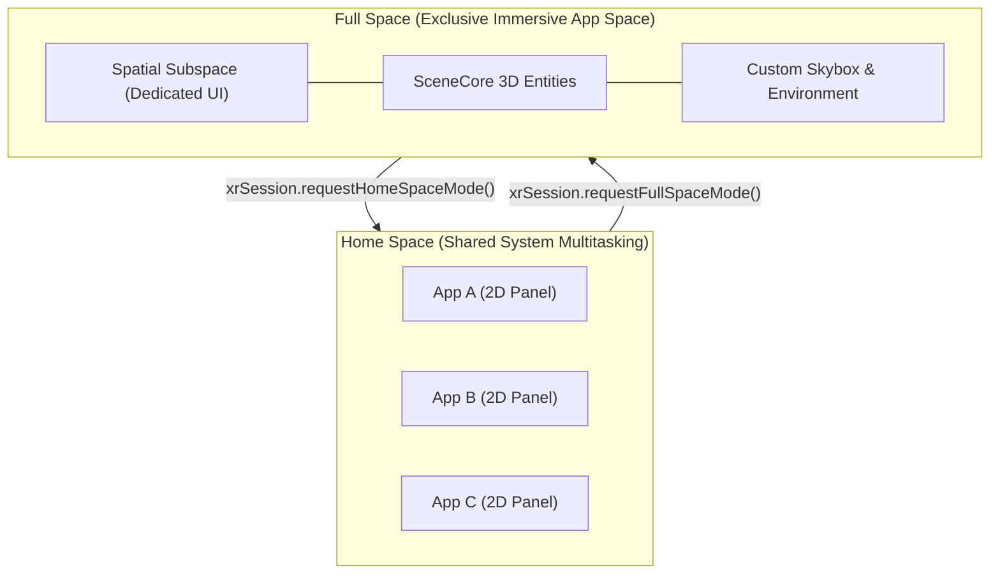

## Home Space vs Full Space 공간 모드 전환

상위 문서: [Android 폼 팩터와 플랫폼 확장 지도](../android-platforms-and-form-factors.md)

관련 지도: [Android XR 계약](xr.md)

개념 노트: [Android XR은 평면 앱 포트가 아니라 공간 폼 팩터다](android-xr-spatial-computing.md)

---

### 1. 개요 및 비유로 이해하는 개념 (Overview & Intuitive Analogy)

**Home Space 와 Full Space 는 Android XR 시스템이 제공하는 두 가지 핵심 런타임 멀티태스킹 공간 모드입니다.**

- **Home Space**: 시스템 멀티태스킹 공간으로, 사용자의 3D 거실 공간 안에서 여러 앱 패널(2D Window Surface)이 나란히 공존하는 기본 공유 모드입니다.
- **Full Space**: 앱이 시스템에 전환을 요청하여 3D 전면 공간 전체를 독점 권한으로 획득한 후, 3D 엔티티, 파노라마 배경, 3D 서브스페이스(Spatial Subspace)를 자유롭게 렌더링하는 몰입 모드입니다.

#### 초보자를 위한 쉬운 비유

- **Home Space (공유 거실)**: **"거실 소파에 여럿이 앉아 각자 태블릿(2D 앱 창)을 들고 화면을 보고 있는 상태"**
  다양한 앱 패널들이 3D 공간 상에 팝업되어 떠 있으며, 사용자는 음악 앱, 인터넷 브라우저, 메모 앱 창을 동시에 띄워두고 자유롭게 움직이거나 크기를 변경할 수 있습니다.
- **Full Space (전용 가상 영화관 진입)**: **"거실 조명이 꺼지고 특정 앱 전용 3D 체험관/영화관으로 공간 전체가 변신하는 상태"**
  사용자가 동영상 앱의 '3D 몰입 관람' 버튼을 누르면 다른 앱 창들이 화면 밖으로 뒤로 물러나고, 그 앱만이 사용자의 3D 시야 전체(Skybox, 3D 가구/오브젝트)를 독점 조작하게 됩니다.



---

### 2. 핵심 메커니즘 및 런타임 특성 (Core Mechanism)

#### 1) Home Space 런타임 동작 원리
- Android XR 환경의 기본(Default) 진입 모드입니다.
- 앱은 2D 평면 패널(`SpatialPanel`) 또는 가벼운 3D 볼륨 표면 형태로 노출되며, 다른 시스템 앱 및 사용자 알림 창과 3D 공간을 안전하게 공유합니다.
- 앱은 공간 전체를 덮는 전용 3D 엔티티나 커스텀 배경(Environment)을 직접 조작할 수 없습니다.

#### 2) Full Space 런타임 동작 원리
- 앱이 사용자 인터랙션에 따라 Jetpack XR SDK 의 `Session.requestFullSpaceMode()` 를 호출하여 시스템의 승인을 받아 진입합니다.
- 진입 성공 시 앱은 `Subspace` 내부에서 3D `GltfEntity`, `Orbiter`, spatial UI 컴포넌트 및 전용 파노라마 배경 렌더링 권한을 부여받습니다.
- **시스템 바운더리 보호**: Full Space 상태에서도 사용자의 물리적 안전을 위해 패스스루(Passthrough) 경계 및 보안 알림 UI 는 앱이 임의로 차단하거나 가릴 수 없도록 시스템 레벨에서 별도로 겹쳐서 표시됩니다.

#### 3) 두 공간 모드 사양 비교표

| 항목 | Home Space | Full Space |
| :--- | :--- | :--- |
| **공간 주도권** | 시스템 공유 멀티태스킹 | 단일 앱 독점 전면 공간 |
| **렌더링 요소** | 2D 패널 (`SpatialPanel`), 기본 볼륨 | 3D Entity, Subspace, Custom Environment |
| **진입 시점** | XR 앱 실행 시 기본 상태 | 앱 내부에서 `requestFullSpaceMode()` 호출 |
| **사용 사례** | 일반 웹서핑, 문서 작업, 2D UI 탐색 | 3D 시뮬레이션, 게임, 360도 미디어 감상 |
| **시스템 바운더리** | 타 앱 패널과 함께 배치 | 전면 렌더링 + 패스스루 안전 경계 유지 |

---

### 3. 실전 모드 전환 및 세션 구현 코드 (Implementation)

Jetpack XR SDK 를 사용하여 Home Space 와 Full Space 간의 모드 전환을 처리하는 표준 액티비티 예시 코드입니다.

```kotlin
import android.os.Bundle
import androidx.activity.ComponentActivity
import androidx.lifecycle.lifecycleScope
import androidx.xr.scenecore.Session
import androidx.xr.scenecore.SpatialStateResult
import kotlinx.coroutines.launch

class SpatialXrActivity : ComponentActivity() {
    private var xrSession: Session? = null

    override fun onCreate(savedInstanceState: Bundle?) {
        super.onCreate(savedInstanceState)
        
        // Jetpack XR SDK Session 인스턴스 획득
        xrSession = Session.getOrCreate(this)
    }

    /**
     * 사용자가 '몰입 모드 진입' 버튼을 눌렀을 때 실행되는 함수
     */
    fun enterImmersiveFullSpace() {
        val session = xrSession ?: return
        
        lifecycleScope.launch {
            // Full Space 전환 요청
            val result = session.requestFullSpaceMode()
            
            when (result) {
                is SpatialStateResult.Success -> {
                    // Full Space 진입 성공 -> 3D Subspace 및 3D Model 렌더링 활성화
                    setupFullSpace3DScene()
                }
                is SpatialStateResult.Failure -> {
                    // 사용자 거부 또는 기기 정책에 따른 전환 실패 -> Home Space 2D Panel 유지
                    fallbackTo2DPanelUI()
                }
            }
        }
    }

    private fun setupFullSpace3DScene() {
        // SceneCore 엔티티 및 커스텀 파노라마 배경 렌더링 로직
    }

    private fun fallbackTo2DPanelUI() {
        // 기존 2D Panel UI 상태 유지 안내
    }
}
```

---

### 4. 판단 기준 및 설계 선택 (Decision Criteria & Boundaries)

1. **사용자 주도 전환 원칙 (User-Driven Transition)**:
   - 앱이 시작되자마자 사용자의 승인 없이 강제로 Full Space 전환을 요청하는 것은 몰입감을 방해하고 멀티태스킹 경험을 해칩니다. 반드시 Home Space 의 2D 패널에서 명시적인 UI 버튼 클릭을 통해 전환해야 합니다.
2. **폴백(Fallback) 안전망 확보**:
   - 사용자가 시스템 팝업에서 Full Space 진입을 거절하거나 디바이스 기능 제약으로 전환이 실패할 수 있으므로, 앱은 항상 Home Space 의 2D 패널 모드에서도 기본 기능을 이용할 수 있도록 폴백 경로를 설계합니다.

---

### 5. 관측 가능한 증거 및 관련 노트 (Observable Evidence & Related Notes)

#### 관측 가능한 증거 (Observable Evidence)

```bash
# 1. XR Session 공간 모드 (Home Space -> Full Space) 이벤트 로그 추적
adb logcat -v threadtime | grep -E "XrSession|SpaceMode|FullSpace"

# 2. dumpsys에서 Spatial Display Layer 및 Active Mode 덤프
adb shell dumpsys activity top | grep -E "SpatialCapabilities|SpaceMode"
```

#### 관련 노트

- [Android XR은 평면 앱 포트가 아니라 공간 폼 팩터다](android-xr-spatial-computing.md)
- [Android XR 계약](xr.md)
- [Android 폼 팩터와 플랫폼 확장 지도](../android-platforms-and-form-factors.md)
