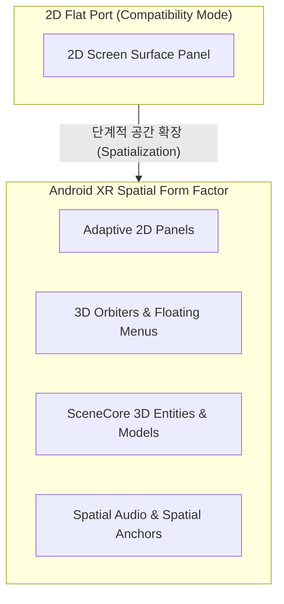

## Android XR 은 평면 앱 포트가 아니라 공간 폼 팩터다

상위 문서: [Android 폼 팩터와 플랫폼 확장 지도](../../android-platforms-and-form-factors.md)

관련 지도: [Android XR 계약](./xr.md)

세부 공간 모드: [Home Space vs Full Space 공간 모드 전환](../xr-home-space-vs-full-space.md)

---

### 1. 개요 및 비유로 이해하는 개념 (Overview & Intuitive Analogy)

**Android XR 은 기존 스마트폰/태블릿의 2D 안드로이드 앱을 3D 가상 공간 안의 대형 화면 패널로 보여주는 2D 호환 렌더링에 머무르지 않고, 3D 오브젝트, 공간 오디오, 깊이(Depth), 시선/손짓 입력을 통합 다루는 독립된 공간 폼 팩터(Spatial Form Factor)입니다.**

Android XR 앱 설계는 화면 안의 픽셀 배치를 넘어서, 주변 물리 공간, 시야각, 객체와의 거리, 신체적 편안함(Comfort)을 아우르는 공간적 경험(Spatial Experience)을 핵심 아키텍처로 다룹니다.

#### 초보자를 위한 쉬운 비유

- **"벽에 걸린 TV 액자(2D 호환 패널) vs 방 안 전체에 가구를 직접 배치하는 인테리어(공간화)"**
  기존 앱을 2D 방식으로 포팅하는 것은 가상 3D 방의 한쪽 벽면에 TV(2D 패널)를 걸어두고 스마트폰 앱 화면을 크게 시청하는 것입니다. 반면 genuine Android XR 폼 팩터 경험을 구축한다는 것은 TV 화면 밖으로 3D 소품과 오디오 스피커를 꺼내어 방 안 공간 곳곳에 실제로 입체 배치하고, 사용자가 주변을 거닐며 시선과 손짓으로 직접 조작하게 만드는 것입니다.



---

### 2. 핵심 메커니즘 및 공간화 3단계 진화 (Core Mechanism)

Android XR 플랫폼 대응은 단순한 패널 표시부터 완벽한 공간 융합까지 3 단계 구조로 분이하여 진화합니다.

#### 1) 2D 호환 실행 단계 (2D Compatibility)
- 기존 Compose 또는 View 기반 2D UI 를 XR 가상 3D 공간 내부의 패널(`SpatialPanel`) 형태로 그대로 표시합니다.
- 기존 앱 자산을 최소 수정으로 빠르게 XR 환경으로 가져오는 출발점 역할을 합니다.

#### 2) 공간 확장 단계 (Spatialization)
- 2D 패널 주위에 Floating UI 조작부(`Orbiter`), 공간 레이아웃, 3D 모델 패널, 공간 오디오(Spatial Audio)를 배치합니다.
- 패널 내부의 2D 인터랙션과 패널 외부의 깊이감 있는 3D 소품이 조화를 이루기 시작합니다.

#### 3) 전면 몰입 경험 단계 (Full Spatial Immersion)
- `SceneCore` 3D 가상 엔티티, 파노라마 가상 환경(Skybox), 공간 앵커(Spatial Anchors), Passthrough 조작을 앱 경험의 정중앙에 통합합니다.
- 사용자가 거실 공간 전체를 전용 3D 환경으로 활용할 수 있게 됩니다. (공간 모드 전환의 메커니즘은 [Home Space vs Full Space 공간 모드 전환](../xr-home-space-vs-full-space.md) 참고)

---

### 3. 실전 공간화 전략 코드 패턴 (Implementation Strategy)

Jetpack XR SDK 를 도입하여 기존 2D 컴포저블을 공간 UI 컴포넌트로 확장하는 아키텍처 패턴입니다.

```kotlin
// Compose for XR: 2D 패널과 3D 공간 컴포넌트(Orbiter)의 결합
@Composable
fun SpatialAppMainScreen() {
    // 2D 주 화면 패널
    SpatialPanel(
        modifier = Modifier
            .width(800.dp)
            .height(600.dp)
    ) {
        Main2DContent()
    }
    
    // 패널 외곽 공간에 입체적으로 떠 있는 3D 조작 툴바 (Orbiter)
    Orbiter(
        position = OrbiterPosition.Bottom,
        offset = 16.dp
    ) {
        SpatialControlToolbar()
    }
}

@Composable
fun Main2DContent() {
    Surface {
        Text("XR 공간 내부에서 동작하는 2D UI 패널")
    }
}

@Composable
fun SpatialControlToolbar() {
    Row {
        IconButton(onClick = { /* 몰입 모드 전환 */ }) {
            Icon(Icons.Default.3dRotation, contentDescription = "Full Space")
        }
    }
}
```

---

### 4. 판단 기준 및 경계 (Decision Criteria & Boundaries)

- **2D 호환성은 시작점일 뿐임**: 2D 호환 패널 실행만으로는 Android XR 플랫폼만의 공간적 차별성과 가치를 제공할 수 없습니다. 2D 앱 이식 후 단계적인 공간화(Spatialization) 작업이 이어져야 합니다.
- **시스템 UI 및 바운더리 존중**: 사용자의 신체적 피로(Comfort), 안전 경계, Passthrough 고지, 권한 UI 등을 앱의 자체 커스텀 장식으로 숨기거나 무력화해서는 안 됩니다.
- **경계 분리**:
  - Home Space 공유 공간과 Full Space 전면 몰입 공간 전환 메커니즘은 [Home Space vs Full Space 공간 모드 전환](../xr-home-space-vs-full-space.md) 노트가 전담합니다.
  - Compose for XR 의 Subspace 및 공간 컴포넌트 구현 상세는 [Compose for XR은 기존 Compose를 subspace와 spatial component로 확장한다](./compose-for-xr-extends-compose-with-subspace-and-spatial-components.md) 가 다룹니다.

---

### 5. 관측 가능한 증거 및 관련 노트 (Observable Evidence & Related Notes)

#### 관측 가능한 증거 (Observable Evidence)

```bash
# 1. XR 공간 디스플레이 및 Surface 덤프 관측
adb shell dumpsys window | grep -i "SpatialSurface"

# 2. XR Session 및 Spatial Space 모드 변경 이벤트 추적
adb logcat -v threadtime | grep -E "XrSession|SpaceMode|FullSpace"
```

#### 관련 노트

- [Home Space vs Full Space 공간 모드 전환](../xr-home-space-vs-full-space.md)
- [2D 호환 실행은 XR 공간화의 시작점일 뿐이다](./two-dimensional-compatibility-is-only-start-of-xr-spatialization.md)
- [Compose for XR은 기존 Compose를 subspace와 spatial component로 확장한다](./compose-for-xr-extends-compose-with-subspace-and-spatial-components.md)
- [Android XR 계약](./xr.md)
- [Android 폼 팩터와 플랫폼 확장 지도](../../android-platforms-and-form-factors.md)
