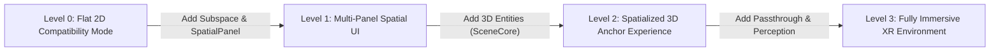

## 2D 호환 실행은 XR 공간화의 시작점일 뿐이다

상위 문서: [Android XR 계약](./xr.md)

기존 Android 앱을 XR 환경의 2D 패널로 띄우는 것은 좋은 시작점이다. 하지만 XR 의 제품 가치는 패널을 많이 띄우는 데서 끝나지 않고, 사용자의 시야, 거리, 주변 공간, 입력 맥락에 맞게 기능을 공간화할 때 생긴다.

### 2D 호환성 vs 공간화 단계별 아키텍처



앱이 2D 패널에서 Spatial UI로 전환할 때는 Compose for XR의 `SpatialPanel`을 활용하여 기존 2D 컴포넌트들을 공간 안에 띄울 수 있다.

```kotlin
@Composable
fun MySpatialApp() {
    val session = LocalSession.current
    var isSpatial by remember { mutableStateOf(false) }
    
    if (isSpatial) {
        // 공간화 단계 (Level 1)
        SpatialPanel(modifier = Modifier.width(400.dp).height(300.dp)) {
            Surface {
                Text("이 UI는 3D 공간 안의 패널로 렌더링됩니다.")
            }
        }
    } else {
        // 2D 호환성 모드 (Level 0)
        Surface {
            Column {
                Text("이 UI는 기존 2D 평면 창에서 실행됩니다.")
                Button(onClick = { 
                    session?.requestFullSpaceMode() 
                    isSpatial = true 
                }) {
                    Text("Enter Spatial Mode")
                }
            }
        }
    }
}
```

### 판단 기준

- 정보 입력과 설정처럼 평면 UI 가 더 빠른 작업은 2D 패널로 유지한다.
- 위치, 크기, 깊이, 실제 공간과의 관계가 의미를 만드는 기능만 공간화한다.
- 3D object 나 immersive environment 는 제품 과업을 단축하거나 이해를 높일 때 도입한다.
- business state 와 화면 state 는 2D/공간 표현 사이에서 공유하되, spatial session state 는 별도 입력으로 둔다.

### 관측 가능한 증거 (Observable Evidence)

```bash
# 2D 호환 모드 실행 패널 가로/세로 Ratio 및 패널 백엔드 덤프 관측
adb shell dumpsys window windows | grep -A 5 "ActivityRecord.*2DParent"

# 2D 패널 및 공간 Subspace 진입 이벤트를 로그캣으로 관측
adb logcat -v threadtime | grep -E "SpatialPanelScaffold|2DCompatibilityMode"
```

### 관련 문서

- [Android XR은 평면 앱 포트가 아니라 공간 폼 팩터다](./android-xr-is-spatial-form-factor-not-flat-port.md)
- [Compose for XR은 기존 Compose를 subspace와 spatial component로 확장한다](./compose-for-xr-extends-compose-with-subspace-and-spatial-components.md)
- [SceneCore는 3D entity와 공간 환경을 다루는 계층이다](./scenecore-manages-3d-entities-and-spatial-environments.md)

공식 문서: [Develop with the Jetpack XR SDK](https://developer.android.com/develop/xr/jetpack-xr-sdk)

