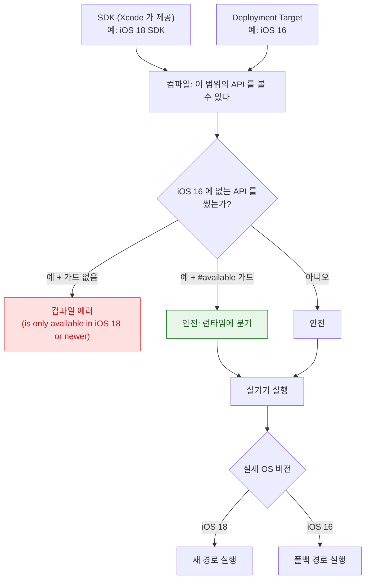

## Apple 플랫폼의 버전은 SDK·배포 타깃·런타임 확인이라는 세 개의 독립된 축으로 이루어진다

"iOS 18 부터 되는 기능"이라는 말은 **세 가지 서로 다른 것**을 가리킬 수 있다. 이 셋을 분리하지 않으면 "빌드는 되는데 구형 기기에서 크래시"나 "왜 이 API 가 안 보이지"를 진단할 수 없다.

| 축 | 무엇을 정하는가 | 어디서 설정 |
| :--- | :--- | :--- |
| **SDK 버전** | 컴파일할 때 **볼 수 있는** API 의 범위 | Xcode 버전이 결정 |
| **Deployment Target** | 앱이 **실행될 수 있는** 최소 OS | 빌드 설정 |
| **런타임 확인** | 실제 기기에서 그 API 가 **있는지** | `#available` / `@available` |



### 실무 규칙

```swift
// 런타임 분기 — 컴파일러가 가드 안에서만 새 API 를 허용한다
if #available(iOS 18, *) {
    useNewAPI()
} else {
    useFallback()
}

// 선언 자체에 가용성 표시
@available(iOS 18, *)
struct NewFeatureView: View { ... }

// 폐기 예고 — 사용처에 경고를 띄운다
@available(iOS, deprecated: 17, message: "Use newMethod() instead")
func oldMethod() { }
```

>[!IMPORTANT] `#available` 의 `*`
>`*` 는 "명시하지 않은 다른 모든 플랫폼에서는 통과"를 뜻한다. 생략할 수 없으며, 멀티플랫폼 코드에서 macOS/watchOS 조건을 빠뜨리는 실수를 막아 준다.

### 2025 년 버전 통합

2025 년부터 모든 Apple OS 의 메이저 버전 번호가 **출시 연도 기준으로 통합**되었다. iOS 26, macOS 26, watchOS 26, visionOS 26 이 같은 세대를 가리킨다.

이것이 바꾸는 것과 바꾸지 않는 것:

| 바뀐 것 | 바뀌지 않은 것 |
| :--- | :--- |
| 버전 번호가 플랫폼 간 정렬됨 | **API 가용성은 여전히 플랫폼마다 다르다** |
| 세대 파악이 쉬워짐 | `@available` 은 여전히 플랫폼별로 명시해야 한다 |

**같은 번호라고 같은 API 가 있는 것이 아니다.** watchOS 26 에 없는 iOS 26 API 가 여전히 존재한다.

### 시대별 대전환 — 왜 지금 구조가 이런가

각 전환은 "무엇을 포기하고 무엇을 얻었는가"로 읽어야 현재 제약이 이해된다.

| 시기 | 전환 | 남긴 제약 |
| :--- | :--- | :--- |
| 초기 | Objective-C + 수동 참조 계수 | ObjC 런타임이 여전히 하부에 있음 → [dispatch 3 종](apple-runtime-and-swift.md) |
| ARC 도입 | 수동 retain/release 제거 | 순환 참조는 여전히 개발자 책임 |
| Swift 도입 | 정적 타입·값 타입 중심 | ObjC 상호 운용 비용이 남음 |
| Swift 5 ABI 안정화 | 런타임을 OS 에 내장 | 앱 번들 크기 감소, 대신 OS 버전 의존 |
| SwiftUI | 선언형 UI | UIKit 과의 상호 운용 계층 필요 |
| Apple Silicon | 아키텍처 전환 | Universal 바이너리, Rosetta 과도기 |
| Swift 6 | **데이터 경합을 컴파일 에러로** | 기존 코드베이스의 [마이그레이션 부담](../01_language_concurrency/concurrency/swift6-migration-path.md) |
| 공간 컴퓨팅 | visionOS | [Space 종류가 API 를 제한](../07_platforms/apple-visionos-system.md) |

### 관찰 가능한 증거

```bash
# 산출물의 최소 지원 버전과 빌드 SDK
otool -l MyApp.app/MyApp | grep -A4 LC_BUILD_VERSION
#   minos  = Deployment Target
#   sdk    = 빌드에 사용한 SDK

# 설치된 SDK 목록
xcodebuild -showsdks

# 현재 Xcode 가 쓰는 툴체인
xcrun --show-sdk-version
xcrun --show-sdk-path
```

**`minos` 를 확인하는 습관**이 중요하다. 빌드 설정과 실제 산출물이 어긋나는 경우가 있고, 그러면 지원한다고 생각한 기기에서 설치조차 되지 않는다.

### 관련 문서

- [apple-platform-differences](apple-platform-differences.md) - 플랫폼 축(버전 축과 별개)
- [apple-runtime-and-swift](apple-runtime-and-swift.md) - ObjC/Swift 런타임 공존의 뿌리
- [Swift 6 마이그레이션은 경고를 먼저 켜서 모듈 단위로 단계적으로 한다](../01_language_concurrency/concurrency/swift6-migration-path.md)
- [apple-foundations](apple-foundations.md) - 전체 지도
- [android-release-history](../../android/00_foundations/history/android-release-history.md) - 안드로이드의 API level·target SDK 축과 비교

공식 문서: [Availability condition](https://docs.swift.org/swift-book/documentation/the-swift-programming-language/statements/#Availability-Condition) · [SDKs and deployment targets](https://developer.apple.com/documentation/xcode/configuring-the-build-settings-of-a-target)
