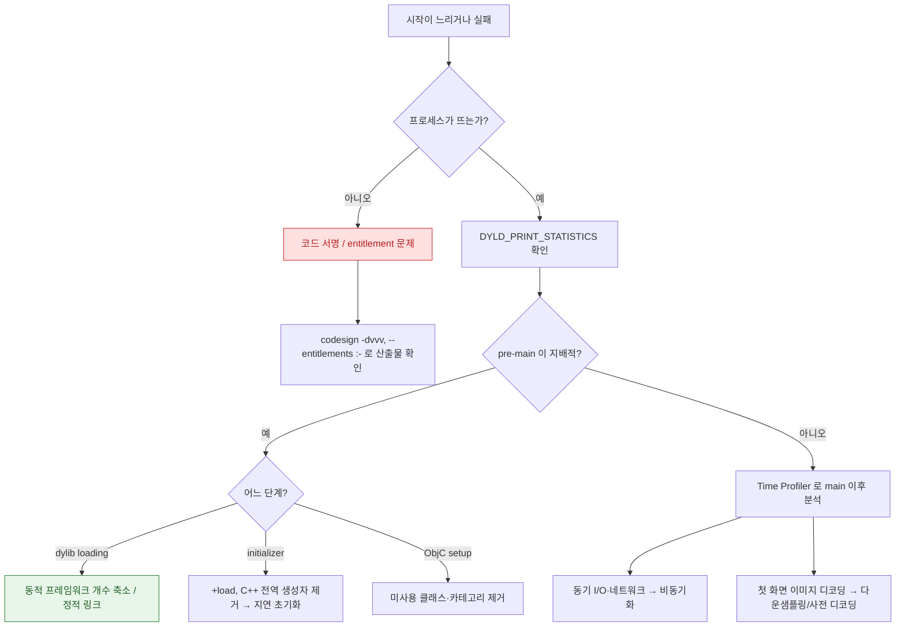

## 앱 시작이 느리거나 아예 실행되지 않는다

### 1. 증상 및 징후

다음 중 하나 이상이 관찰된다.

- 아이콘을 탭한 뒤 첫 화면이 나오기까지 눈에 띄게 오래 걸린다.
- 시작 도중 `0x8badf00d` 로 강제 종료된다. (→ [02-watchdog-and-hang](02-watchdog-and-hang.md) 와 함께 본다)
- 앱이 실행되자마자 아무 로그 없이 종료된다. (서명/entitlement 문제 신호)
- Xcode Organizer 의 Launch Time 지표가 특정 기기 모델에서만 나쁘다.

### 2. 재현 조건 및 환경 격리

- **콜드 스타트와 웜 스타트를 구분한다.** 앱을 강제 종료한 뒤 첫 실행(콜드)과 최근 종료 후 재실행(웜)은 완전히 다른 경로다. 측정은 반드시 콜드로 한다.
- **디버거를 분리한다.** Xcode 로 실행하면 dyld 동작과 워치독이 달라진다.
- **최저 사양 지원 기기에서 확인한다.** 시작 시간은 기기 성능에 크게 좌우된다.
- **재설치 직후 첫 실행은 제외한다.** 시스템 캐시가 준비되지 않아 정상보다 느리다.

### 3. 실패 경계 및 원인 우선순위

| 순위 | 구간 | 판정 방법 |
| :---: | :--- | :--- |
| 1 | **실행 자체 실패** (서명/entitlement) | 프로세스가 뜨지 않음. `codesign` 확인 |
| 2 | **pre-main** (dylib 로딩, fixup, initializer) | `DYLD_PRINT_STATISTICS` 로 단계별 시간 |
| 3 | **post-main 초기화** | Time Profiler 로 `main` 이후 스택 |
| 4 | **첫 프레임 구성** | 첫 화면의 레이아웃·이미지 디코딩 |
| 5 | **동기 I/O·네트워크** | 워치독으로 이어지면 별도 런북 |

### 4. 진단 의사결정 흐름도



### 5. 관찰 가능한 증거

```bash
# 1) 산출물에 실제로 서명된 내용 확인 (Xcode 설정이 아니라 결과물을 본다)
codesign -dvvv MyApp.app
codesign -d --entitlements :- MyApp.app

# 2) 링크된 동적 라이브러리 개수 (pre-main 비용의 주범)
otool -L MyApp.app/MyApp | wc -l

# 3) chained fixups 적용 여부
otool -l MyApp.app/MyApp | grep -c LC_DYLD_CHAINED_FIXUPS
```

Xcode scheme 의 Environment Variables 에 다음을 설정한다.

```
DYLD_PRINT_STATISTICS = 1     # 단계별 pre-main 시간
DYLD_PRINT_LIBRARIES  = 1     # 실제 로드된 이미지 목록
```

Instruments 의 **App Launch** 템플릿으로 pre-main 과 post-main 을 한 시간축에서 본다. 실사용자 분포는 MetricKit 의 `MXAppLaunchMetric` 과 Xcode Organizer 의 Launch Time 을 본다.

### 6. 수정 후 검증

- 콜드 스타트를 5 회 이상 측정해 중앙값을 비교한다. 1 회 측정은 노이즈가 크다.
- 회귀를 막으려면 XCTest 의 `XCTApplicationLaunchMetric` 으로 시작 시간을 CI 에 고정한다.

### 7. 연관 문서

- [pre-main 시간은 대부분 dylib 로딩과 static initializer 가 쓴다](../../01_system_internals/boot-and-runtime/pre-main-launch-time-budget.md)
- [dyld shared cache 는 시스템 프레임워크를 한 번 매핑해 모든 프로세스가 공유하게 만든다](../../01_system_internals/boot-and-runtime/dyld-shared-cache.md)
- [AMFI 는 exec 시점에 코드 서명과 entitlement 를 커널에서 강제한다](../../01_system_internals/kernel-and-driver/amfi-code-signature-enforcement.md)
- [01-icon-tap-to-first-frame](../worked-examples/01-icon-tap-to-first-frame.md) - 전체 경로 추적
