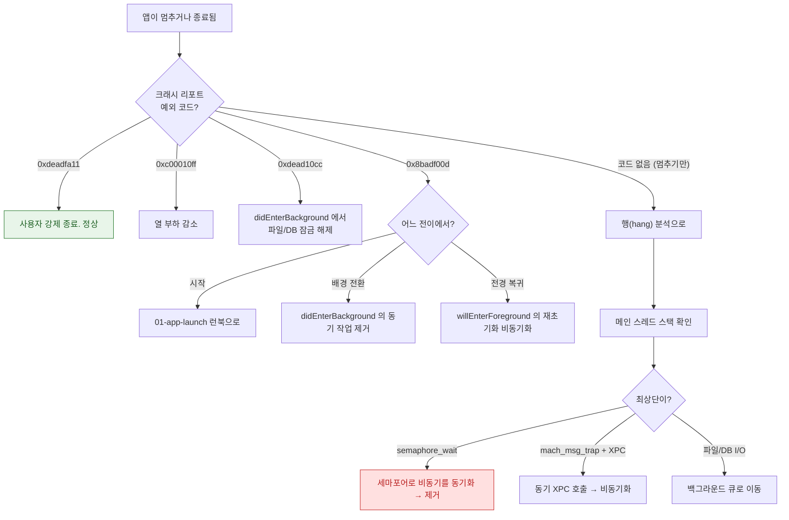

## 앱이 멈추거나 워치독으로 강제 종료된다

### 1. 증상 및 징후

- 화면이 터치에 반응하지 않다가 앱이 사라진다.
- 크래시 리포트의 예외 코드가 `0x8badf00d` 또는 `0xdead10cc` 다.
- Xcode 실행 중에는 재현되지 않는다. (**디버거가 붙으면 워치독이 비활성화된다**)
- Xcode Organizer 의 Hangs 지표가 특정 화면에서 높다.

### 2. 재현 조건 및 환경 격리

- **디버거를 반드시 분리한다.** 붙어 있으면 워치독이 동작하지 않아 재현 자체가 불가능하다.
- **느린 네트워크를 만든다.** Network Link Conditioner 로 고지연·패킷 손실을 재현한다. 동기 네트워크 호출이 원인이면 여기서 드러난다.
- **저전력 모드와 열 상태를 확인한다.** `0xc00010ff` 는 열 관리 종료다.
- **전이 시점을 특정한다.** 시작 / 전경 복귀 / 배경 전환 / 종료 중 어디인가.

### 3. 실패 경계 및 원인 우선순위

| 순위 | 예외 코드 | 원인 | 조사 지점 |
| :---: | :--- | :--- | :--- |
| 1 | `0x8badf00d` | 생명주기 전이 시간 초과 | 해당 델리게이트 메서드의 동기 작업 |
| 2 | `0xdead10cc` | 정지 시점에 공유 컨테이너 잠금 보유 | `didEnterBackground` 의 DB/파일 정리 |
| 3 | — (종료 없이 멈춤) | 메인 스레드 블로킹 | `DispatchSemaphore.wait()`, 동기 XPC, 동기 I/O |
| 4 | `0xc00010ff` | 열 부하 | 지속적 고CPU/GPU 작업 |
| 5 | `0xdeadfa11` | **사용자 강제 종료. 버그 아님** | 조치 불필요 |

### 4. 진단 의사결정 흐름도



### 5. 관찰 가능한 증거

**기기**: `설정 > 개인정보 보호 및 보안 > 분석 및 향상 > 분석 데이터` 에서 크래시 리포트를 찾아 `Exception Codes` 를 확인한다.

**Xcode**: Organizer > Hangs 에서 실사용자 행 발생 화면과 스택을 본다. Debug 중에는 Xcode 가 메인 스레드 행을 감지해 경고한다(Thread Performance Checker).

**MetricKit**:

```swift
// MXHangDiagnostic 은 종료까지 가지 않은 행도 수집한다
func didReceive(_ payloads: [MXDiagnosticPayload]) {
    for p in payloads {
        p.hangDiagnostics?.forEach { print($0.hangDuration, $0.callStackTree) }
    }
}
```

**macOS 에서 기기 스택 뜨기**:

```bash
log stream --device --predicate 'process == "MyApp"' --info
```

### 6. 수정 후 검증

- 문제 코드를 제거한 뒤 **디버거 없이** 느린 네트워크에서 같은 전이를 20 회 반복한다.
- `didEnterBackground` 에서 하는 일은 "이미 준비된 것을 기록"만 남긴다. 계산이나 I/O 가 남아 있으면 아직 위험하다.
- MetricKit 의 워치독 종료 수가 릴리스 후 감소하는지 추적한다.

### 7. 연관 문서

- [워치독 종료는 예외 코드로 원인 구간을 구분할 수 있다](../../01_system_internals/ipc-and-process/watchdog-termination-codes.md)
- [mach_msg 는 모든 상위 IPC 가 결국 통과하는 단일 전송 원시다](../../01_system_internals/ipc-and-process/mach-msg-primitive.md) - 스택 읽는 법
- [NSFileCoordinator 는 프로세스 간 파일 접근을 조정한다](../../01_system_internals/storage/file-coordination-across-processes.md)
- [메인 스레드의 이벤트 처리와 화면 갱신은 RunLoop 한 바퀴 안에서 정해진 순서로 일어난다](../../01_system_internals/boot-and-runtime/runloop-drives-main-thread.md)
