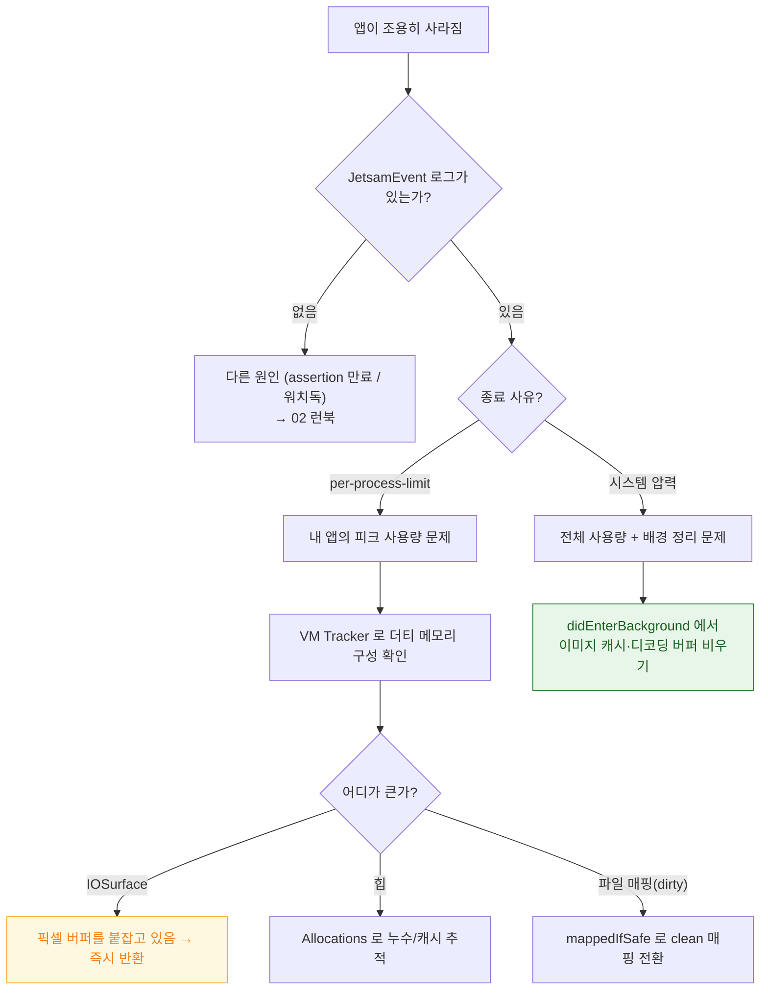

## 앱이 메모리 때문에 종료된다

### 1. 증상 및 징후

- 크래시 리포트가 없는데 앱이 사라진다. 대신 `JetsamEvent-*.ips` 파일이 있다.
- 특정 화면(사진 편집, 대용량 목록)에서만 재현된다.
- **앱 확장(위젯, 알림 서비스)에서만** 죽는다.
- 저사양 기기에서만 발생한다.

### 2. 재현 조건 및 환경 격리

- **Xcode 를 분리한다.** 디버거가 붙으면 메모리 회수 동작이 다르다.
- **다른 앱들로 시스템 압력을 만든다.** 카메라, 지도 등을 여러 개 띄운 뒤 대상 앱으로 돌아온다.
- **확장은 별도로 테스트한다.** 확장은 호스트 앱과 **완전히 다른, 훨씬 낮은 한도**를 갖는다.
- **최저 사양 지원 기기에서 확인한다.**

### 3. 실패 경계 및 원인 우선순위

먼저 `JetsamEvent` 로그의 사유를 확인해 두 경로를 나눈다.

| 사유 | 의미 | 처방 |
| :--- | :--- | :--- |
| **`per-process-limit`** | 내 프로세스 하나가 상한 초과 | **피크 사용량**을 줄인다 (다른 앱 무관) |
| **`vm-pageshortage` 등** | 시스템 전체 압력 | 배경 전환 시 캐시를 비워 우선순위 밴드에서 살아남는다 |

원인 우선순위:

1. **이미지 디코딩 버퍼** — 원본 해상도로 디코딩해 화면 크기와 무관하게 큰 메모리 점유
2. **`CVPixelBuffer` / IOSurface 미해제** — 힙에 안 잡혀 Allocations 로는 안 보임
3. **캐시 무제한 증가** — `NSCache` 대신 딕셔너리 사용
4. **순환 참조 누수** — 화면을 닫아도 해제되지 않음
5. **대용량 파일 전체 읽기** — `Data(contentsOf:)` 로 더티 메모리 생성

### 4. 진단 의사결정 흐름도



### 5. 관찰 가능한 증거

**기기**: `설정 > 개인정보 보호 및 보안 > 분석 및 향상 > 분석 데이터` 의 `JetsamEvent-*.ips`. 종료 사유와 당시 모든 프로세스의 메모리 사용량이 들어 있다.

**Instruments**:

| 계측기 | 보는 것 |
| :--- | :--- |
| **Allocations** | 힙 증가 추이, 누수 후보 |
| **VM Tracker** | 영역별 더티/상주 — **IOSurface 는 여기서만 보인다** |
| **Leaks** | 순환 참조 |

**macOS 에서 (시뮬레이터/맥 앱)**:

```bash
vmmap --summary <pid>          # 영역별 요약
footprint <pid>                # Jetsam 관점에 가장 가까운 수치
heap <pid> | head -40          # 힙 객체 분포
```

**MetricKit**: `MXAppExitMetric.cumulativeMemoryResourceLimitExitCount` 로 실사용자 한도 초과 종료 수를 추적한다.

### 6. 수정 후 검증

- 문제 화면을 20 회 진입/이탈한 뒤 메모리가 시작 수준으로 돌아오는지 확인한다. 계단식으로 올라가면 누수다.
- 이미지는 **표시 크기에 맞춰 다운샘플링해서 디코딩**했는지 확인한다.
- 확장은 별도 스킴으로 실행해 따로 측정한다.

> [!WARNING] 한도 수치를 상수로 삼지 않는다
> 프로세스별 메모리 한도는 공개된 계약값이 아니며 기기·OS·프로세스 종류에 따라 다르다. 반드시 대상 기기에서 실측한다.

### 7. 연관 문서

- [Jetsam 은 LRU 가 아니라 우선순위 밴드로 죽일 대상을 고른다](../../01_system_internals/ipc-and-process/jetsam-memory-pressure-bands.md)
- [Mach VM 은 영역 단위로 매핑하고 물리 페이지 할당을 미룬다](../../01_system_internals/kernel-and-driver/mach-vm-and-memory-regions.md)
- [IOSurface 는 프로세스와 GPU 가 함께 보는 메모리다](../../01_system_internals/graphics-and-media/iosurface-shared-gpu-memory.md)
- [앱 확장은 호스트가 수명을 쥔 별도 프로세스다](../../01_system_internals/ipc-and-process/app-extension-process-model.md)
