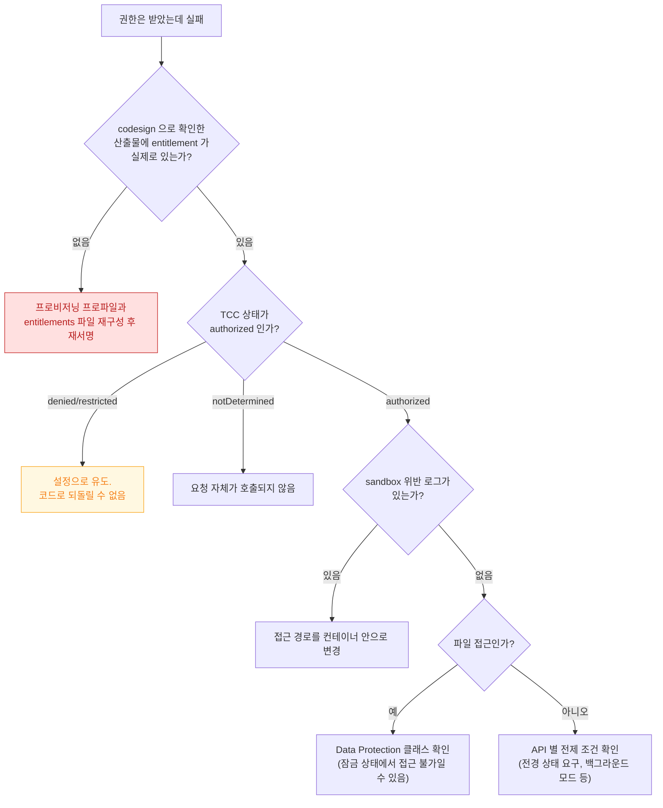

## 권한을 받았는데 API 가 실패한다

### 1. 증상 및 징후

- 사용자가 권한 프롬프트에서 허용했는데도 API 가 빈 결과나 오류를 준다.
- `EPERM` (Operation not permitted) 이 반환된다.
- 시뮬레이터에서는 되는데 실기기에서만 실패한다.
- 개발 빌드에서는 되는데 TestFlight/App Store 빌드에서 실패한다.

### 2. 게이트가 세 개라는 것부터 안다

이 문제의 본질은 **"권한"이 하나가 아니라 서로 독립적인 세 개의 게이트**라는 점이다. 하나가 통과해도 다른 것이 막으면 실패한다.

| 게이트 | 확정 시점 | 집행 주체 | 실패 증상 |
| :--- | :--- | :--- | :--- |
| **Entitlement** | **코드 서명 시** | AMFI (커널) | API 자체가 없거나 실행 불가 |
| **Sandbox 프로필** | 프로세스 시작 시 | TrustedBSD MAC (커널) | `EPERM` |
| **TCC 동의** | **런타임, 사용자 응답** | `tccd` 데몬 | 빈 결과 또는 거부 상태 |

여기에 네 번째로 **Privacy Manifest**(심사 시점 선언)가 있으나, 이것은 런타임 실패가 아니라 심사 반려로 나타난다.

### 3. 진단 의사결정 흐름도



### 4. 관찰 가능한 증거

**게이트 1 — Entitlement (가장 흔한 원인)**

```bash
# Xcode 설정이 아니라 "산출물에 실제로 무엇이 서명되었는지" 를 본다
codesign -d --entitlements :- MyApp.app

# 서명 전체 검증
codesign --verify --deep --strict --verbose=2 MyApp.app
```

개발 빌드와 배포 빌드의 출력을 **diff** 하면 배포에서만 실패하는 원인이 대부분 드러난다.

**게이트 2 — Sandbox**

```bash
# macOS: sandbox 거부 로그
log stream --predicate 'senderImagePath CONTAINS "Sandbox"' --info
log show --last 5m --predicate 'eventMessage CONTAINS "deny"' --info
```

iOS 는 `sysdiagnose` 를 수집해 그 안의 로그에서 같은 항목을 찾는다.

**게이트 3 — TCC**

```bash
# TCC 데몬 판정 로그
log stream --device --predicate 'subsystem == "com.apple.TCC"' --info

# 시뮬레이터에서 상태 조작해 각 분기 테스트
xcrun simctl privacy booted grant  camera com.example.app
xcrun simctl privacy booted revoke camera com.example.app
xcrun simctl privacy booted reset  all    com.example.app
```

코드에서는 프레임워크별 상태 조회 API 로 현재 값을 **로그에 남긴다**. `authorized` 를 가정하지 말고 실제 값을 확인한다.

### 5. 자주 놓치는 것들

| 함정 | 설명 |
| :--- | :--- |
| **권한은 회수될 수 있다** | 사용자가 설정에서 언제든 끌 수 있다. 매번 상태를 확인한다 |
| **한 번만 허용** | 앱을 다시 실행하면 `notDetermined` 로 돌아간다 |
| **제한된 사진 접근** | `limited` 는 `authorized` 가 아니다. 별도 분기가 필요하다 |
| **정확도 낮춤 위치** | 권한은 있으나 좌표 정밀도가 낮다. 실패가 아니다 |
| **백그라운드 제약** | 위치·마이크는 전경 상태나 별도 백그라운드 모드를 요구한다 |
| **잠긴 기기** | 파일이 `complete` 보호 클래스면 백그라운드에서 읽히지 않는다 |

### 6. 수정 후 검증

- 권한을 **거부한 상태**로도 앱이 정상 동작(기능 축소)하는지 확인한다.
- 설정에서 권한을 껐다 켜는 왕복을 테스트한다.
- **TestFlight 빌드로** 다시 확인한다. 개발 빌드와 서명이 다르다.

### 7. 연관 문서

- [apple-privacy-and-tcc-details](../../05_security_privacy/apple-privacy-and-tcc-details.md)
- [AMFI 는 exec 시점에 코드 서명과 entitlement 를 커널에서 강제한다](../../01_system_internals/kernel-and-driver/amfi-code-signature-enforcement.md)
- [TrustedBSD MAC 프레임워크가 sandbox 판정이 실제로 일어나는 지점이다](../../01_system_internals/kernel-and-driver/trustedbsd-mac-and-sandbox-enforcement.md)
- [Data Protection 클래스는 파일 키를 기기 잠금 상태에 묶는다](../../01_system_internals/storage/data-protection-classes.md)
- [06-permission-gates-in-sequence](../worked-examples/06-permission-gates-in-sequence.md) - 세 게이트를 순서대로 통과시키는 예제
