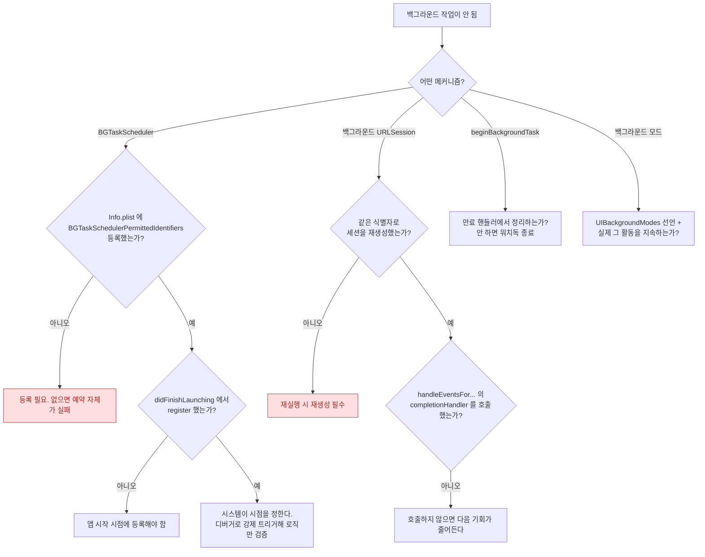

## 백그라운드 작업이 실행되지 않거나 늦는다

### 1. 증상 및 징후

- `BGTaskScheduler` 로 예약한 작업이 며칠째 실행되지 않는다.
- 백그라운드 다운로드가 완료됐는데 앱이 결과를 받지 못한다.
- 배경 전환 직후 하려던 작업이 중간에 끊긴다.
- 시뮬레이터에서는 되는데 실기기에서는 안 된다.

### 2. 먼저 네 가지 메커니즘을 구분한다

"백그라운드"라는 한 단어가 완전히 다른 네 가지를 가리킨다. **어느 것을 쓰고 있는지부터 확정**해야 한다.

| 메커니즘 | 실행 주체 | 시점 통제 | 대표 실패 |
| :--- | :--- | :--- | :--- |
| `beginBackgroundTask` | 앱 프로세스 | 짧은 유예 시간만 | 만료 핸들러 미처리 → 강제 종료 |
| `BGAppRefreshTask` / `BGProcessingTask` | 앱 프로세스 (재실행됨) | **시스템이 결정. 보장 없음** | 등록 누락, 예약 시점 오류 |
| 백그라운드 `URLSession` | **시스템 데몬** | 시스템이 결정 | 세션 재생성 누락 |
| 백그라운드 모드 (오디오/위치 등) | 앱 프로세스 | 조건 충족 시 지속 | 모드 선언 누락 |

### 3. 진단 의사결정 흐름도



### 4. 관찰 가능한 증거

**BGTaskScheduler 를 디버거로 강제 실행** (시점 문제와 로직 문제를 분리하는 가장 빠른 방법)

```
# Xcode 에서 앱을 실행 → 배경으로 보낸 뒤 디버거 콘솔에서:
e -l objc -- (void)[[BGTaskScheduler sharedScheduler] _simulateLaunchForTaskWithIdentifier:@"com.example.refresh"]
```

이것으로 실행되면 **로직은 정상이고 시스템이 시점을 안 준 것**이다. 실행되지 않으면 등록/식별자 문제다.

**시스템 로그**

```bash
# 실행 허가 판정
log stream --device --predicate 'process == "runningboardd"' --info

# 백그라운드 작업 스케줄링
log stream --device --predicate 'subsystem == "com.apple.duetactivityscheduler"' --info
```

**MetricKit**: `MXBackgroundTimeMetric` 으로 실사용자 기기에서 실제로 얼마나 백그라운드 시간을 받았는지 본다.

### 5. 시스템이 시점을 주지 않는 이유들

이것들은 버그가 아니라 정책이다. **보장을 전제로 설계하면 안 된다.**

- 사용자가 앱을 자주 쓰지 않음 (사용 패턴 학습 기반 스케줄링)
- 저전력 모드
- 배터리 잔량 부족
- `설정 > 일반 > 백그라운드 앱 새로고침` 이 꺼져 있음
- 앱 전환기에서 **사용자가 강제 종료함** — 이 경우 대부분의 백그라운드 실행이 중단된다

>[!IMPORTANT] 설계 원칙
>백그라운드 실행은 **최적화이지 보장이 아니다.** "백그라운드에서 동기화되어 있을 것"을 전제로 UI 를 만들면 안 되고, 전경 복귀 시에도 동기화하는 경로가 반드시 있어야 한다.

### 6. 수정 후 검증

- 강제 트리거로 로직을 검증한 뒤, **실기기를 하룻밤 정상 사용**하며 실제 실행 여부를 로그로 확인한다.
- 백그라운드 `URLSession` 은 **앱을 강제 종료한 상태에서** 완료 → 재실행 → 콜백까지 이어지는지 확인한다.
- 파일 저장 목적지의 [보호 클래스](../../01_system_internals/storage/data-protection-classes.md) 가 잠금 중 쓰기를 막지 않는지 확인한다.

### 7. 연관 문서

- [RunningBoard assertion 이 프로세스의 실행 지속 여부를 결정한다](../../01_system_internals/ipc-and-process/runningboard-assertions.md)
- [백그라운드 전송은 앱이 아니라 시스템 데몬이 이어서 수행한다](../../01_system_internals/connectivity/background-transfer-daemon.md)
- [apple-background-tasks](../../04_system_services/apple-background-tasks.md)
- [Data Protection 클래스는 파일 키를 기기 잠금 상태에 묶는다](../../01_system_internals/storage/data-protection-classes.md)
