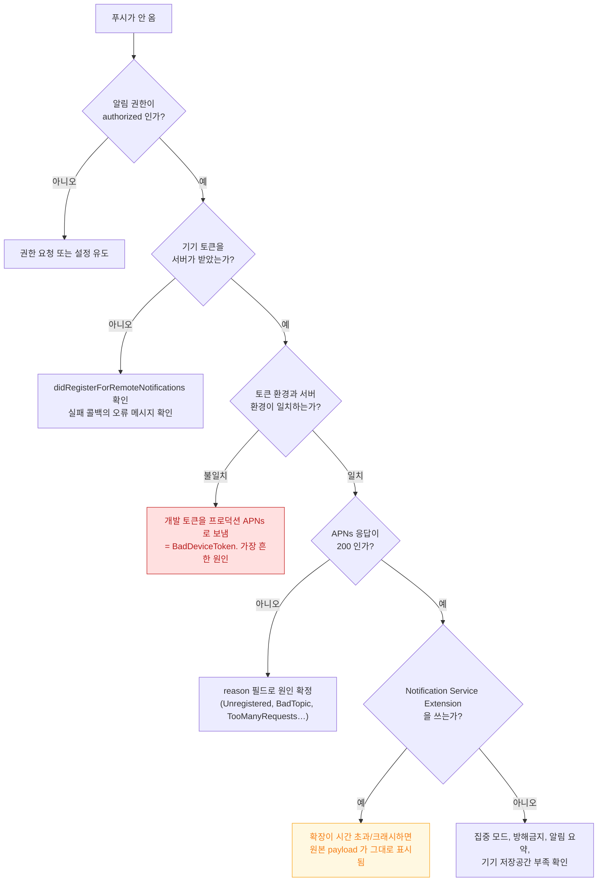

## 푸시 알림이 오지 않는다

### 1. 증상 및 징후

- 서버는 성공 응답을 받았는데 기기에 알림이 나타나지 않는다.
- 개발 빌드에서는 오는데 TestFlight/App Store 빌드에서는 안 온다.
- 일부 기기에서만 안 온다.
- 알림은 오는데 **내용이 서버가 보낸 것과 다르다** (Notification Service Extension 실패)

### 2. 실패 지점이 여섯 개다


각 지점의 판정 방법이 다르므로, **어디까지 갔는지를 먼저 확정**한다.

### 3. 진단 의사결정 흐름도



### 4. 관찰 가능한 증거

**토큰 환경 불일치 (1 순위 원인)**

개발 빌드의 토큰은 APNs **개발 환경**에서만 유효하고, TestFlight/App Store 빌드는 **프로덕션 환경**이다. 서버가 잘못된 엔드포인트로 보내면 `BadDeviceToken` 이 온다.

```bash
# APNs 에 직접 보내 응답을 확인한다 (HTTP/2)
curl -v --http2 \
  --header "apns-topic: com.example.app" \
  --header "authorization: bearer $JWT" \
  --data '{"aps":{"alert":"test","sound":"default"}}' \
  https://api.sandbox.push.apple.com/3/device/$DEVICE_TOKEN
# 프로덕션은 https://api.push.apple.com
```

응답의 `reason` 필드가 원인을 그대로 알려준다.

| reason | 의미 |
| :--- | :--- |
| `BadDeviceToken` | **토큰과 환경 불일치** 또는 잘못된 토큰 |
| `Unregistered` | 앱이 삭제되었거나 토큰 만료 → 서버에서 제거 |
| `BadTopic` | `apns-topic` 이 번들 ID 와 불일치 |
| `TooManyRequests` | 같은 토큰에 과도한 전송 |
| `PayloadTooLarge` | payload 크기 초과 |

**기기 로그**

```bash
log stream --device --predicate 'subsystem == "com.apple.pushkit" OR process == "apsd"' --info
```

**앱 코드에서 반드시 로그를 남길 것**

```swift
func application(_ app: UIApplication,
                 didFailToRegisterForRemoteNotificationsWithError error: Error) {
    // 이 콜백을 비워 두면 원인을 영영 알 수 없다
    log("APNs 등록 실패: \(error)")
}
```

### 5. Notification Service Extension 함정

확장을 쓰면 실패 지점이 하나 늘어난다.

- 확장은 **매우 짧은 시간** 안에 완료해야 한다. 초과하면 시스템이 `serviceExtensionTimeWillExpire` 를 호출하고, 여기서도 처리하지 않으면 **원본 payload 가 그대로 표시**된다.
- 확장은 [별도 프로세스이자 훨씬 낮은 메모리 한도](../../01_system_internals/ipc-and-process/app-extension-process-model.md)를 갖는다. 큰 이미지를 받아 첨부하려다 종료되는 것이 흔하다.
- payload 에 `mutable-content: 1` 이 없으면 확장이 아예 호출되지 않는다.

### 6. 수정 후 검증

- **TestFlight 빌드로** 프로덕션 환경 경로를 반드시 확인한다. 개발 빌드 테스트만으로는 부족하다.
- 앱 삭제 → 재설치 후 토큰이 갱신되어 서버에 반영되는지 확인한다.
- 집중 모드와 알림 요약이 켜진 상태에서의 동작을 확인한다.

### 7. 연관 문서

- [apple-push-notifications-apns](../../04_system_services/apple-push-notifications-apns.md)
- [앱 확장은 호스트가 수명을 쥔 별도 프로세스다](../../01_system_internals/ipc-and-process/app-extension-process-model.md)
- [04-apns-to-notification-display-and-tap](../worked-examples/04-apns-to-notification-display-and-tap.md) - 전체 경로 추적
