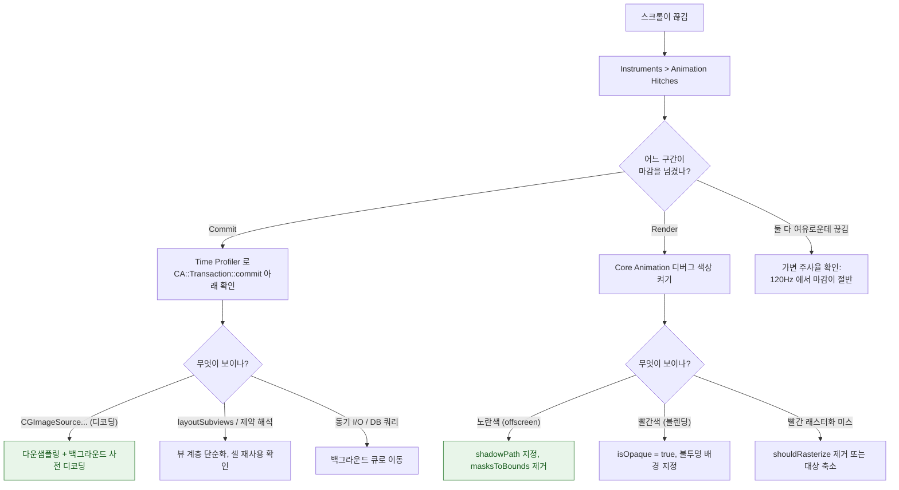

## 스크롤이나 애니메이션이 끊긴다

### 1. 증상 및 징후

- 목록을 빠르게 스크롤할 때 툭툭 걸린다.
- 화면 전환 애니메이션이 부드럽지 않다.
- **120Hz 기기에서만** 끊긴다. (60Hz 기기에서는 멀쩡)
- Xcode Organizer 의 Scrolling 지표가 특정 기기 모델에서만 나쁘다.

### 2. 먼저 어느 프로세스가 늦었는지 확정한다

프레임은 두 구간을 거친다. **어느 구간이 마감을 넘겼는지 모르면 잘못된 곳을 고치게 된다.**

| 구간 | 주체 | 마감 초과 시 |
| :--- | :--- | :--- |
| **Commit** | 앱 프로세스 (메인 스레드) | 레이아웃·그리기·**이미지 디코딩**이 비용 |
| **Render** | Render Server / GPU | 레이어 수·**offscreen 패스**·오버드로가 비용 |

Instruments 의 **Animation Hitches** 템플릿이 이 둘을 시간축에서 분리해 준다. 이것을 먼저 본다.

### 3. 진단 의사결정 흐름도



### 4. 관찰 가능한 증거

**Core Animation 디버그 색상** (Xcode 실행 중 Debug 메뉴 / 시뮬레이터 Debug 메뉴)

| 옵션 | 나쁜 신호 |
| :--- | :--- |
| Color Offscreen-Rendered Yellow | **노란 영역이 셀마다 있음** |
| Color Blended Layers | 빨간 영역이 화면 대부분 |
| Color Hits Green and Misses Red | 래스터화가 매 프레임 빨강 |
| Color Misaligned Images | 이미지가 리샘플링되고 있음 |

**Instruments**

```
Animation Hitches   : commit 구간 / render 구간 분리, 히치 시간 비율
Time Profiler       : commit 아래 스택 (디코딩·레이아웃 범인 찾기)
Metal System Trace  : GPU 실제 작업 시간과 렌더 패스 수
```

**실사용자 데이터**

- Xcode Organizer > Scrolling: 기기 모델·OS 별 히치 비율. **120Hz 기기만 나쁜지 확인한다.**
- MetricKit `MXAnimationMetric.scrollHitchTimeRatio`

### 5. 효과 순으로 정리한 처방

1. **`layer.shadowPath` 지정** — 그림자를 쓰는 곳이면 거의 항상 가장 큰 효과. 알파 분석이 통째로 사라진다.
2. **이미지 다운샘플링** — 표시 크기에 맞춰 디코딩한다. 원본 해상도 디코딩은 메모리와 커밋 시간을 동시에 먹는다.
3. **`isOpaque = true` + 불투명 배경** — 오버드로 제거.
4. **`cornerRadius` + `masksToBounds` 회피** — 미리 둥근 이미지를 쓰거나 배경으로 처리.
5. **셀 재사용 확인** — 재사용이 깨지면 매 셀이 새로 구성된다.
6. **`preferredFrameRateRange` 선언** — 필요 없는 고주사율을 요구하지 않는다.

### 6. 수정 후 검증

- **120Hz 기기에서** 다시 측정한다. 60Hz 기기 통과는 검증이 아니다.
- 히치 시간 비율을 수정 전후로 비교한다. 평균 FPS 는 보지 않는다.
- 회귀 방지: `XCTOSSignpostMetric.scrollDecelerationMetric` 으로 CI 에 고정한다.

### 7. 연관 문서

- [히치는 평균 FPS 가 아니라 사용자가 실제로 본 지연을 잰다](../../01_system_internals/graphics-and-media/hitches-measure-user-visible-jank.md)
- [Offscreen 렌더링은 추가 패스와 컨텍스트 전환을 강제한다](../../01_system_internals/graphics-and-media/offscreen-rendering-cost.md)
- [레이어 트리는 IPC 로 Render Server 에 커밋된다](../../01_system_internals/graphics-and-media/layer-tree-commit-to-render-server.md)
- [가변 주사율에서는 프레임 마감 시각 자체가 달라진다](../../01_system_internals/graphics-and-media/promotion-variable-refresh-deadline.md)
- [07-swiftui-state-change-to-pixel](../worked-examples/07-swiftui-state-change-to-pixel.md)
