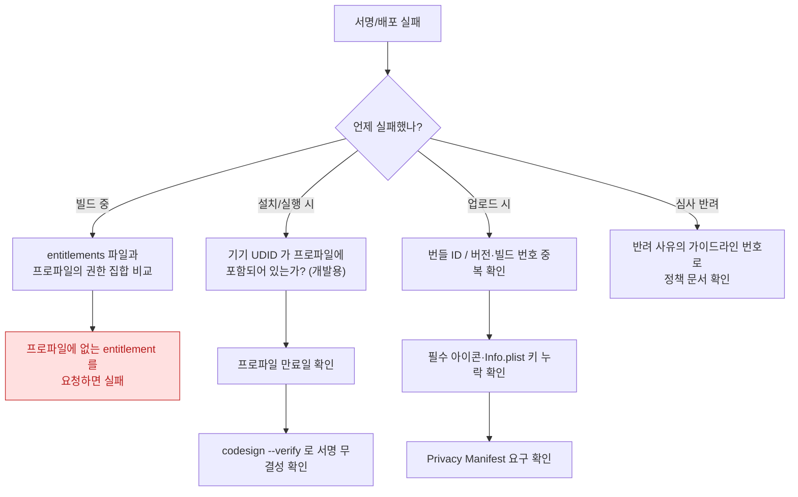

## 서명·프로비저닝·배포가 실패한다

### 1. 증상 및 징후

- `Provisioning profile doesn't match the entitlements` 로 빌드가 실패한다.
- 아카이브는 되는데 App Store Connect 업로드가 거부된다.
- 로컬에서는 실행되는데 TestFlight 설치 후 즉시 종료된다.
- CI 에서만 서명이 실패한다.

### 2. 관문이 시점별로 나뉜다

| 관문 | 시점 | 실패 증상 |
| :--- | :--- | :--- |
| **의존성 해석** | 빌드 이전 | 패키지 확인 실패 |
| **코드 서명 + entitlement 봉인** | 빌드 시 | `doesn't match the entitlements` |
| **프로비저닝 프로파일 매칭** | 설치 시 | 설치 실패, 실행 즉시 종료 |
| **App Store 검증** | 업로드 시 | 업로드 거부, 자동 이메일 |
| **심사** | 배포 시 | 반려 |

**증상이 어느 시점에서 났는지가 곧 조사 범위다.**

### 3. 진단 의사결정 흐름도



### 4. 관찰 가능한 증거

**항상 산출물을 본다. 설정을 보지 않는다.**

```bash
# 1) 아카이브/앱에 실제로 봉인된 entitlement
codesign -d --entitlements :- MyApp.app

# 2) 서명 주체, 팀 식별자, 해시 알고리즘
codesign -dvvv MyApp.app

# 3) 서명 무결성 전체 검증
codesign --verify --deep --strict --verbose=2 MyApp.app

# 4) 임베드된 프로비저닝 프로파일 내용 (권한 집합, 만료일, 기기 목록)
security cms -D -i MyApp.app/embedded.mobileprovision

# 5) 키체인의 서명 인증서 목록
security find-identity -v -p codesigning
```

**핵심 진단**: (1)의 출력과 (4)의 `Entitlements` 항목을 **diff** 한다. 앱이 요구하는 entitlement 중 프로파일에 없는 것이 실패 원인이다.

**확장도 각각 확인한다.** 앱 확장은 자기 번들 ID 와 자기 프로파일을 갖는다. 앱 본체는 맞는데 확장의 프로파일이 틀린 경우가 흔하다.

```bash
for e in MyApp.app/PlugIns/*.appex; do
  echo "=== $e"
  codesign -d --entitlements :- "$e"
done
```

### 5. 자주 겪는 원인

| 원인 | 설명 |
| :--- | :--- |
| **entitlement 와 프로파일 불일치** | Capabilities 를 켰지만 프로파일을 재생성하지 않음 |
| **App Group / Keychain 그룹 불일치** | 앱과 확장이 서로 다른 그룹을 선언 |
| **프로파일 만료** | 개발 프로파일은 유효기간이 있다 |
| **CI 의 키체인 문제** | 인증서/키가 없거나 키체인이 잠겨 있음 |
| **번들 ID 오타** | 확장의 번들 ID 가 앱 번들 ID 의 하위여야 함 |
| **개발/배포 서명 혼용** | 개발 인증서로 서명한 것을 배포 채널에 업로드 |

### 6. 수정 후 검증

- 수정 후 **클린 빌드**로 다시 아카이브한다. 서명 문제는 캐시된 산출물로 재현/해소가 모호해진다.
- TestFlight 로 실제 설치까지 확인한다. 로컬 실행 성공은 배포 서명 검증이 아니다.
- 확장을 포함한 모든 번들의 entitlement 를 스크립트로 일괄 출력해 CI 로그에 남긴다.

### 7. 연관 문서

- [apple-build-and-distribution](../../08_packaging_deployment/apple-build-and-distribution.md)
- [apple-distribution-and-policies](../../08_packaging_deployment/apple-distribution-and-policies.md)
- [AMFI 는 exec 시점에 코드 서명과 entitlement 를 커널에서 강제한다](../../01_system_internals/kernel-and-driver/amfi-code-signature-enforcement.md)
- [apple-security-entitlements](../../05_security_privacy/apple-security-entitlements.md)
- [08-archive-to-testflight-to-update](../worked-examples/08-archive-to-testflight-to-update.md)
