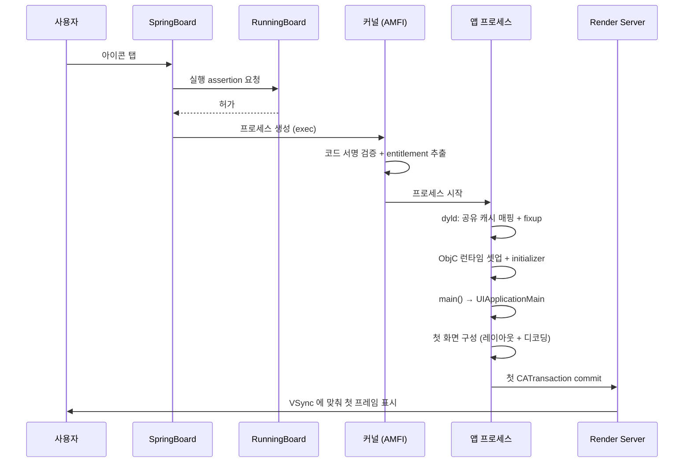

## 아이콘 탭에서 첫 프레임까지

사용자가 아이콘을 탭한 뒤 화면에 무언가 나타나기까지, 서로 다른 **다섯 개의 프로세스**가 관여한다. 각 구간의 소유자가 다르므로 "느리다"는 문제도 구간별로 처방이 다르다.

### 구간 1 — SpringBoard 와 assertion

사용자가 탭하면 [SpringBoard](../../01_system_internals/ipc-and-process/springboard-frontboard-lifecycle.md) 가 전환을 결정하고, [RunningBoard](../../01_system_internals/ipc-and-process/runningboard-assertions.md) 가 실행 assertion 을 부여한다.

이 구간에서 사용자가 보는 것은 **런치 스크린**이다. 런치 스크린은 앱 코드가 그리는 것이 아니라 시스템이 스토리보드로 렌더링한다. **그래서 여기에 동적 데이터를 넣을 수 없다.**

### 구간 2 — 커널의 검증 (AMFI)

`exec` 시점에 [AMFI](../../01_system_internals/kernel-and-driver/amfi-code-signature-enforcement.md) 가 코드 서명을 검증하고 entitlement 를 추출해 커널에 등록한다.

**여기서 실패하면 앱은 로그 한 줄 없이 사라진다.** 시작이 아니라 실행 자체가 안 되는 증상이면 이 구간을 먼저 본다.

### 구간 3 — dyld (pre-main, 최적화 여지가 가장 큼)

| 단계 | 비용의 원인 | 처방 |
| :--- | :--- | :--- |
| 공유 캐시 매핑 | 거의 무료 ([dyld shared cache](../../01_system_internals/boot-and-runtime/dyld-shared-cache.md)) | — |
| **앱 번들의 dylib 로딩** | **서드파티 동적 프레임워크 개수** | 개수 축소 / 정적 링크 |
| fixup | 외부 심볼 참조 수 | 불필요 의존성 제거 |
| ObjC 런타임 셋업 | 클래스·카테고리 총량 | 미사용 코드 제거 |
| initializer | `+load`, C++ 전역 생성자 | `+initialize` / 지연 초기화 |

이 구간의 실측은 `DYLD_PRINT_STATISTICS=1` 하나로 끝난다. → [pre-main 예산](../../01_system_internals/boot-and-runtime/pre-main-launch-time-budget.md)

### 구간 4 — main 이후

`didFinishLaunching` 에서 하는 일이 전부 여기에 쌓인다. **동기 네트워크·DB 마이그레이션·대용량 파일 읽기가 있으면 [워치독](../../01_system_internals/ipc-and-process/watchdog-termination-codes.md) 위험까지 간다.**

원칙: 이 메서드에서는 **첫 화면을 그리는 데 반드시 필요한 것만** 하고, 나머지는 첫 프레임 이후로 미룬다.

### 구간 5 — 첫 프레임

첫 화면의 뷰가 구성되고 [RunLoop 종료 시점에 CATransaction 이 커밋](../../01_system_internals/boot-and-runtime/runloop-drives-main-thread.md)된다. 이때 이미지 디코딩이 함께 일어나므로, 첫 화면에 큰 이미지가 많으면 여기서 지연이 발생한다.

`RS` 가 합성하고 VSync 에 맞춰 표시한 순간이 **사용자가 인지하는 "앱이 떴다"** 시점이다.

### 전체를 측정하는 법

| 도구 | 보는 것 |
| :--- | :--- |
| `DYLD_PRINT_STATISTICS=1` | 구간 3 단계별 |
| Instruments App Launch | 구간 3~5 를 한 시간축에서 |
| MetricKit `MXAppLaunchMetric` | 실사용자 기기 분포 |
| Xcode Organizer Launch Time | 기기 모델·OS 별 |

### 연관 문서

- [01-app-launch-slow-or-fails](../diagnostic-runbooks/01-app-launch-slow-or-fails.md) - 이 경로가 느릴 때의 런북
- [apple-boot-and-runtime](../../01_system_internals/boot-and-runtime/apple-boot-and-runtime.md)
- [apple-app-lifecycle-and-ui](../../02_ui_frameworks/apple-app-lifecycle-and-ui.md)
