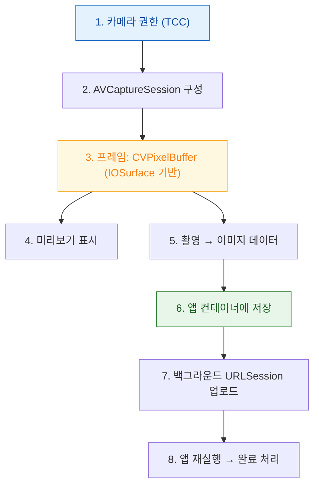

## 사진 촬영에서 업로드까지

카메라로 찍은 사진을 화면에 보여주고, 저장하고, 서버로 올리는 흔한 기능이다. 이 짧은 경로에 **권한 게이트 · 메모리 한도 · 파일 보호 클래스 · 백그라운드 전송**이 전부 등장한다.



### 1. 권한 — 게이트가 두 개일 수 있다

카메라 접근은 TCC 게이트다. 사진 라이브러리에 저장까지 한다면 **별개의 두 번째 게이트**가 있다.

- `Info.plist` 에 `NSCameraUsageDescription` (그리고 저장 시 `NSPhotoLibraryAddUsageDescription`)
- 사진 라이브러리는 `limited`(선택한 항목만) 상태가 있다. **`limited` 는 `authorized` 가 아니다.**

권한이 있는데도 실패하면 → [04 런북](../diagnostic-runbooks/04-permission-granted-but-api-fails.md)

### 2~3. 세션과 버퍼

`AVCaptureSession` 구성은 무겁다. **메인 스레드에서 `startRunning()` 을 호출하면 안 된다.**

프레임은 [`CVPixelBuffer`(IOSurface 기반)](../../01_system_internals/graphics-and-media/iosurface-shared-gpu-memory.md)로 온다. 여기서 가장 흔한 사고:

> [!WARNING] 프레임을 배열에 쌓지 않는다
> 델리게이트로 받은 `CMSampleBuffer` 를 붙잡고 있으면 버퍼 풀이 고갈되어 캡처가 프레임을 떨어뜨린다. 필요한 데이터만 복사하고 즉시 놓아준다.

### 4. 미리보기 — zero-copy 유지

필터를 입힌 미리보기를 만든다면 `CVPixelBuffer` → `UIImage` 변환은 **매 프레임 CPU 복사**다. `CVMetalTextureCache` 로 Metal 텍스처를 만들어 복사 없이 렌더한다.

### 5. 촬영 — 메모리 피크가 발생하는 지점

원본 해상도 이미지를 디코딩해 메모리에 올리면 [per-process 한도](../../01_system_internals/ipc-and-process/jetsam-memory-pressure-bands.md)에 부딪힐 수 있다. 특히 저사양 기기에서 그렇다.

- 화면 표시용은 **표시 크기에 맞춰 다운샘플링**해서 디코딩한다.
- 업로드용 원본은 메모리에 올리지 말고 **파일로 바로 쓴다**.

### 6. 저장 — 디렉터리와 보호 클래스 두 축

| 선택 | 이유 |
| :--- | :--- |
| 디렉터리: `Library/Application Support` 또는 `Documents` | 업로드 완료 전까지 시스템이 지우면 안 됨. **`tmp`/`Caches` 는 위험** |
| 보호 클래스: `completeUnlessOpen` 또는 `completeUntilFirstUserAuthentication` | 기기 잠금 중에도 백그라운드 업로드가 읽어야 함. **`complete` 면 실패** |

→ [컨테이너 정책](../../01_system_internals/storage/app-container-directory-policies.md), [Data Protection](../../01_system_internals/storage/data-protection-classes.md)

### 7~8. 업로드 — 앱 프로세스 밖에서 이어진다

대용량 업로드는 [백그라운드 `URLSession`](../../01_system_internals/connectivity/background-transfer-daemon.md) 으로 넘긴다.

```swift
let config = URLSessionConfiguration.background(withIdentifier: "com.example.uploads")
let session = URLSession(configuration: config, delegate: self, delegateQueue: nil)
// 메모리가 아니라 파일에서 업로드한다
session.uploadTask(with: request, fromFile: fileURL).resume()
```

지켜야 할 세 가지:

1. 앱 재실행 시 **같은 식별자로 세션 재생성**
2. `handleEventsForBackgroundURLSession` 의 completion handler 를 저장했다가 `urlSessionDidFinishEvents` 에서 호출
3. 저데이터 모드 대응 — [제약 경로](../../01_system_internals/connectivity/constrained-and-expensive-paths.md)에서 대용량 업로드를 강행하지 않는다

### 검증 체크리스트

- [ ] 권한 거부 상태에서 앱이 멈추지 않는가
- [ ] 사진 라이브러리 `limited` 상태를 분기하는가
- [ ] 저사양 기기에서 연속 촬영 20 회 시 메모리가 안정적인가
- [ ] **앱을 강제 종료해도** 업로드가 완료되고 앱이 재실행되는가
- [ ] 기기 잠금 상태에서 업로드가 완료되는가 (보호 클래스 검증)

### 연관 문서

- [apple-media-pipeline-deep](../../02_ui_frameworks/apple-media-pipeline-deep.md)
- [03-jetsam-memory-termination](../diagnostic-runbooks/03-jetsam-memory-termination.md)
- [05-background-work-not-running](../diagnostic-runbooks/05-background-work-not-running.md)
