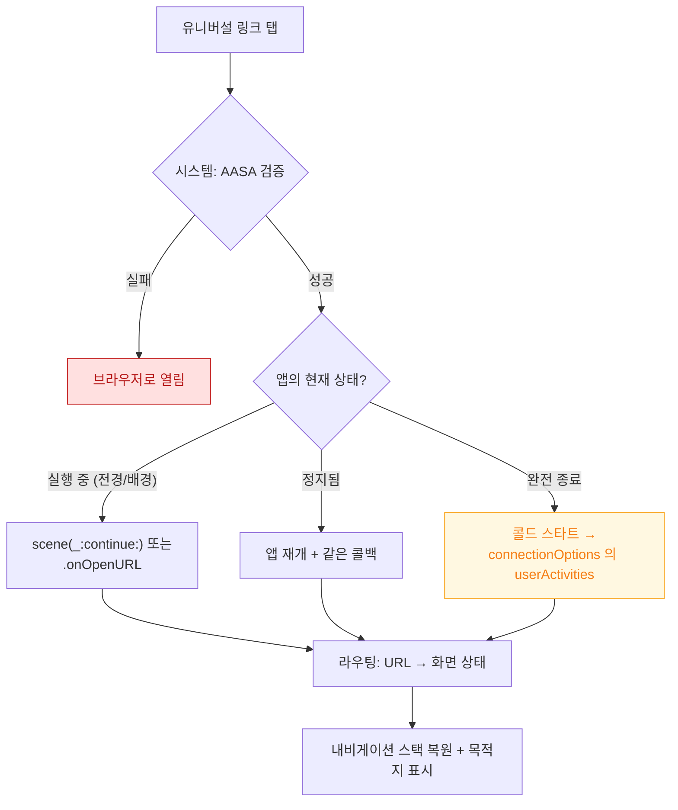

## 유니버설 링크에서 올바른 화면 상태까지

메시지 앱의 링크를 탭했을 때 앱이 열리고 **정확한 화면**에 도달해야 한다. 이 경로는 앱이 이미 떠 있는지, 정지 상태인지, 완전히 종료되었는지에 따라 **서로 다른 진입점**을 탄다. 셋 중 하나만 구현하면 나머지 상황에서 조용히 실패한다.



### 1. 시스템 검증 — 앱 코드가 실행되기 전

유니버설 링크는 **도메인 소유 증명**을 요구한다. → [딥링크 계약](../../04_system_services/apple-deep-links.md)

- 서버의 `https://example.com/.well-known/apple-app-site-association` 에 `TeamID.BundleID` 명시
- Xcode 의 Associated Domains 에 `applinks:example.com` 추가 (**entitlement 다.** 서명에 봉인된다)

**검증 실패는 앱 코드에 도달하지 않는다.** 브라우저가 열리면 앱 로직이 아니라 이 설정을 본다.

```bash
# 기기가 AASA 를 가져왔는지 로그로 확인
log stream --device --predicate 'subsystem == "com.apple.swcd"' --info

# 시뮬레이터에서 링크 열기
xcrun simctl openurl booted "https://example.com/items/42"
```

### 2. 세 가지 진입점 — 전부 구현해야 한다

| 앱 상태 | 진입점 |
| :--- | :--- |
| 실행 중 | `scene(_:continue:)` (UIKit) / `.onOpenURL` (SwiftUI) |
| 정지됨 | 같음 (앱이 재개되며 호출) |
| **완전 종료** | `scene(_:willConnectTo:options:)` 의 `connectionOptions.userActivities` |

세 번째가 가장 많이 누락된다. **앱을 강제 종료한 뒤 링크를 탭하는 테스트**를 반드시 한다.

```swift
func scene(_ scene: UIScene, willConnectTo session: UISceneSession,
           options connectionOptions: UIScene.ConnectionOptions) {
    // 콜드 스타트 경로: 여기서 안 받으면 링크가 사라진다
    if let activity = connectionOptions.userActivities.first,
       activity.activityType == NSUserActivityTypeBrowsingWeb,
       let url = activity.webpageURL {
        route(to: url)
    }
}

func scene(_ scene: UIScene, continue userActivity: NSUserActivity) {
    // 실행 중 / 정지 상태 경로
    if let url = userActivity.webpageURL { route(to: url) }
}
```

### 3. 라우팅 — URL 을 상태로 번역한다

핵심 설계 원칙: **URL 을 "화면 하나"가 아니라 "내비게이션 상태 전체"로 번역한다.**

목록 → 상세 구조라면 링크는 상세만 띄우는 것이 아니라 **목록이 스택에 있는 상태로 상세를 띄워야** 한다. 그래야 뒤로가기가 자연스럽다.

```swift
// 화면 하나를 push 하는 것이 아니라 경로 전체를 만든다
navigationPath = [.itemList, .itemDetail(id: 42)]
```

### 4. 인증·준비 상태와의 경합

가장 흔한 버그: **로그인이 필요한 화면인데 앱이 아직 인증 복원 중**이라 라우팅이 무시된다.

해결: 링크를 **보류 상태로 저장**했다가 준비가 끝나면 실행한다.

```swift
var pendingRoute: Route?

func route(to url: URL) {
    let target = parse(url)
    guard isReady else { pendingRoute = target; return }
    navigate(to: target)
}

func onReadyStateChanged() {
    if let p = pendingRoute { pendingRoute = nil; navigate(to: p) }
}
```

### 5. Scene 상태 복원과의 관계

iPadOS 멀티윈도우에서는 [scene 이 생명주기 단위](../../01_system_internals/ipc-and-process/springboard-frontboard-lifecycle.md)다. 링크로 새 창을 열지, 기존 창을 재사용할지 결정해야 한다. `UISceneSession` 의 `userInfo` 로 각 창의 상태를 구분한다.

### 검증 체크리스트

- [ ] 앱 **완전 종료** 상태에서 링크 탭 → 목적지 도달
- [ ] 앱 실행 중 상태에서 링크 탭 → 목적지 도달
- [ ] 로그아웃 상태에서 인증 필요 링크 → 로그인 후 목적지 도달
- [ ] 잘못된 URL → 크래시 없이 기본 화면
- [ ] AASA 를 가져오지 못하는 네트워크에서도 이미 캐시된 검증으로 동작

### 연관 문서

- [apple-deep-links](../../04_system_services/apple-deep-links.md)
- [SpringBoard 와 FrontBoard 가 앱의 전경·배경 전이를 소유한다](../../01_system_internals/ipc-and-process/springboard-frontboard-lifecycle.md)
- [05-termination-recovery-of-edit-state](05-termination-recovery-of-edit-state.md)
