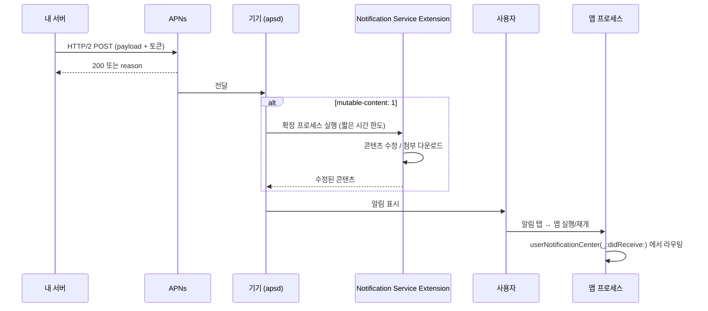

## APNs 에서 알림 표시와 탭 처리까지

푸시 하나가 사용자 화면에 뜨고, 탭으로 앱의 특정 화면까지 가는 경로다. 중간에 **별도 프로세스(확장)** 가 끼어들고, 탭 처리는 [딥링크와 같은 세 가지 진입 상태](03-universal-link-to-scene-restore.md) 문제를 다시 만난다.



### 1. 토큰 등록 — 환경이 두 개다

```swift
UIApplication.shared.registerForRemoteNotifications()

func application(_ app: UIApplication,
                 didRegisterForRemoteNotificationsWithDeviceToken token: Data) {
    let hex = token.map { String(format: "%02x", $0) }.joined()
    sendToServer(hex)   // 서버는 이 토큰의 "환경"도 함께 알아야 한다
}

func application(_ app: UIApplication,
                 didFailToRegisterForRemoteNotificationsWithError error: Error) {
    log("APNs 등록 실패: \(error)")   // 비워 두면 원인을 영영 모른다
}
```

> [!IMPORTANT] 가장 흔한 실패
> 개발 빌드의 토큰은 **sandbox APNs** 에서만, TestFlight/App Store 빌드의 토큰은 **프로덕션 APNs** 에서만 유효하다. 서버가 잘못된 엔드포인트로 보내면 `BadDeviceToken` 이다. 서버는 토큰과 함께 환경을 저장해야 한다.

### 2. 서버 → APNs

```bash
curl -v --http2 \
  --header "apns-topic: com.example.app" \
  --header "apns-push-type: alert" \
  --header "authorization: bearer $JWT" \
  --data '{"aps":{"alert":{"title":"제목","body":"본문"},"mutable-content":1,"sound":"default"}}' \
  https://api.sandbox.push.apple.com/3/device/$TOKEN
```

응답의 `reason` 이 원인을 직접 알려준다. → [06 런북의 reason 표](../diagnostic-runbooks/06-push-notification-missing.md)

### 3. Notification Service Extension — 별도 프로세스, 짧은 시간

`mutable-content: 1` 이 있어야 확장이 호출된다. 확장은 [별도 프로세스이자 훨씬 낮은 메모리 한도](../../01_system_internals/ipc-and-process/app-extension-process-model.md)를 갖는다.

```swift
class NotificationService: UNNotificationServiceExtension {
    var contentHandler: ((UNNotificationContent) -> Void)?
    var bestAttempt: UNMutableNotificationContent?

    override func didReceive(_ request: UNNotificationRequest,
                             withContentHandler handler: @escaping (UNNotificationContent) -> Void) {
        contentHandler = handler
        bestAttempt = request.content.mutableCopy() as? UNMutableNotificationContent
        // 이미지 첨부 등 — 반드시 짧게. 큰 이미지는 메모리 한도 위험.
        downloadAttachment { [weak self] attachment in
            if let a = attachment { self?.bestAttempt?.attachments = [a] }
            handler(self!.bestAttempt!)
        }
    }

    override func serviceExtensionTimeWillExpire() {
        // 이걸 구현하지 않으면 원본 payload 가 그대로 표시된다
        if let c = bestAttempt { contentHandler?(c) }
    }
}
```

**시간 초과 시 fallback 을 구현하지 않으면**, 서버가 보낸 원본이 그대로 뜬다. "가끔 알림 내용이 다르다"의 정체가 이것이다.

### 4. 표시 — 앱이 전경일 때는 기본적으로 안 뜬다

앱이 전경에 있으면 시스템은 배너를 띄우지 않는다. 띄우려면 명시해야 한다.

```swift
func userNotificationCenter(_ c: UNUserNotificationCenter,
                            willPresent n: UNNotification) async
                            -> UNNotificationPresentationOptions {
    return [.banner, .sound, .list]
}
```

### 5. 탭 처리 — 딥링크와 같은 문제

```swift
func userNotificationCenter(_ c: UNUserNotificationCenter,
                            didReceive response: UNNotificationResponse) async {
    let info = response.notification.request.content.userInfo
    // 앱이 종료 상태에서 탭된 경우에도 이 콜백이 온다.
    // 단, 앱 초기화가 끝나지 않았을 수 있으므로 보류 큐를 쓴다.
    route(to: info)
}
```

[유니버설 링크와 동일하게](03-universal-link-to-scene-restore.md) **인증·초기화가 끝나지 않았으면 보류했다가 실행**하는 패턴이 필요하다.

### 검증 체크리스트

- [ ] **TestFlight 빌드**로 프로덕션 경로 확인 (개발 빌드만으로는 부족)
- [ ] 앱 완전 종료 상태에서 알림 탭 → 목적지 도달
- [ ] 앱 전경 상태에서 알림 표시
- [ ] 확장이 시간 초과했을 때 fallback 콘텐츠 표시
- [ ] 저사양 기기에서 큰 이미지 첨부 시 확장이 죽지 않는가
- [ ] 앱 삭제 후 재설치 시 토큰 갱신이 서버에 반영되는가

### 연관 문서

- [06-push-notification-missing](../diagnostic-runbooks/06-push-notification-missing.md)
- [apple-push-notifications-apns](../../04_system_services/apple-push-notifications-apns.md)
- [앱 확장은 호스트가 수명을 쥔 별도 프로세스다](../../01_system_internals/ipc-and-process/app-extension-process-model.md)
