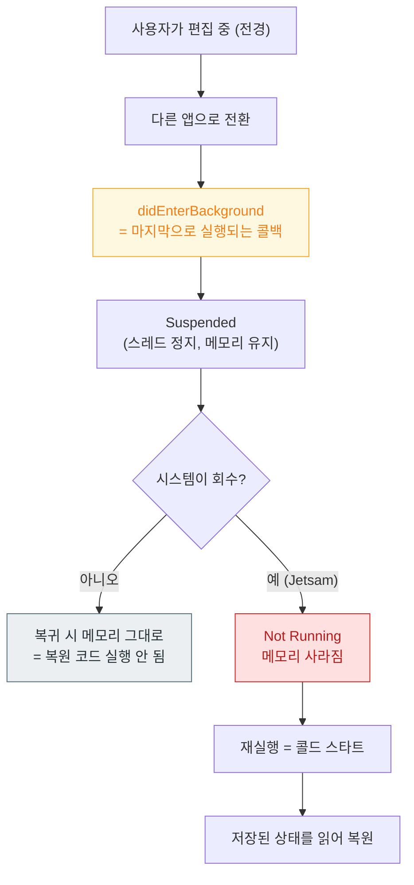

## 종료 후 편집 상태 복원

사용자가 글을 쓰다가 다른 앱으로 갔고, 그 사이 시스템이 앱을 종료했다. 돌아왔을 때 쓰던 내용이 그대로 있어야 한다. 이 요구를 만족하려면 **"정지"와 "종료"가 다르다는 것**과 **저장 시점이 언제여야 하는지**를 알아야 한다.



### 1. 핵심 사실: 종료 직전 콜백은 없다

`Background` → `Suspended` 전이에는 콜백이 없고, `Suspended` → `Not Running` 에도 없다. **[`didEnterBackground` 가 실행이 보장되는 마지막 지점](../../01_system_internals/ipc-and-process/springboard-frontboard-lifecycle.md)이다.**

따라서 저장은 다음 두 시점이어야 한다.

1. **편집 중 주기적으로** (디바운스된 자동 저장)
2. **`didEnterBackground` 에서 최종 확정**

`willTerminate` 에 의존하면 안 된다. 시스템이 정지 상태의 앱을 종료할 때는 이 콜백이 호출되지 않는다.

### 2. `didEnterBackground` 에서 할 일과 하면 안 되는 일

| 해야 할 것 | 하면 안 되는 것 |
| :--- | :--- |
| 이미 메모리에 있는 상태를 **빠르게 기록** | 동기 네트워크 요청 |
| **열린 DB 연결·파일 잠금 닫기** | 무거운 마이그레이션·직렬화 |
| 캐시 비우기 (Jetsam 밴드에서 살아남기 위해) | 사용자 입력 대기 |

> [!WARNING] 잠금을 쥔 채 정지되면 강제 종료된다
> 공유 컨테이너의 SQLite 나 파일 잠금을 쥔 채 정지되면 [`0xdead10cc`](../../01_system_internals/ipc-and-process/watchdog-termination-codes.md) 로 죽는다. 여기서 오래 걸리면 [`0x8badf00d`](../diagnostic-runbooks/02-watchdog-and-hang.md) 다. **빠르고 짧게.**

### 3. 저장 위치와 보호 클래스

| 축 | 선택 | 이유 |
| :--- | :--- | :--- |
| 디렉터리 | `Library/Application Support` | **`tmp`/`Caches` 는 시스템이 지운다** |
| 보호 클래스 | `completeUntilFirstUserAuthentication` | 백그라운드에서도 쓸 수 있어야 함 |
| 백업 | 포함 (사용자 데이터) | 기기 교체 시 이어짐 |

→ [컨테이너 정책](../../01_system_internals/storage/app-container-directory-policies.md), [Data Protection](../../01_system_internals/storage/data-protection-classes.md)

### 4. 무엇을 저장할 것인가

**화면 객체가 아니라 상태를 저장한다.** 뷰 컨트롤러나 뷰 인스턴스가 아니라, 그것을 다시 만들 수 있는 최소 데이터다.

```swift
struct EditorState: Codable {
    let documentID: UUID
    let text: String
    let cursorLocation: Int
    let scrollOffset: Double
    let navigationPath: [RouteKey]     // 어느 화면 스택이었는지
}
```

내비게이션 경로까지 저장해야 "쓰던 화면"으로 정확히 돌아간다. [딥링크 라우팅과 같은 구조](03-universal-link-to-scene-restore.md)를 재사용할 수 있다.

### 5. 복원 시점

콜드 스타트에서 복원한다. 단, **[첫 프레임을 늦추지 않도록](01-icon-tap-to-first-frame.md)** 주의한다. 복원 데이터가 크면 첫 화면을 먼저 그리고 비동기로 채운다.

### 6. 테스트 방법 — 이것이 가장 중요하다

**정지와 종료는 재현 방법이 다르다.** Xcode 로 실행한 상태에서는 실제 종료가 재현되지 않는다.

| 재현하려는 것 | 방법 |
| :--- | :--- |
| 정지 후 복귀 | 홈으로 나갔다가 돌아오기 |
| **시스템 종료 후 재실행** | Xcode 분리 → 배경으로 → **다른 앱들로 메모리 압력** → 돌아오기 |
| 사용자 강제 종료 | 앱 전환기에서 스와이프 (`0xdeadfa11`) |

**앱 전환기 스와이프로 테스트하면 안 된다.** 그것은 사용자 강제 종료이고, 시스템 회수와 동작이 다르다. 실제 시나리오는 메모리 압력에 의한 회수다.

### 검증 체크리스트

- [ ] 편집 중 홈 → 다른 앱 여러 개 실행 → 복귀 시 내용 유지
- [ ] `didEnterBackground` 실행 시간이 짧은가 (워치독 여유)
- [ ] 배경 전환 시 DB 연결이 닫히는가 (`0xdead10cc` 방지)
- [ ] 기기 잠금 상태에서도 저장이 성공하는가 (보호 클래스)
- [ ] 복원이 첫 프레임을 늦추지 않는가

### 연관 문서

- [RunningBoard assertion 이 프로세스의 실행 지속 여부를 결정한다](../../01_system_internals/ipc-and-process/runningboard-assertions.md)
- [Jetsam 은 LRU 가 아니라 우선순위 밴드로 죽일 대상을 고른다](../../01_system_internals/ipc-and-process/jetsam-memory-pressure-bands.md)
- [02-watchdog-and-hang](../diagnostic-runbooks/02-watchdog-and-hang.md)
