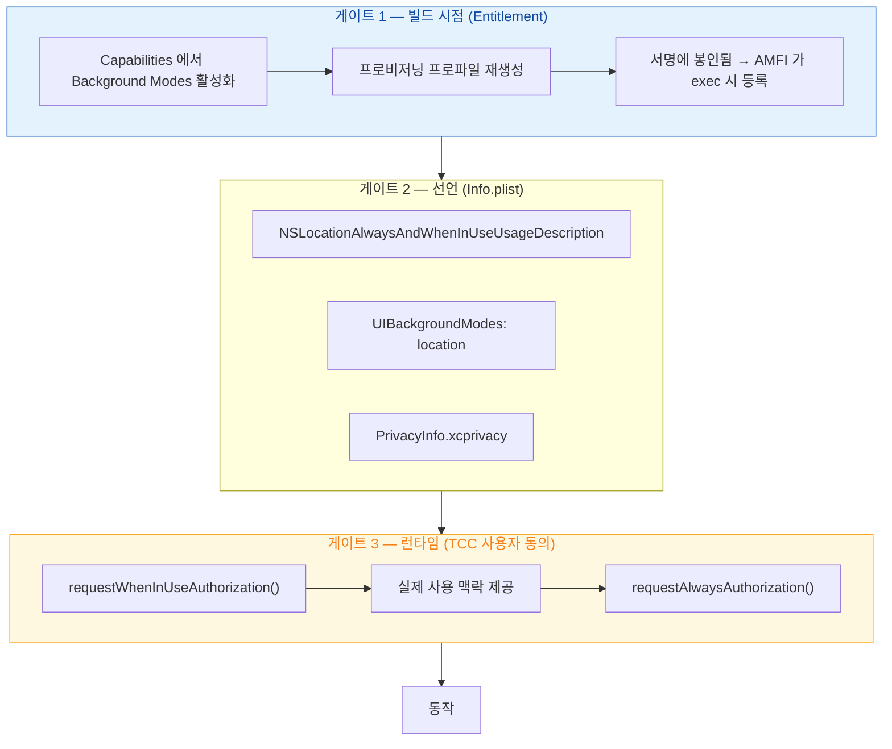

## 세 개의 권한 게이트를 순서대로 통과시키기

"백그라운드에서 위치를 추적해 서버로 보내는" 기능 하나를 예로, **서로 다른 시점에 확정되는 세 게이트**를 모두 통과시키는 과정을 따라간다. 하나라도 빠지면 실패하는데, 실패 증상이 서로 비슷해 혼동하기 쉽다.



### 게이트 1 — Entitlement (빌드 시 확정, 런타임 변경 불가)

Xcode 의 Capabilities 는 **entitlements 파일과 프로비저닝 프로파일을 맞추는 작업**이다. 실제로 서명에 들어갔는지는 산출물로 확인해야 한다.

```bash
codesign -d --entitlements :- MyApp.app
```

여기 없으면 [AMFI](../../01_system_internals/kernel-and-driver/amfi-code-signature-enforcement.md)가 그 권한을 모르고, 관련 API 는 조용히 실패한다. **런타임에 추가할 방법이 없다.**

### 게이트 2 — 선언 (Info.plist / Privacy Manifest)

| 항목 | 없으면 |
| :--- | :--- |
| `NSLocation...UsageDescription` | **프롬프트를 띄우는 순간 크래시** |
| `UIBackgroundModes` | 배경 전환 시 위치 갱신이 멈춤 |
| `PrivacyInfo.xcprivacy` | 런타임은 되지만 **심사에서 반려** |

Usage Description 문구는 심사 대상이다. "위치가 필요합니다" 같은 무의미한 문구는 반려된다. **무엇을 위해 쓰는지** 구체적으로 쓴다.

### 게이트 3 — TCC (런타임, 사용자가 언제든 회수 가능)

가장 흔한 실수는 **`always` 를 처음부터 요청하는 것**이다. 시스템은 이 흐름을 권장하지 않고 사용자도 거부하기 쉽다.

```swift
// 1단계: 앱 사용 중 권한부터
manager.requestWhenInUseAuthorization()

// 2단계: 사용자가 실제로 기능을 써서 가치를 경험한 뒤
//        그때 always 를 요청한다
func userEnabledBackgroundTracking() {
    manager.requestAlwaysAuthorization()
}

// 상태는 매번 확인한다. 회수될 수 있다.
func locationManagerDidChangeAuthorization(_ m: CLLocationManager) {
    switch m.authorizationStatus {
    case .authorizedAlways:      startBackgroundTracking()
    case .authorizedWhenInUse:   startForegroundOnlyTracking()   // 기능 축소
    case .denied, .restricted:   showSettingsGuidance()          // 코드로 되돌릴 수 없음
    case .notDetermined:         break
    @unknown default:            break
    }
}
```

또한 **정확도 낮춤**이 별도 축으로 존재한다. 권한이 `authorizedAlways` 여도 `accuracyAuthorization` 이 `reducedAccuracy` 일 수 있다. 이것은 실패가 아니므로 저정밀 좌표로 동작하는 경로가 필요하다.

### 게이트 4 (숨은 것) — 파일 보호 클래스

수집한 위치를 저장한다면, **기기가 잠긴 상태에서 백그라운드로 쓰기가 일어난다.** 목적지 파일이 `complete` 보호 클래스면 쓰기가 실패한다. → [Data Protection](../../01_system_internals/storage/data-protection-classes.md)

### 실패 증상으로 게이트 역추적하기

| 증상 | 어느 게이트 |
| :--- | :--- |
| 프롬프트를 띄우는 순간 크래시 | 2 (Usage Description 누락) |
| 프롬프트가 아예 안 뜸 | 3 (요청 코드 미호출) 또는 이미 결정된 상태 |
| 허용했는데 배경에서만 멈춤 | 1 (`UIBackgroundModes`) 또는 entitlement |
| 실기기에서만 실패 | 1 (서명/프로파일) |
| 배포 빌드에서만 실패 | 1 (개발/배포 프로파일 차이) |
| 잠금 시에만 저장 실패 | 4 (보호 클래스) |

### 검증 체크리스트

- [ ] 개발 빌드와 **배포 빌드의 `codesign -d --entitlements` 출력을 diff**
- [ ] 각 권한 상태(`notDetermined`/`denied`/`whenInUse`/`always`)에서 앱이 정상 동작
- [ ] 정확도 낮춤 상태에서 동작
- [ ] 설정에서 권한을 껐다 켜는 왕복
- [ ] 기기 잠금 상태에서 백그라운드 저장 성공

### 연관 문서

- [04-permission-granted-but-api-fails](../diagnostic-runbooks/04-permission-granted-but-api-fails.md)
- [apple-privacy-and-tcc-details](../../05_security_privacy/apple-privacy-and-tcc-details.md)
- [apple-location-and-maps](../../04_system_services/apple-location-and-maps.md)
- [TrustedBSD MAC 프레임워크가 sandbox 판정이 실제로 일어나는 지점이다](../../01_system_internals/kernel-and-driver/trustedbsd-mac-and-sandbox-enforcement.md)
