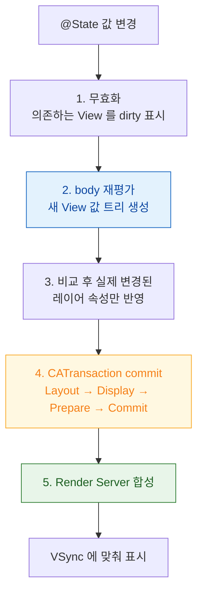

## SwiftUI 상태 변경에서 픽셀까지

`@State` 값 하나를 바꿨을 때 그것이 화면 픽셀이 되기까지 거치는 경로다. **앱 프로세스 안의 세 단계**와 **프로세스 밖의 두 단계**로 나뉘며, 끊김이 생기면 어느 쪽인지부터 나눠야 한다.



### 1~2. 무효화와 body 재평가 (SwiftUI 계층)

SwiftUI 는 상태에 **의존하는 뷰만** 무효화한다. 문제는 의존성을 넓게 잡았을 때다.

| 문제 | 결과 | 대응 |
| :--- | :--- | :--- |
| 최상위에 큰 `@Observable` 객체를 두고 모든 하위 뷰가 참조 | 관련 없는 뷰까지 전부 재평가 | 필요한 속성만 전달하거나 뷰를 분리 |
| `body` 안에서 무거운 계산 | **매 재평가마다 반복** | 계산 결과를 상태로 올리거나 캐시 |
| `body` 안에서 배열 정렬·필터 | 같음 | 미리 계산된 컬렉션 사용 |

> [!IMPORTANT] `body` 는 여러 번 호출된다
> `body` 는 순수해야 하고 값싸야 한다. 여기에 네트워크 요청이나 무거운 변환이 있으면 프레임마다 반복될 수 있다.

### 3. 비교 후 레이어 반영

SwiftUI 가 만든 것은 아직 화면이 아니라 **View 값 트리**다. 이전 트리와 비교해 실제로 달라진 부분만 레이어 속성 변경으로 옮긴다. 여기까지가 SwiftUI 의 몫이고, 이후는 UIKit/AppKit 과 완전히 같은 경로다.

### 4. CATransaction commit (여기부터 프레임 예산)

[RunLoop 종료 직전](../../01_system_internals/boot-and-runtime/runloop-drives-main-thread.md)에 [커밋이 일어난다](../../01_system_internals/graphics-and-media/layer-tree-commit-to-render-server.md). 네 단계 중 **Prepare(이미지 디코딩)** 가 가장 흔한 병목이다.

```swift
// ❌ 목록에서 원본 해상도 이미지를 그대로
Image(uiImage: UIImage(contentsOfFile: path)!)

// ✅ 표시 크기에 맞춰 다운샘플링한 것을 쓴다
Image(uiImage: downsampled(path, to: CGSize(width: 80, height: 80)))
```

### 5. Render Server 합성 (프로세스 밖)

[별도 프로세스가 합성](../../01_system_internals/graphics-and-media/render-server-composition.md)한다. 여기서 비싼 것은 코드가 아니라 **레이어의 형태**다.

- 그림자에 `shadowPath` 가 없으면 [offscreen 패스](../../01_system_internals/graphics-and-media/offscreen-rendering-cost.md)
- 반투명이 겹치면 오버드로
- `cornerRadius` + 클리핑이 셀마다 있으면 셀 수만큼 패스 추가

SwiftUI 에서도 `.shadow()`, `.clipShape()`, `.opacity()` 가 그대로 이 비용으로 이어진다.

### 어느 구간이 문제인지 나누는 법

```
1) Instruments > Animation Hitches
   → commit 구간이 긴가, render 구간이 긴가?

2) commit 이 길다  → Time Profiler
   → body 재평가가 두꺼운가? (SwiftUI 계층)
   → CGImageSource... 가 보이는가? (디코딩)

3) render 가 길다  → Core Animation 디버그 색상
   → 노란색(offscreen)? 빨간색(블렌딩)?

4) 둘 다 여유로운데 끊긴다
   → 120Hz 기기인가? 마감이 절반이다.
```

### SwiftUI 특유의 진단

```swift
// 어떤 이유로 뷰가 재평가되었는지 콘솔에 출력 (디버그 전용)
let _ = Self._printChanges()
```

`body` 안에 이 줄을 넣으면 재평가를 유발한 속성이 출력된다. **예상보다 자주 재평가되는 뷰**를 찾는 가장 빠른 방법이다.

### 검증 체크리스트

- [ ] `_printChanges()` 로 불필요한 재평가가 없는지 확인
- [ ] `body` 안에 무거운 계산이 없는가
- [ ] 목록 이미지가 표시 크기로 다운샘플링되는가
- [ ] Core Animation 디버그 색상에서 노란/빨간 영역이 셀마다 있지 않은가
- [ ] **120Hz 기기에서** 히치 시간 비율 측정

### 연관 문서

- [07-scroll-hitches](../diagnostic-runbooks/07-scroll-hitches.md)
- [apple-swiftui-deep-dive](../../02_ui_frameworks/apple-swiftui-deep-dive.md)
- [apple-graphics-and-media](../../01_system_internals/graphics-and-media/apple-graphics-and-media.md)
- [apple-observation-framework](../../01_language_concurrency/apple-observation-framework.md)
