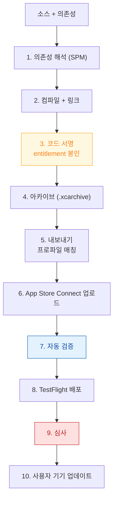

## 아카이브에서 TestFlight 배포와 업데이트까지

소스에서 사용자 기기의 업데이트된 앱까지 가는 경로다. **각 관문의 실패 시점이 다르므로**, 어디서 막혔는지가 곧 조사 범위다.



### 1~2. 의존성과 빌드

SPM 의존성은 버전 해석 결과를 `Package.resolved` 에 고정한다. **CI 에서 이 파일을 커밋하지 않으면** 빌드마다 다른 버전이 들어올 수 있다.

동적 프레임워크로 링크할지 정적으로 링크할지가 [앱 시작 시간](01-icon-tap-to-first-frame.md)에 직접 영향을 준다.

### 3. 코드 서명 — 여기가 실패의 대부분

entitlement 가 서명에 봉인된다. 앱 본체뿐 아니라 **모든 확장이 각자 서명**된다.

```bash
# 앱과 모든 확장의 entitlement 를 한 번에 출력 (CI 로그에 남길 것)
codesign -d --entitlements :- MyApp.app
for e in MyApp.app/PlugIns/*.appex; do
  echo "=== $e"; codesign -d --entitlements :- "$e"
done
```

**앱은 맞는데 확장 프로파일이 틀린 경우**가 흔하다. App Group 이나 Keychain 그룹이 앱과 확장에서 다르면 여기서 어긋난다.

### 4~5. 아카이브와 내보내기

```bash
xcodebuild archive \
  -scheme MyApp -configuration Release \
  -archivePath build/MyApp.xcarchive \
  -destination 'generic/platform=iOS'

xcodebuild -exportArchive \
  -archivePath build/MyApp.xcarchive \
  -exportOptionsPlist ExportOptions.plist \
  -exportPath build/export
```

내보내기 시 프로파일과 entitlement 가 다시 대조된다. `Provisioning profile doesn't match the entitlements` 는 이 지점 또는 3 번에서 난다. → [08 런북](../diagnostic-runbooks/08-signing-and-distribution-failure.md)

### 6~7. 업로드와 자동 검증

```bash
xcrun altool --upload-app -f build/export/MyApp.ipa \
  -t ios --apiKey "$KEY_ID" --apiIssuer "$ISSUER_ID"
# 또는
xcrun notarytool ...   # macOS 앱 공증
```

자동 검증에서 걸리는 대표 항목:

| 항목 | 내용 |
| :--- | :--- |
| 버전/빌드 번호 | 이미 업로드된 조합은 거부 |
| 필수 아이콘 | 누락 시 거부 |
| **Privacy Manifest** | Required Reason API 사유 미기재 |
| 지원 기기/아키텍처 | Info.plist 선언 불일치 |
| 암호화 수출 규정 | `ITSAppUsesNonExemptEncryption` 미선언 시 경고 |

### 8. TestFlight — 여기서만 잡히는 문제들

**개발 빌드에서 안 잡히는 것들이 여기서 잡힌다.** 반드시 이 단계를 거친다.

- [APNs 프로덕션 환경 토큰](04-apns-to-notification-display-and-tap.md) 동작
- 배포 프로파일로 서명된 entitlement 동작
- 릴리스 빌드 최적화(`-O`)에서만 나타나는 동작 차이
- 실제 다운로드 크기 (App Store Connect 에서 확인)

### 9~10. 심사와 업데이트 배포

심사에서 흔한 반려: 권한 문구 부적절, 앱 진입 즉시 권한 요청, 결제 정책 위반, 기능 미완성, ATT 미구현.

배포 후에는 **단계적 출시**로 문제 발견 시 중단할 수 있다. 업데이트가 사용자 기기에 적용된 뒤에는:

- **마이그레이션이 실제로 도는지**를 이전 버전 데이터로 확인한다
- Xcode Organizer 에서 새 버전의 크래시·히치·시작 시간을 이전 버전과 비교한다

### 검증 체크리스트

- [ ] `Package.resolved` 가 커밋되어 있는가
- [ ] 앱과 **모든 확장**의 entitlement 를 CI 로그에 출력하는가
- [ ] TestFlight 빌드로 푸시·권한·서명 경로를 확인했는가
- [ ] 이전 버전에서 업데이트했을 때 데이터 마이그레이션이 성공하는가
- [ ] 단계적 출시로 시작했는가
- [ ] 배포 후 Organizer 지표를 이전 버전과 비교했는가

### 연관 문서

- [08-signing-and-distribution-failure](../diagnostic-runbooks/08-signing-and-distribution-failure.md)
- [apple-packaging-deployment-map](../../08_packaging_deployment/apple-packaging-deployment-map.md)
- [apple-build-and-distribution](../../08_packaging_deployment/apple-build-and-distribution.md)
- [apple-distribution-and-policies](../../08_packaging_deployment/apple-distribution-and-policies.md)
