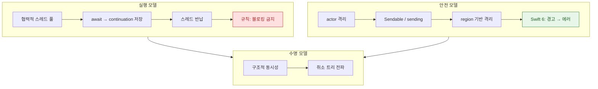

## Swift Concurrency 는 스레드를 늘리는 대신 continuation 을 저장하고 actor 격리로 데이터 경합을 컴파일 타임에 막는다

Swift Concurrency 를 `async/await` 문법으로만 이해하면 실무에서 막힌다. 이 모델은 서로 맞물린 **두 개의 결정**으로 이루어져 있고, 거의 모든 실무 문제가 그 둘 중 하나에서 나온다.

1. **실행 모델**: 스레드를 늘리지 않는다. 대신 `await` 에서 상태를 힙에 저장하고 스레드를 반납한다. → 그래서 **블로킹이 금지**된다.
2. **안전 모델**: 공유 가변 상태를 actor 로 격리하고, 도메인을 넘는 값에 `Sendable` 을 요구한다. → 그래서 **경합이 컴파일 에러**가 된다.

### 정본 노트

**실행 모델 — 왜 블로킹하면 안 되는가**

- [협력적 스레드 풀은 코어 수만큼만 스레드를 유지해 thread explosion 을 구조적으로 막는다](concurrency/cooperative-thread-pool.md) - GCD 와의 근본 차이, 금지되는 API 목록.
- [await 는 스레드를 막지 않고 continuation 을 힙에 저장한다](concurrency/await-suspension-stores-continuation.md) - 중단 지점의 세 가지 귀결과 콜백 API 래핑.

**안전 모델 — 왜 컴파일이 안 되는가**

- [actor 격리는 가변 상태 접근을 직렬화해 데이터 경합을 컴파일 타임에 차단한다](concurrency/actor-isolation-serializes-state-access.md) - actor 가 부적절한 경우까지.
- [actor 재진입성은 await 경계에서 불변식을 깬다](concurrency/actor-reentrancy-breaks-invariants.md) - **중복 요청 버그와 두 가지 해결 패턴.**
- [Sendable 은 타입 수준 보장이고 sending 은 값 수준 소유권 이전이다](concurrency/sendable-vs-sending.md) - 판단 순서 흐름도.
- [region 기반 격리는 non-Sendable 값의 안전한 전송을 컴파일러가 증명한다](concurrency/region-based-isolation.md) - 영역 병합 때문에 나는 의외의 에러.
- [@MainActor 는 UI 상태를 메인 스레드에 묶고 nonisolated 가 그 탈출구다](concurrency/mainactor-and-nonisolated.md) - 격리 상속 규칙.

**수명 모델**

- [구조적 동시성은 작업 수명을 스코프에 묶고 취소를 트리로 전파한다](concurrency/structured-concurrency-task-tree.md) - `async let` / `TaskGroup` / 비구조적 `Task` 의 구분, 동시 실행 수 제한.

**전환**

- [Swift 6 마이그레이션은 경고를 먼저 켜서 모듈 단위로 단계적으로 한다](concurrency/swift6-migration-path.md) - 효과 순 작업 순서.

### 문제에서 시작하기

| 증상 | 어느 노트로 |
| :--- | :--- |
| 앱이 멈추거나 데드락이 난다 | [협력적 스레드 풀](concurrency/cooperative-thread-pool.md) — 블로킹 코드를 찾는다 |
| 같은 요청이 중복해서 나간다 | [actor 재진입성](concurrency/actor-reentrancy-breaks-invariants.md) |
| `Sendable` 경고가 쏟아진다 | [Sendable vs sending](concurrency/sendable-vs-sending.md) → [마이그레이션](concurrency/swift6-migration-path.md) |
| 넘긴 적 없는 값에서 에러가 난다 | [region 격리](concurrency/region-based-isolation.md) — 영역이 병합됐다 |
| 화면을 닫아도 요청이 계속 돈다 | [구조적 동시성](concurrency/structured-concurrency-task-tree.md) — 취소가 전파되지 않는다 |
| UI 갱신이 컴파일 에러다 | [@MainActor](concurrency/mainactor-and-nonisolated.md) |

### ⚡️ Kotlin Coroutines (Android) vs Swift Concurrency

| 특징 | [Kotlin Coroutines](../../android/02_app_framework/data/async-flow/coroutines/kotlin-coroutines.md) | Swift Concurrency |
| :--- | :--- | :--- |
| **핵심 키워드** | `suspend`, `launch`, `async` | `async`, `await`, `Task` |
| **스레드 전환** | `withContext(Dispatchers.IO)` (명시적) | actor 격리 기반 (자동) |
| **데이터 경합** | 개발자 책임 | **컴파일 타임 차단** (Sendable, actor) |
| **비동기 스트림** | `Flow` (Cold), `StateFlow` (Hot) | `AsyncSequence`, `AsyncStream` |
| **취소 전파** | Job 계층 | Task 트리 |
| **블로킹 허용** | `Dispatchers.IO` 는 블로킹 전제 | **협력적 풀에서 금지** |

마지막 줄이 가장 중요한 차이다. Kotlin 은 블로킹 작업을 위한 전용 디스패처를 두지만, **Swift 는 블로킹 자체를 허용하지 않는다.**

>[!TIP] Android 개발자를 위한 대응표
> - `viewModelScope.launch` ≃ `Task { }` (`@MainActor` 컨텍스트에서)
> - `withContext(Dispatchers.IO)` ≃ `nonisolated` 메서드 또는 별도 actor
> - `Flow.collect` ≃ `for await in sequence`
> - `Mutex` / `synchronized` ≃ `actor`
>상세 비교는 [android-coroutines-flow](../../android/02_app_framework/data/async-flow/android-coroutines-flow.md) 참고.

### 연관 문서

- [apple-gcd-deep-dive](apple-gcd-deep-dive.md) - 기존 GCD 와의 차이
- [apple-operation-queue](apple-operation-queue.md) - Operation 기반 의존성 관리
- [apple-observation-framework](apple-observation-framework.md) - `@Observable` 과 actor 의 결합
- [apple-combine-framework](../03_data_networking/apple-combine-framework.md) - AsyncSequence 로의 마이그레이션
- [apple-security-swift6-safety](../05_security_privacy/apple-security-swift6-safety.md) - 보안 관점의 메모리 안전성
- [structured-concurrency](../../../computer-science/structured-concurrency.md) - 언어 독립적 개념

공식 문서: [Concurrency — The Swift Programming Language](https://docs.swift.org/swift-book/documentation/the-swift-programming-language/concurrency/) · [WWDC 2021: Swift concurrency — Behind the scenes](https://developer.apple.com/videos/play/wwdc2021/10254/)
