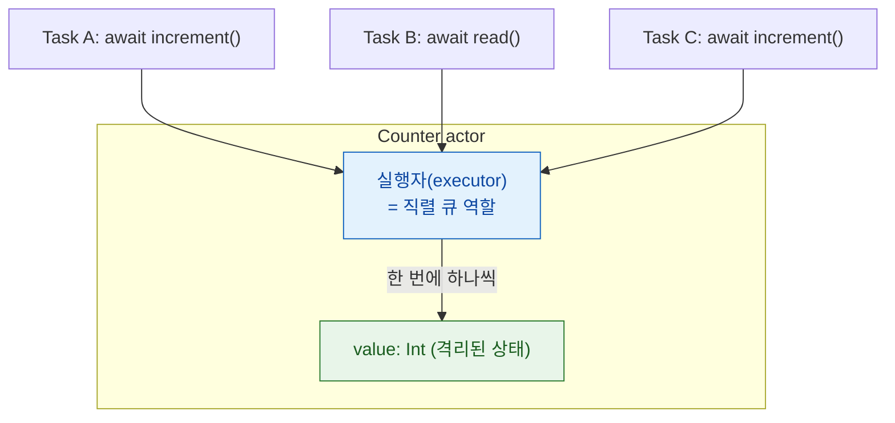

## actor 격리는 가변 상태 접근을 직렬화해 데이터 경합을 컴파일 타임에 차단한다

### 개념 (What)

`actor` 는 자기 가변 상태에 **한 번에 하나의 작업만 접근하도록 컴파일러가 강제**하는 참조 타입이다. 락을 개발자가 거는 것이 아니라, **격리 규칙을 어기는 코드가 컴파일되지 않는다.**

```swift
actor Counter {
    private var value = 0        // actor 로 격리된 상태
    func increment() { value += 1 }
    func read() -> Int { value }
}

let c = Counter()
await c.increment()              // 외부에서는 반드시 await
// c.value                       // ❌ 컴파일 에러: 격리 위반
```

### 왜 필요한가 (Why)

락 기반 동기화의 문제는 **잊어버려도 컴파일이 된다**는 것이다. 락을 걸어야 할 곳 하나를 빠뜨리면 재현하기 어려운 데이터 경합이 된다. actor 는 이것을 타입 시스템의 문제로 바꾼다.

| 방식 | 위반 시점 | 발견 방법 |
| :--- | :--- | :--- |
| 수동 락 | 런타임 | 운이 좋으면 재현, 대개는 프로덕션 |
| `DispatchQueue` 직렬 큐 | 런타임 | 같음 |
| **actor** | **컴파일 타임** | **빌드 실패** |

### 내부 메커니즘 (How)



1. **실행자(executor)**: 각 actor 는 자기 작업을 직렬화하는 실행자를 갖는다. 개념적으로 직렬 큐지만, 스레드를 점유하지 않고 [협력적 풀](cooperative-thread-pool.md) 위에서 돈다.
2. **외부 접근은 비동기**: actor 밖에서 격리된 멤버에 접근하려면 `await` 가 필요하다. 그 지점에서 작업이 실행자 큐에 들어간다.
3. **내부 접근은 동기**: actor 자기 메서드 안에서는 이미 격리 안이므로 `await` 없이 직접 접근한다.

### `nonisolated` — 격리에서 빼기

상태를 건드리지 않는 멤버는 격리할 필요가 없다. `nonisolated` 를 붙이면 `await` 없이 호출할 수 있다.

```swift
actor ImageCache {
    private var cache: [URL: Data] = [:]

    // 불변 상태만 쓰므로 격리 불필요
    nonisolated let identifier: String

    nonisolated func cacheKey(for url: URL) -> String {
        url.absoluteString          // self.cache 접근 불가
    }

    func store(_ data: Data, for url: URL) { cache[url] = data }

    init(identifier: String) { self.identifier = identifier }
}
```

`nonisolated` 멤버에서 격리된 상태에 접근하면 컴파일 에러다. 이것이 안전성의 근거다.

### actor 가 만능이 아닌 경우

| 상황 | actor 가 부적절한 이유 | 대안 |
| :--- | :--- | :--- |
| 고빈도 짧은 접근 | 매 접근이 비동기 → 오버헤드 | `OSAllocatedUnfairLock` |
| UI 상태 | 메인 스레드에 있어야 함 | [`@MainActor`](mainactor-and-nonisolated.md) |
| 순수 값 계산 | 공유 상태가 없음 | 그냥 `struct` + `Sendable` |
| 불변 데이터 | 경합 자체가 불가능 | `let` + `Sendable` |

>[!IMPORTANT] actor 는 데드락을 막지만 불변식은 못 지킨다
>actor 는 재진입 가능하다. `await` 사이에 다른 작업이 들어올 수 있으므로, **여러 단계에 걸친 불변식은 여전히 깨질 수 있다.** → [재진입성](actor-reentrancy-breaks-invariants.md)

### 연관 문서

- [actor 재진입성은 await 경계에서 불변식을 깬다](actor-reentrancy-breaks-invariants.md)
- [@MainActor 는 UI 상태를 메인 스레드에 묶고 nonisolated 가 그 탈출구다](mainactor-and-nonisolated.md)
- [Sendable 은 타입 수준 보장이고 sending 은 값 수준 소유권 이전이다](sendable-vs-sending.md)
- [협력적 스레드 풀은 코어 수만큼만 스레드를 유지해 thread explosion 을 구조적으로 막는다](cooperative-thread-pool.md)

공식 문서: [Actors](https://docs.swift.org/swift-book/documentation/the-swift-programming-language/concurrency/#Actors)
