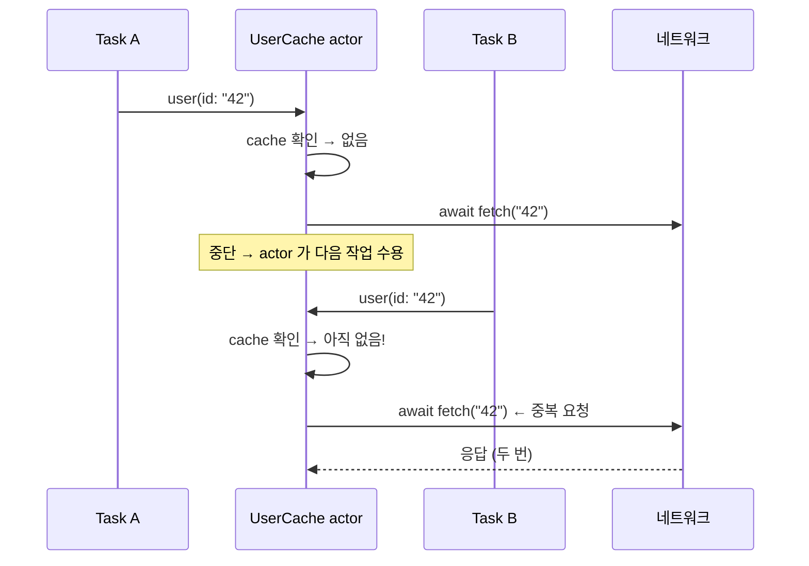

## actor 재진입성은 await 경계에서 불변식을 깬다

### 개념 (What)

actor 는 한 번에 하나의 작업만 상태에 접근하게 한다. 그런데 그 작업이 **`await` 로 중단되면 actor 는 다음 작업을 받아들인다.** 이것이 **재진입성(reentrancy)** 이다.

즉 actor 가 보장하는 것은 **"한 문장 단위의 원자성"이지 "메서드 전체의 원자성"이 아니다.**

### 왜 필요한가 (Why)

재진입성 자체는 의도된 설계다. 만약 actor 가 중단 중에도 다른 작업을 막는다면, 두 actor 가 서로를 기다릴 때 **데드락**이 발생한다. 재진입성은 그 데드락을 원리적으로 없앤다.

대가는 명확하다 — **`await` 앞뒤로 상태가 바뀌었을 수 있다.**

### 전형적인 버그: 중복 요청

```swift
actor UserCache {
    private var cache: [String: User] = [:]

    func user(id: String) async -> User {
        if let cached = cache[id] { return cached }

        // ⚠️ 여기서 중단되면 다른 Task 가 같은 id 로 진입할 수 있다
        let fetched = await network.fetchUser(id)

        cache[id] = fetched
        return fetched
    }
}
```

같은 `id` 로 동시에 두 번 호출하면 **네트워크 요청이 두 번 나간다.** 캐시 검사와 저장 사이에 중단 지점이 있기 때문이다.



### 해결 패턴 1 — 진행 중인 작업을 캐시한다

값이 아니라 **`Task` 자체**를 저장하면, 두 번째 호출이 같은 작업을 기다린다.

```swift
actor UserCache {
    private enum Entry { case inProgress(Task<User, Error>), ready(User) }
    private var entries: [String: Entry] = [:]

    func user(id: String) async throws -> User {
        if let entry = entries[id] {
            switch entry {
            case .ready(let u):        return u
            case .inProgress(let t):   return try await t.value   // 같은 작업을 공유
            }
        }
        let task = Task { try await network.fetchUser(id) }
        entries[id] = .inProgress(task)     // 중단 전에 등록하는 것이 핵심
        do {
            let user = try await task.value
            entries[id] = .ready(user)
            return user
        } catch {
            entries[id] = nil
            throw error
        }
    }
}
```

핵심은 **중단이 일어나기 전에 "작업 중"임을 상태에 기록**하는 것이다.

### 해결 패턴 2 — 재개 후 다시 검사한다

```swift
func user(id: String) async -> User {
    if let cached = cache[id] { return cached }
    let fetched = await network.fetchUser(id)

    // 재개 후 다시 확인 — 그 사이 다른 작업이 채웠을 수 있다
    if let cached = cache[id] { return cached }
    cache[id] = fetched
    return fetched
}
```

중복 요청 자체는 막지 못하지만 **상태 불일치는 막는다.** 요청 비용이 낮으면 이것으로 충분하다.

### 점검 규칙

actor 메서드를 작성할 때 **모든 `await` 에 다음을 자문한다.**

1. 이 중단 사이에 다른 작업이 같은 상태를 바꿀 수 있는가?
2. 바꿨다면 재개 후 내 로직이 여전히 옳은가?
3. `await` 앞에서 읽은 값을 뒤에서 그대로 쓰고 있는가?

세 번째가 특히 위험하다. **`await` 를 건너 값을 들고 가는 코드**를 찾는 것이 리뷰 포인트다.

### 연관 문서

- [actor 격리는 가변 상태 접근을 직렬화해 데이터 경합을 컴파일 타임에 차단한다](actor-isolation-serializes-state-access.md)
- [await 는 스레드를 막지 않고 continuation 을 힙에 저장한다](await-suspension-stores-continuation.md)
- [구조적 동시성은 작업 수명을 스코프에 묶는다](structured-concurrency-task-tree.md)

공식 문서: [SE-0306: Actors](https://github.com/swiftlang/swift-evolution/blob/main/proposals/0306-actors.md)
