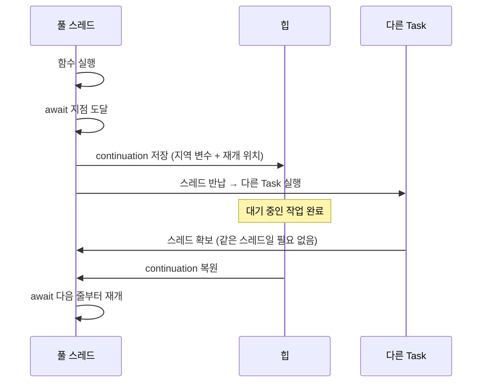

## await 는 스레드를 막지 않고 continuation 을 힙에 저장한 뒤 스레드를 반납한다

### 개념 (What)

`await` 는 "기다린다"가 아니라 **"여기서 중단될 수 있다"** 는 표시다. 실제로 중단이 일어나면 컴파일러가 만든 **continuation** — 그 지점 이후를 다시 시작하는 데 필요한 상태 — 이 힙에 저장되고, 스레드는 반납되어 다른 작업을 집는다.

즉 `await` 지점은 **스레드가 바뀔 수 있는 지점**이며, 동시에 **다른 코드가 끼어들 수 있는 지점**이다.

### 왜 필요한가 (Why)

1. **비동기 함수의 스택 프레임이 스택에 없다**: 일반 함수는 스택 프레임을 쓰지만, 비동기 함수는 중단을 넘어 살아남아야 하므로 프레임이 **힙에 할당**된다. 이것이 async 함수 호출에 약간의 비용이 있는 이유다.
2. **`await` 전후로 상태가 바뀔 수 있다**: 중단 사이에 다른 코드가 같은 상태를 건드릴 수 있다. `await` 앞에서 읽은 값을 뒤에서 그대로 믿으면 안 된다.
3. **취소 확인 지점**: 취소는 강제 중단이 아니라 플래그다. `await` 지점에서 확인되어야 전파된다.

### 내부 메커니즘 (How)



컴파일러는 async 함수를 **중단 지점마다 나뉜 상태 기계**로 변환한다. 각 조각은 독립적으로 스케줄될 수 있다.

### 실무적 귀결 세 가지

**1. `await` 앞뒤의 스레드가 다를 수 있다**

```swift
func load() async {
    print(Thread.current)   // 스레드 A
    let data = await fetch()
    print(Thread.current)   // 스레드 B 일 수 있다
}
```

스레드 로컬 저장소를 쓰면 안 되는 이유다. 대신 `@TaskLocal` 을 쓴다.

**2. `await` 뒤에서 상태를 다시 확인한다**

```swift
// ❌ await 앞의 검사가 뒤에서도 유효하다고 가정
guard !items.isEmpty else { return }
let result = await process()
items.removeFirst()          // 그 사이 비었을 수 있다

// ✅ 재개 후 다시 확인
let result = await process()
guard !items.isEmpty else { return }
items.removeFirst()
```

이것이 [actor 재진입성 문제](actor-reentrancy-breaks-invariants.md) 의 뿌리다.

**3. 취소는 `await` 지점에서 확인된다**

```swift
for item in items {
    try Task.checkCancellation()      // 명시적 확인
    await process(item)               // await 지점에서도 취소 전파
}
```

중단 지점이 전혀 없는 긴 CPU 루프는 취소되지 않는다. 주기적으로 `Task.checkCancellation()` 이나 `await Task.yield()` 를 넣는다.

### 콜백 API 를 감쌀 때

기존 콜백 기반 API 를 async 로 바꾸려면 continuation 을 직접 만든다.

```swift
func loadLegacy() async throws -> Data {
    try await withCheckedThrowingContinuation { continuation in
        legacyAPI { data, error in
            if let error { continuation.resume(throwing: error) }
            else { continuation.resume(returning: data!) }
        }
    }
}
```

>[!WARNING] resume 은 정확히 한 번
>두 번 호출하면 크래시, 한 번도 호출하지 않으면 **영원히 중단된 채 누수**된다. `withCheckedContinuation` 은 이 위반을 런타임에 잡아 주므로 개발 중에는 `unsafe` 버전 대신 이것을 쓴다.

### 연관 문서

- [협력적 스레드 풀은 코어 수만큼만 스레드를 유지해 thread explosion 을 구조적으로 막는다](cooperative-thread-pool.md)
- [actor 재진입성은 await 경계에서 불변식을 깬다](actor-reentrancy-breaks-invariants.md)
- [구조적 동시성은 작업 수명을 스코프에 묶는다](structured-concurrency-task-tree.md)

공식 문서: [Concurrency — The Swift Programming Language](https://docs.swift.org/swift-book/documentation/the-swift-programming-language/concurrency/)
