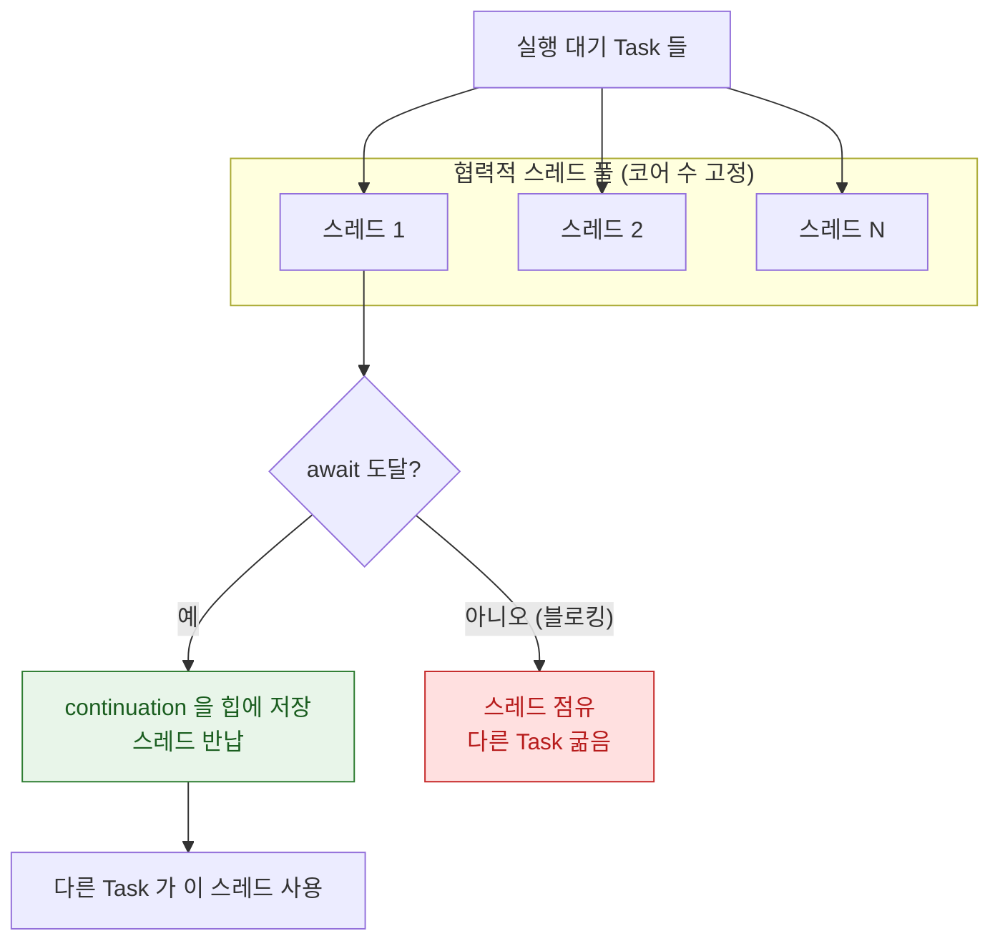

## 협력적 스레드 풀은 코어 수만큼만 스레드를 유지해 thread explosion 을 구조적으로 막는다

### 개념 (What)

Swift Concurrency 의 작업은 **CPU 코어 수에 맞춘 고정 크기의 스레드 풀**에서 실행된다. 아무리 많은 `Task` 를 만들어도 OS 스레드 수는 늘지 않는다. "협력적(cooperative)"이라는 이름은 **각 작업이 자발적으로 스레드를 양보한다**는 전제에서 왔다.

### 왜 필요한가 (Why)

GCD 는 큐에 넣은 작업이 블로킹되면 **다른 작업을 처리하려고 새 스레드를 만든다.** 블로킹 작업이 많으면 스레드가 수십·수백 개로 늘어나고(thread explosion), 각각 스택 메모리를 차지하며 컨텍스트 스위칭 비용이 폭증한다.

```swift
// GCD: 이 코드는 스레드를 수십 개 만들 수 있다
for _ in 0..<100 {
    DispatchQueue.global().async {
        semaphore.wait()          // 블로킹 → 풀이 새 스레드를 만든다
    }
}
```

협력적 풀은 이 문제를 **스레드를 늘리지 않는 것으로** 해결한다. 대신 규칙이 하나 생긴다.

### 규칙: 절대 블로킹하지 않는다

풀의 스레드는 유한하다. 그 위에서 블로킹하면 **다른 모든 작업이 굶는다.** 최악의 경우 풀 전체가 막혀 데드락이 된다.

| 금지 | 대체 |
| :--- | :--- |
| `DispatchSemaphore.wait()` | `await` |
| `Thread.sleep()` | `try await Task.sleep(for:)` |
| 동기 파일/네트워크 I/O | async API |
| `DispatchQueue.sync` | `await` 또는 actor |

> [!WARNING] 가장 위험한 패턴
> "async 함수를 동기처럼 쓰려고" 세마포어로 감싸는 코드가 협력적 풀에서 실행되면 데드락 가능성이 실재한다. 이 패턴은 GCD 시절에는 낭비였지만 Swift Concurrency 에서는 **버그**다.

### 내부 메커니즘 (How)



핵심은 `await` 지점이다. 작업이 `await` 를 만나면 **자기 상태를 힙에 저장하고 스레드를 놓아준다.** 스레드는 즉시 다른 작업을 집는다. 이것이 [continuation 메커니즘](await-suspension-stores-continuation.md)이다.

### QoS 와의 관계

풀의 스레드는 [Mach 스케줄링 우선순위](../../01_system_internals/kernel-and-driver/xnu-mach-bsd-split.md)를 갖는다. `Task(priority:)` 로 지정한 우선순위가 여기에 반영되며, 높은 우선순위 작업이 낮은 것을 기다릴 때 우선순위 상속이 적용된다.

### 관찰 가능한 증거

- **Instruments의 Swift Concurrency 템플릿**: 실행 중인 Task 수, 스레드 점유, 각 Task 의 상태 전이를 보여준다. 스레드 수가 코어 수를 크게 넘으면 블로킹 코드가 섞여 있다는 신호다.
- **Xcode 의 Thread Performance Checker**: 협력적 풀에서의 블로킹을 런타임에 경고한다. 스킴 옵션에서 켜 둔다.

### 연관 문서

- [await 는 스레드를 막지 않고 continuation 을 힙에 저장한다](await-suspension-stores-continuation.md)
- [actor 격리는 가변 상태 접근을 직렬화한다](actor-isolation-serializes-state-access.md)
- [XNU 는 Mach 가 자원을, BSD 가 인터페이스를 맡는 분업 구조다](../../01_system_internals/kernel-and-driver/xnu-mach-bsd-split.md)
- [apple-gcd-deep-dive](../apple-gcd-deep-dive.md) - GCD 와의 차이

공식 문서: [WWDC 2021: Swift concurrency — Behind the scenes](https://developer.apple.com/videos/play/wwdc2021/10254/)
