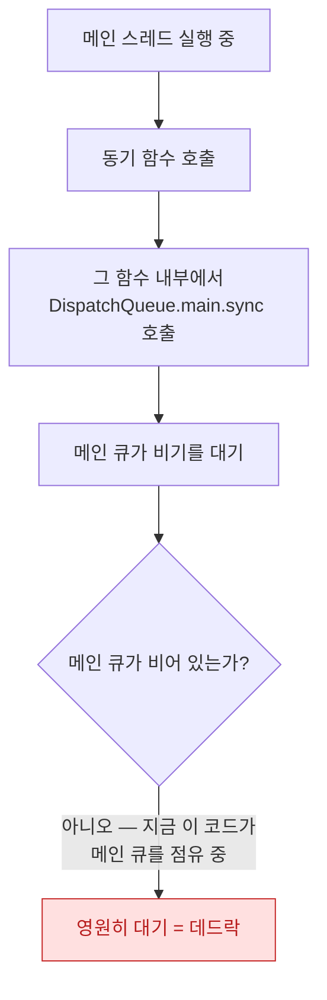

## 현재 큐에 sync 를 걸면 그 큐가 자기 자신을 기다려 즉시 데드락이 된다

### 개념 (What)

`DispatchQueue.sync` 는 **작업이 끝날 때까지 현재 스레드를 블로킹**한다. 문제는 그 대상이 **지금 실행 중인 바로 그 큐**일 때 생긴다.

```swift
// ❌ 메인 스레드에서 메인 큐에 sync — 즉시 데드락
DispatchQueue.main.sync {
    print("절대 실행되지 않는다")
}
```

메인 스레드는 이 작업이 끝나기를 **기다리며 블로킹**된다. 그런데 그 작업은 **메인 큐(=지금 블로킹된 그 스레드)에서 실행되기를 기다리고** 있다. 서로가 서로를 기다리는 순환이 만들어지고, 둘 다 영원히 풀리지 않는다.

### 왜 필요한가 (Why)

이 패턴은 직접 코드에 `DispatchQueue.main.sync` 라고 쓰지 않아도, **간접적으로** 발생하는 경우가 훨씬 위험하다.



**서드파티 라이브러리 안에서 이런 코드를 만나면** 호출자는 자기가 메인 스레드에서 불렀다는 사실조차 모른 채 앱이 멈춘다. 이것이 [워치독 종료](../../01_system_internals/ipc-and-process/watchdog-termination-codes.md)나 "가끔 멈춘다"는 재현 어려운 버그의 흔한 원인이다.

### 임의의 커스텀 큐에서도 같은 규칙이다

```swift
let queue = DispatchQueue(label: "com.example.serial")

queue.async {
    // ❌ 지금 이미 이 큐 위에서 실행 중인데, 같은 큐에 다시 sync
    queue.sync {
        print("데드락")
    }
}
```

**직렬(serial) 큐**에서 특히 위험하다. 직렬 큐는 한 번에 하나의 작업만 실행하므로, 그 작업 안에서 같은 큐에 `sync` 를 걸면 **다음 작업 자리가 영원히 나지 않는다.** 동시(concurrent) 큐라도 마찬가지로 재귀적 `sync` 는 위험할 수 있다.

### 왜 필요했는가 — barrier 패턴과의 충돌

[GCD 의 reader-writer 패턴](../apple-gcd-deep-dive.md)은 읽기에 `sync`, 쓰기에 `async(flags: .barrier)` 를 쓴다. 이 패턴 자체는 안전하지만, **읽기 메서드를 메인 스레드에서 호출하면서 그 큐가 우연히 메인 큐였다면** 위 데드락에 그대로 걸린다.

```swift
final class Cache {
    private let queue = DispatchQueue(label: "cache", attributes: .concurrent)
    func get(_ key: String) -> Any? {
        queue.sync { data[key] }   // 이 queue 가 절대 .main 이 아니어야 안전
    }
}
```

**전용 커스텀 큐를 쓰고, 절대 `.main` 이나 호출자가 이미 있을 수 있는 큐를 대상으로 하지 않는 것**이 이 패턴의 안전 조건이다.

### 안전한 대안

```swift
// ✅ async 로 바꾸면 블로킹이 없다 — 결과가 필요하면 completion 이나 async/await 로
DispatchQueue.main.async {
    updateUI()
}

// ✅ 이미 메인 스레드인지 확인하고 분기
func updateUI() {
    if Thread.isMainThread {
        doUpdate()
    } else {
        DispatchQueue.main.async { self.doUpdate() }
    }
}

// ✅ Swift Concurrency 로 전환 — @MainActor 가 이 문제 자체를 없앤다
@MainActor
func updateUI() {
    // 이미 메인 액터 컨텍스트이므로 sync/async 구분이 필요 없다
}
```

[Swift Concurrency 의 `@MainActor`](mainactor-and-nonisolated.md)는 "지금 메인인지 확인하고 분기"하는 코드 자체를 컴파일러 보장으로 대체한다. GCD 기반 코드에서 이 데드락을 완전히 없애는 가장 확실한 방법은 마이그레이션이다.

### 관찰 가능한 증거

**Xcode 의 Thread Performance Checker** (Diagnostics 에서 상시 켜 둘 것)가 이 패턴을 정적으로 경고한다.

```
# 이미 걸린 데드락을 진단할 때 — 스택 최상단이 이 패턴을 보여준다
po Thread.current
# 디버거로 일시 정지 후 스택 확인: 두 프레임에 같은 큐로의 대기가 겹쳐 보인다
```

**spindump/sample** 로 프로세스를 스냅샷하면, 메인 스레드가 `dispatch_sync` 안에서 멈춰 있고 대상 큐가 자기 자신인 것이 스택에 그대로 드러난다.

### 연관 문서

- [협력적 스레드 풀은 코어 수만큼만 스레드를 유지해 thread explosion 을 구조적으로 막는다](cooperative-thread-pool.md)
- [@MainActor 는 UI 상태를 메인 스레드에 묶고 nonisolated 가 그 탈출구다](mainactor-and-nonisolated.md)
- [워치독 종료는 예외 코드로 원인 구간을 구분할 수 있다](../../01_system_internals/ipc-and-process/watchdog-termination-codes.md)
- [02-watchdog-and-hang](../../00_foundations/diagnostic-runbooks/02-watchdog-and-hang.md)

공식 문서: [Dispatch](https://developer.apple.com/documentation/dispatch)
