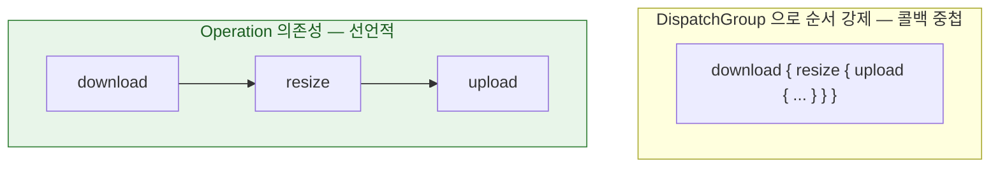

## Operation 의 의존성 그래프는 DispatchGroup 으로 표현할 수 없는 순서 제약을 표현한다

### 개념 (What)

`DispatchGroup` 은 "이 작업들이 **다 끝나면**" 만 표현한다. **"이 작업이 저 작업보다 먼저 끝나야 한다"** 는 순서 제약은 표현하지 못한다. `Operation` 은 이것을 `addDependency` 로 명시적 그래프로 만든다.

```swift
let download = BlockOperation { downloadImage() }
let resize   = BlockOperation { resizeImage() }
let upload   = BlockOperation { uploadImage() }

resize.addDependency(download)   // download 가 끝나야 resize 시작
upload.addDependency(resize)     // resize 가 끝나야 upload 시작

queue.addOperations([download, resize, upload], waitUntilFinished: false)
```

### 왜 필요한가 (Why)

`DispatchGroup` 으로 같은 것을 하려면 **중첩된 completion 콜백**이 필요하고, 순서가 하나만 늘어도 중첩이 깊어진다.



`Operation` 그래프는 **선언한 순서가 곧 실행 순서**라서 코드를 읽는 것만으로 파이프라인이 보인다. 콜백 중첩 버전은 순서를 코드 실행 흐름을 따라가야만 알 수 있다.

### 취소가 그래프를 타고 전파된다

```swift
resize.cancel()
// download 는 이미 끝났으므로 취소 대상 아님
// resize 는 취소됨
// upload 는 resize 에 의존하므로 resize 가 취소되면 시작되지 않음
```

`Operation` 의 `isCancelled` 플래그는 [`Task` 의 취소처럼 협력적](structured-concurrency-task-tree.md)이다 — 직접 확인해서 조기 종료해야 한다.

```swift
final class ResizeOperation: Operation {
    override func main() {
        guard !isCancelled else { return }   // 시작 전 확인
        for step in steps {
            guard !isCancelled else { return }   // 중간에도 확인
            process(step)
        }
    }
}
```

### 병렬 수와 우선순위를 큐가 직접 관리한다

```swift
let queue = OperationQueue()
queue.maxConcurrentOperationCount = 3   // 동시 실행 개수를 큐가 강제
queue.qualityOfService = .userInitiated

let op = BlockOperation { heavyWork() }
op.queuePriority = .high                // 큐 안에서의 우선순위
queue.addOperation(op)
```

`DispatchQueue` 로 동시 실행 수를 제한하려면 [세마포어로 스레드를 블로킹](dispatch-sync-on-current-queue-deadlocks.md)해야 했지만, `OperationQueue` 는 `maxConcurrentOperationCount` 로 **블로킹 없이** 제한한다.

### KVO 로 상태를 관찰할 수 있다

```swift
let observation = operation.observe(\.isFinished) { op, _ in
    if op.isFinished { updateProgress() }
}
```

`isReady`, `isExecuting`, `isFinished`, `isCancelled` 가 모두 KVO 로 노출되어, UI 진행률 표시와 자연스럽게 연결된다.

### 커스텀 비동기 Operation 의 함정

기본 `Operation` 은 `main()` 이 반환하면 완료로 간주한다. **내부에서 비동기 작업(네트워크 등)을 시작하고 그것이 끝나기 전에 `main()` 이 반환**하면, 큐는 이미 완료로 착각해 다음 작업을 진행한다.

```swift
// ❌ 비동기 콜백을 기다리지 않고 main() 이 즉시 반환
override func main() {
    api.fetch { result in self.handle(result) }   // main() 은 이미 끝났다고 간주됨
}

// ✅ isFinished 를 KVO 로 직접 관리하는 비동기 Operation
final class AsyncOperation: Operation, @unchecked Sendable {
    private var _isFinished = false
    override var isFinished: Bool {
        get { _isFinished }
        set { willChangeValue(for: \.isFinished); _isFinished = newValue; didChangeValue(for: \.isFinished) }
    }
    override func main() {
        api.fetch { [weak self] result in
            self?.handle(result)
            self?.isFinished = true   // ★ 여기서 명시적으로 완료 통지
        }
    }
}
```

이 보일러플레이트가 `Operation` 을 비동기 작업에 쓸 때 가장 자주 틀리는 지점이다.

### 언제 Operation, 언제 Swift Concurrency

| 상황 | 선택 |
| :--- | :--- |
| 새로 작성하는 코드 | [`async let` / `TaskGroup`](structured-concurrency-task-tree.md) — 의존성이 코드 구조로 표현됨 |
| 사용자가 취소·재시도·재정렬 가능한 UI 작업 큐 | **`OperationQueue`** — KVO 관찰, 우선순위 조정이 자연스러움 |
| 기존 대형 `Operation` 파이프라인 유지보수 | 그대로 유지 |

**`TaskGroup` 은 실행 후 취소·재우선순위화가 어렵지만, `OperationQueue` 는 실행 중에도 큐를 조작할 수 있다.** 다운로드 매니저처럼 사용자가 개입하는 큐에는 여전히 `Operation` 이 적합하다.

### 관찰 가능한 증거

```swift
print(queue.operationCount, queue.isSuspended)
print(op.isReady, op.isExecuting, op.isFinished, op.isCancelled)
```

**가장 흔한 버그**: 커스텀 비동기 `Operation` 에서 `isFinished` KVO 통지를 안 보내 큐가 그 작업을 영원히 "진행 중"으로 본다. 다음 작업이 시작되지 않으면 이것을 먼저 의심한다.

### 연관 문서

- [현재 큐에 sync 를 걸면 그 큐가 자기 자신을 기다려 즉시 데드락이 된다](dispatch-sync-on-current-queue-deadlocks.md)
- [구조적 동시성은 작업 수명을 스코프에 묶고 취소를 트리로 전파한다](structured-concurrency-task-tree.md)
- [apple-gcd-deep-dive](../apple-gcd-deep-dive.md)

공식 문서: [Operation](https://developer.apple.com/documentation/foundation/operation) · [OperationQueue](https://developer.apple.com/documentation/foundation/operationqueue)
