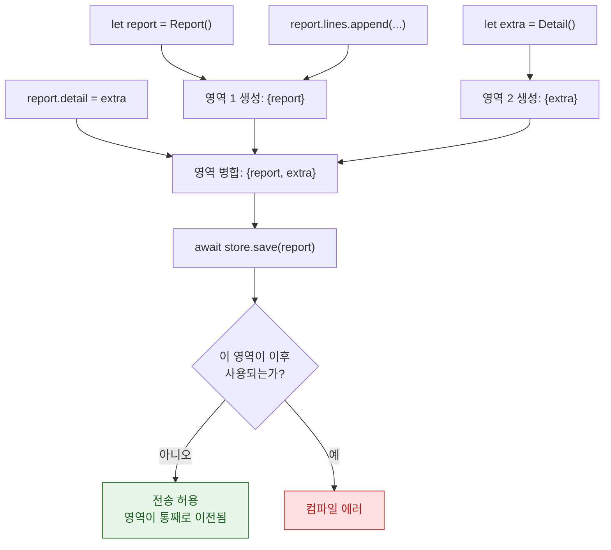

## region 기반 격리는 non-Sendable 값의 안전한 전송을 컴파일러가 증명한다

### 개념 (What)

Swift 6 의 컴파일러는 각 값이 속한 **격리 영역(region)** 을 추적한다. 영역은 "서로 참조로 얽혀 있어 함께 움직여야 하는 값들의 묶음"이다.

어떤 값을 다른 동시성 도메인으로 넘길 때, 컴파일러는 **그 값이 속한 영역이 원래 쪽에서 더 이상 쓰이지 않음을 증명**할 수 있으면 통과시킨다. 타입이 `Sendable` 이 아니어도 된다.

### 왜 필요한가 (Why)

이것이 없던 시절, 완벽히 안전한 코드가 컴파일 에러를 냈다.

```swift
final class Report { var lines: [String] = [] }   // Sendable 아님

func build() async {
    let report = Report()
    report.lines.append("hello")
    await store.save(report)     // Swift 5: 에러. Swift 6: 통과
    // report 를 여기서 다시 쓰지 않으므로 안전
}
```

개발자는 `@unchecked Sendable` 을 붙이거나 불필요한 복사를 하는 수밖에 없었다. region 분석은 **이 보일러플레이트를 상당 부분 없앤다.**

### 내부 메커니즘 (How)



1. **영역 형성**: 값이 만들어지면 자기 영역에 속한다.
2. **영역 병합**: 두 값이 참조로 연결되면 **영역이 합쳐진다.** 이후 둘은 함께 움직인다.
3. **전송 판정**: 전송 시점 이후 그 영역의 어떤 값도 쓰이지 않으면 안전하다고 판정한다.

### 왜 여전히 에러가 나는가

병합 규칙 때문에 직관과 다른 결과가 나올 수 있다.

```swift
func build() async {
    let report = Report()
    let logger = Logger()
    report.logger = logger        // 영역 병합: {report, logger}

    await store.save(report)      // 영역 전체가 이전됨

    logger.log("done")            // ❌ 에러: 이전된 영역의 값
}
```

`logger` 를 넘긴 적이 없는데 에러다. **`report` 와 연결된 순간 같은 영역이 되었기 때문이다.** 이럴 때는 연결을 끊거나 `logger` 를 `Sendable` 로 만든다.

### `sending` 과의 관계

| | 판정 주체 | 표현 |
| :--- | :--- | :--- |
| **region 격리** | 컴파일러가 **자동** 판정 | 코드에 아무것도 안 씀 |
| **`sending`** | 개발자가 **명시** 선언 | 함수 시그니처에 계약으로 남음 |

API 경계에서는 `sending` 으로 의도를 명시하는 것이 낫다. 호출자에게 "이 값을 넘기면 더 못 쓴다"가 시그니처에 드러나기 때문이다. 내부 구현에서는 region 분석에 맡기면 코드가 깨끗해진다.

### 연관 문서

- [Sendable 은 타입 수준 보장이고 sending 은 값 수준 소유권 이전이다](sendable-vs-sending.md)
- [Swift 6 마이그레이션은 경고를 먼저 켜서 단계적으로 한다](swift6-migration-path.md)
- [actor 격리는 가변 상태 접근을 직렬화해 데이터 경합을 컴파일 타임에 차단한다](actor-isolation-serializes-state-access.md)

공식 문서: [SE-0414: Region based isolation](https://github.com/swiftlang/swift-evolution/blob/main/proposals/0414-region-based-isolation.md)
