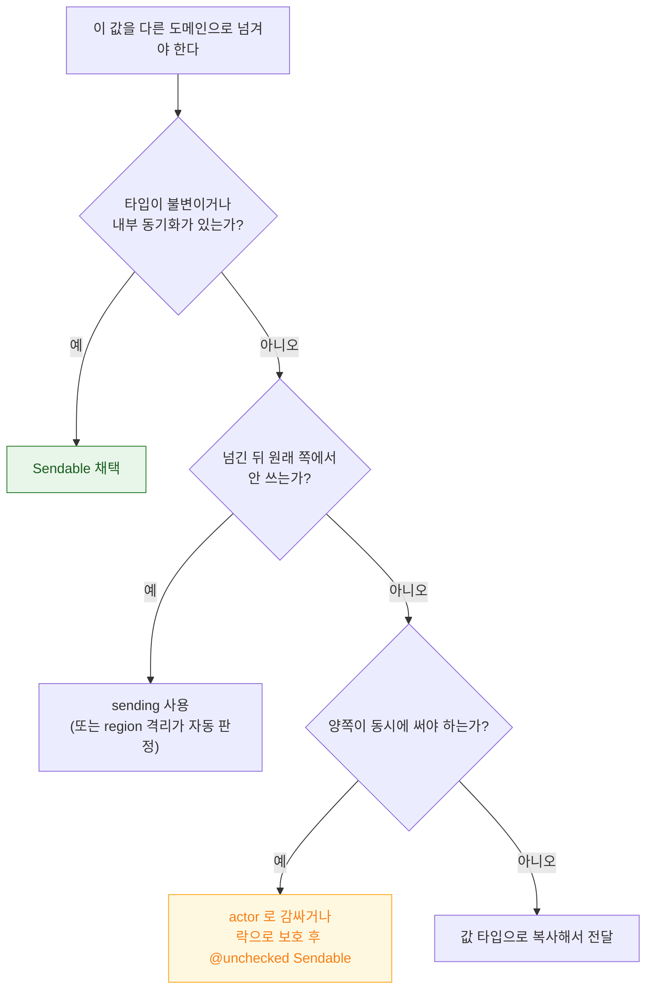

## Sendable 은 타입 수준 보장이고 sending 은 값 수준 소유권 이전이다

### 개념 (What)

두 기능 모두 "이 값을 다른 동시성 도메인으로 넘겨도 안전한가"를 다루지만, **보장의 단위가 다르다.**

| | `Sendable` | `sending` |
| :--- | :--- | :--- |
| 단위 | **타입** | **개별 값** |
| 의미 | 이 타입의 모든 인스턴스는 언제나 안전 | 이 값의 소유권을 넘긴다 |
| 요구 | 불변이거나 내부 동기화 | 넘긴 뒤 원래 쪽에서 안 쓰면 됨 |
| 검증 | 타입 정의 시점 | 호출 지점의 사용 흐름 분석 |

### 왜 필요한가 (Why)

`Sendable` 만으로는 표현할 수 없는 흔한 패턴이 있다 — **"만들어서 넘기고 나는 더 안 쓴다"** 는 경우다.

```swift
final class ImageBuffer { var pixels: [UInt8] = [] }   // Sendable 아님

func process() async {
    let buffer = ImageBuffer()
    fill(buffer)
    await renderer.submit(buffer)    // 넘긴 뒤 여기서 안 쓴다 → 사실 안전
}
```

타입은 `Sendable` 이 아니지만 이 사용 흐름은 안전하다. 예전에는 `@unchecked Sendable` 로 우회할 수밖에 없었고, 그것은 **컴파일러 검증을 통째로 포기**하는 것이었다.

### `Sendable` — 타입 수준 보장

```swift
// 값 타입: 멤버가 전부 Sendable 이면 자동 준수
struct Point: Sendable { let x: Double; let y: Double }

// actor: 내부 동기화가 있으므로 항상 Sendable
actor Cache { var items: [String] = [] }

// 클래스: final + 불변만 가능
final class Config: Sendable {
    let host: String
    init(host: String) { self.host = host }
}

// ❌ 가변 상태를 가진 클래스는 불가
final class Counter: Sendable { var count = 0 }   // 컴파일 에러

// 직접 동기화를 보장할 때만 (컴파일러 검증 없음)
final class LockedCounter: @unchecked Sendable {
    private let lock = OSAllocatedUnfairLock(initialState: 0)
    func increment() { lock.withLock { $0 += 1 } }
}
```

> [!WARNING] `@unchecked Sendable` 은 약속이지 보장이 아니다
> 컴파일러는 이 선언을 그대로 믿는다. 실제로 동기화하지 않았다면 데이터 경합이 그대로 남고, **컴파일러는 더 이상 경고하지 않는다.** 반드시 락이나 큐로 실제 보호가 되어 있어야 한다.

### `sending` — 값 수준 소유권 이전

```swift
// 이 값의 소유권을 넘긴다. 호출자는 이후 접근 불가.
func submit(sending buffer: ImageBuffer) async { ... }

// 반환값에도 쓸 수 있다
func makeBuffer() -> sending ImageBuffer {
    ImageBuffer()   // 반환 후 이 함수 안에서는 접근 불가
}
```

컴파일러가 호출 지점의 사용 흐름을 분석해, 넘긴 뒤 원래 쪽에서 쓰면 **에러로 잡는다.** `@unchecked` 와 달리 검증이 유지된다.

### 판단 순서



### 연관 문서

- [region 기반 격리는 non-Sendable 값의 안전한 전송을 컴파일러가 증명한다](region-based-isolation.md)
- [actor 격리는 가변 상태 접근을 직렬화해 데이터 경합을 컴파일 타임에 차단한다](actor-isolation-serializes-state-access.md)
- [Swift 6 마이그레이션은 경고를 먼저 켜서 단계적으로 한다](swift6-migration-path.md)

공식 문서: [SE-0430: sending parameter and result values](https://github.com/swiftlang/swift-evolution/blob/main/proposals/0430-transferring-parameters-and-results.md)
