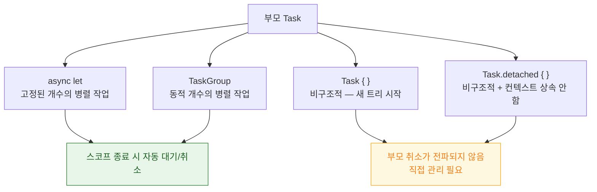

## 구조적 동시성은 작업 수명을 스코프에 묶고 취소를 트리로 전파한다

### 개념 (What)

**구조적 동시성**의 규칙은 하나다 — **자식 작업은 부모의 스코프를 벗어나 살아남을 수 없다.** 부모는 모든 자식이 끝날 때까지 반환하지 않고, 부모가 취소되면 자식도 자동으로 취소된다.

이 규칙이 작업들을 **트리** 로 만든다. 트리이기 때문에 취소·오류·우선순위가 예측 가능한 경로로 전파된다.

### 왜 필요한가 (Why)

비구조적 동시성(예전 `DispatchQueue.async`)의 문제는 **던져 놓은 작업을 추적할 수 없다**는 것이다.

| 문제 | 구조적 동시성의 해답 |
| :--- | :--- |
| 화면을 닫았는데 요청이 계속 돈다 | 부모 취소 → 자식 자동 취소 |
| 여러 요청 중 하나가 실패했는데 나머지가 계속 돈다 | 형제 작업 자동 취소 |
| 어떤 작업이 아직 도는지 모른다 | 트리 구조로 추적 가능 |
| 취소를 수동으로 전파해야 한다 | 자동 전파 |

### 세 가지 생성 방식



**`async let` — 개수가 고정일 때**

```swift
func loadProfile(id: String) async throws -> Profile {
    async let user = api.fetchUser(id)       // 즉시 시작
    async let posts = api.fetchPosts(id)     // 병렬로 시작
    async let friends = api.fetchFriends(id)
    // 여기서 세 개를 함께 기다린다. 하나가 던지면 나머지는 자동 취소.
    return try await Profile(user: user, posts: posts, friends: friends)
}
```

**`TaskGroup` — 개수가 런타임에 정해질 때**

```swift
func loadImages(ids: [String]) async throws -> [UIImage] {
    try await withThrowingTaskGroup(of: UIImage.self) { group in
        for id in ids { group.addTask { try await fetchImage(id) } }
        var results: [UIImage] = []
        for try await image in group { results.append(image) }
        return results
    }
    // 스코프를 벗어나는 순간 남은 자식은 전부 취소된다
}
```

> [!TIP] 동시 실행 수를 제한하려면
> `TaskGroup` 에 1000 개를 한 번에 넣으면 1000 개가 동시에 시작된다. 슬라이딩 윈도우로 제한한다.
> ```swift
> for id in ids.prefix(maxConcurrent) { group.addTask { ... } }
> for try await r in group {
>     results.append(r)
>     if let next = iterator.next() { group.addTask { ... } }
> }
> ```

### 취소는 협력적이다

취소는 **강제 중단이 아니라 플래그**다. 작업이 스스로 확인해야 멈춘다.

```swift
for item in largeCollection {
    try Task.checkCancellation()      // 취소되었으면 여기서 throw
    process(item)
}

// 중단 지점이 없는 CPU 루프에서는 주기적으로 양보한다
for i in 0..<1_000_000 {
    if i % 1000 == 0 { await Task.yield() }
    heavyComputation(i)
}
```

취소를 확인하지 않는 긴 루프는 **부모가 취소되어도 끝까지 돈다.** 배터리와 응답성 문제가 여기서 나온다.

### 비구조적 작업은 언제 쓰는가

`Task { }` 는 트리를 벗어나므로 **직접 관리해야 한다.** UI 이벤트 핸들러에서 비동기 작업을 시작할 때처럼 async 컨텍스트가 없는 곳에서 쓴다.

```swift
final class ViewController: UIViewController {
    private var loadTask: Task<Void, Never>?

    @IBAction func didTapLoad() {
        loadTask = Task { await load() }
    }
    deinit { loadTask?.cancel() }     // 직접 취소해야 한다
}
```

SwiftUI 의 `.task { }` 수정자는 **뷰가 사라질 때 자동 취소**해 주므로 이 관리를 대신해 준다.

### 연관 문서

- [await 는 스레드를 막지 않고 continuation 을 힙에 저장한다](await-suspension-stores-continuation.md)
- [actor 재진입성은 await 경계에서 불변식을 깬다](actor-reentrancy-breaks-invariants.md)
- [@MainActor 는 UI 상태를 메인 스레드에 묶고 nonisolated 가 그 탈출구다](mainactor-and-nonisolated.md)

공식 문서: [SE-0304: Structured concurrency](https://github.com/swiftlang/swift-evolution/blob/main/proposals/0304-structured-concurrency.md)
