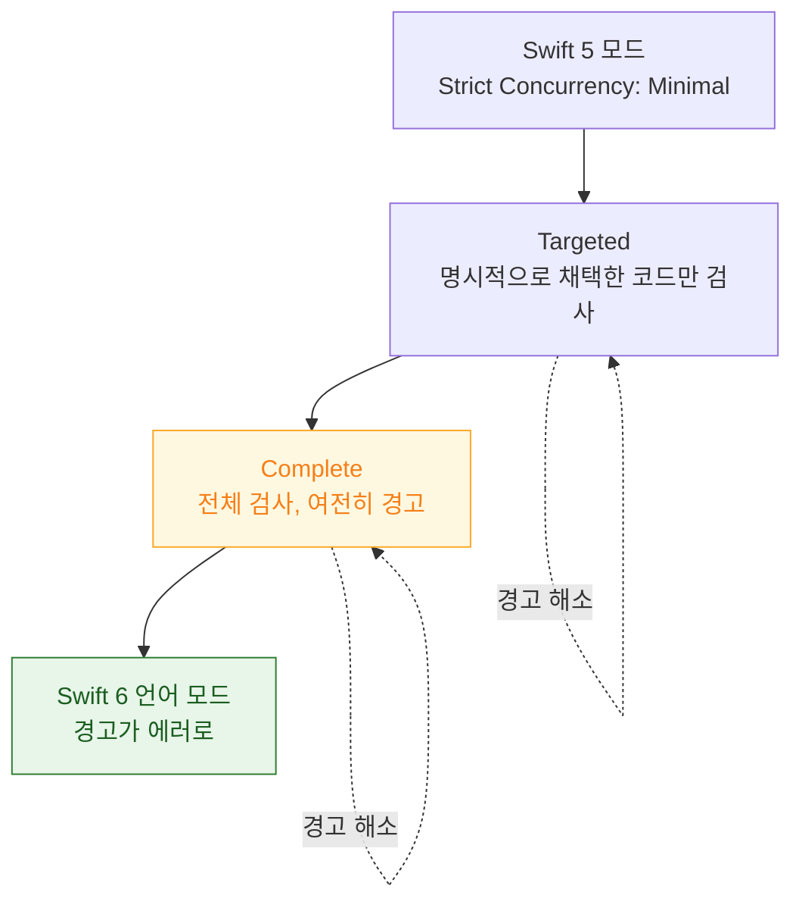

## Swift 6 마이그레이션은 경고를 먼저 켜서 모듈 단위로 단계적으로 한다

### 개념 (What)

Swift 6 언어 모드에서는 **데이터 경합이 경고가 아니라 컴파일 에러**가 된다. 기존 코드베이스를 한 번에 전환하면 에러가 수백 개 쏟아지고, 그것을 급하게 넘기려다 `@unchecked Sendable` 을 남발하게 된다. 그러면 **검증을 포기한 코드**만 남는다.

올바른 순서는 **경고 단계를 먼저 켜고 모듈 단위로 좁혀 가는 것**이다.

### 단계별 전환



| 단계 | 설정 | 목적 |
| :--- | :--- | :--- |
| 1 | `SWIFT_STRICT_CONCURRENCY = targeted` | 새 코드부터 규칙 적용 |
| 2 | `SWIFT_STRICT_CONCURRENCY = complete` | **전체 문제를 경고로 파악** |
| 3 | 경고를 0 으로 | 여기가 실제 작업 |
| 4 | `SWIFT_VERSION = 6` | 회귀 방지 잠금 |

**모듈 단위로 진행한다.** SPM 패키지나 프레임워크 타깃별로 나누면 한 번에 다루는 경고 수가 관리 가능해진다.

### 경고 유형별 처방

| 경고 | 원인 | 처방 |
| :--- | :--- | :--- |
| `Sendable` 준수 필요 | 값이 도메인을 넘음 | 값 타입화 → [`Sendable`](sendable-vs-sending.md) → 안 되면 actor |
| 전역 가변 상태 | `static var` | `let` 으로 만들거나 actor 로 감쌈 |
| 캡처된 값이 non-Sendable | 클로저 캡처 | 필요한 값만 복사해 캡처 |
| MainActor 격리 위반 | 백그라운드에서 UI 접근 | `@MainActor` 명시 |
| 델리게이트 콜백 격리 불명 | 레거시 API | `MainActor.assumeIsolated` (확실할 때만) |

### 하면 안 되는 것

>[!WARNING] `@unchecked Sendable` 로 경고를 끄지 않는다
>이것은 "내가 직접 동기화를 보장한다"는 선언이고, 컴파일러는 더 이상 검사하지 않는다. **실제 락이 없다면 데이터 경합이 그대로 남은 채 경고만 사라진다.** 정말 락으로 보호한 경우에만, 그리고 그 사실을 주석으로 남기고 쓴다.

`@preconcurrency` 는 다르다. Swift 6 이전에 만들어진 모듈에서 오는 타입에 대한 경고를 **일시적으로 유예**하는 표시이며, 그 모듈이 업데이트되면 제거한다.

```swift
// 아직 동시성을 채택하지 않은 외부 모듈
@preconcurrency import LegacyFramework
```

### 실제 작업 순서 (효과 순)

1. **전역 가변 상태를 먼저 없앤다.** `static var` 는 거의 항상 문제이고, 고치면 연쇄적으로 여러 경고가 사라진다.
2. **모델 타입을 값 타입 + `Sendable` 로.** 대부분의 DTO 는 `struct` 로 바꾸면 자동 준수한다.
3. **UI 계층에 `@MainActor` 를 명시**한다. ViewModel, 뷰 관련 타입.
4. **공유 캐시·저장소를 actor 로.** 여러 곳에서 접근하는 가변 상태.
5. 남는 것만 `sending` 이나 (정말 필요하면) `@unchecked Sendable`.

### 검증

```bash
# 경고 수를 세어 진행 상황을 추적한다
xcodebuild -scheme MyApp -configuration Debug 2>&1 | grep -c "warning:.*concurrency"
```

CI 에 이 숫자를 기록해 **역행하지 않는지** 확인한다. 0 이 되면 언어 모드를 6 으로 올려 잠근다.

### 연관 문서

- [Sendable 은 타입 수준 보장이고 sending 은 값 수준 소유권 이전이다](sendable-vs-sending.md)
- [region 기반 격리는 non-Sendable 값의 안전한 전송을 컴파일러가 증명한다](region-based-isolation.md)
- [actor 격리는 가변 상태 접근을 직렬화해 데이터 경합을 컴파일 타임에 차단한다](actor-isolation-serializes-state-access.md)
- [apple-security-swift6-safety](../../05_security_privacy/apple-security-swift6-safety.md) - 보안 관점의 메모리 안전성

공식 문서: [Migrating to Swift 6](https://www.swift.org/migration/documentation/migrationguide/)
