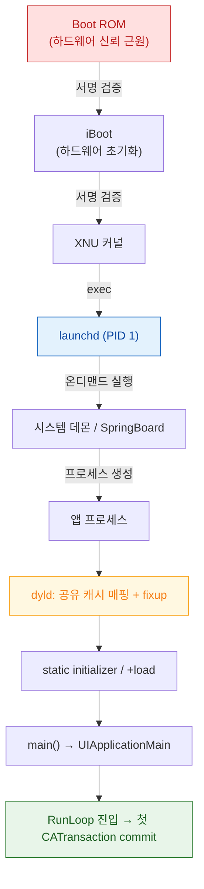

## 전원부터 첫 프레임까지는 서명 검증·프로세스 생성·심볼 바인딩·RunLoop 진입의 네 구간으로 나뉜다

"앱이 늦게 뜬다"와 "기기가 부팅되지 않는다"는 완전히 다른 구간의 문제다. 이 클러스터는 전원 인가부터 앱의 첫 프레임까지를 네 구간으로 나누고, 각 구간에서 누가 무엇을 검증하고 무엇을 소유하는지를 다룬다.

### 1 구간 — 서명 검증 사슬 (기기 부팅)

각 단계가 다음 단계의 서명을 검증한 뒤에만 제어를 넘긴다. 이 사슬이 깨지면 기기는 부팅되지 않고 복구 모드로 떨어진다.

- [Boot ROM 은 교체 불가능한 하드웨어 신뢰 근원이다](boot-rom-hardware-root-of-trust.md)
- [iBoot 는 하드웨어를 초기화하고 커널 이미지의 서명을 검증한 뒤에만 제어를 넘긴다](iboot-loads-and-verifies-the-kernel.md)
- [SSV 는 시스템 볼륨 전체를 해시 트리로 봉인해 읽는 순간마다 검증한다](signed-system-volume-seal.md)

### 2 구간 — 프로세스 생성 (누가 앱을 띄우는가)

- [launchd 는 PID 1 로서 모든 프로세스의 조상이며 선언에 따라 필요할 때만 데몬을 띄운다](launchd-is-pid-1.md)

### 3 구간 — 링크와 바인딩 (앱 실행 준비)

앱 바이너리가 메모리에 올라가고 심볼이 실제 주소로 확정되는 구간이다. **앱 시작 지연의 대부분이 여기서 발생한다.**

- [Mach-O 의 __TEXT 는 읽기 전용이며 페이지 인 될 때마다 서명 해시와 대조된다](mach-o-segments-and-code-signature.md)
- [dyld shared cache 는 시스템 프레임워크를 한 번 매핑해 모든 프로세스가 공유하게 만든다](dyld-shared-cache.md)
- [chained fixups 는 lazy binding 을 대체해 심볼 해석 비용을 실행 전으로 옮긴다](dyld-fixups-and-launch-closures.md)
- [pre-main 시간은 대부분 dylib 로딩과 static initializer 가 쓴다](pre-main-launch-time-budget.md)

### 4 구간 — RunLoop 진입 (첫 프레임)

- [메인 스레드의 이벤트 처리와 화면 갱신은 RunLoop 한 바퀴 안에서 정해진 순서로 일어난다](runloop-drives-main-thread.md)

### 경계

- 언어 런타임(ARC, dispatch, 메타데이터)은 이 클러스터가 아니라 [apple-runtime-and-swift](../../00_foundations/apple-runtime-and-swift.md) 와 [apple-memory-management](../../01_language_concurrency/apple-memory-management.md) 에 둔다.
- 부팅 개괄과 복구/DFU 모드의 사용자 관점 설명은 [apple-boot-flow-and-images](../../00_foundations/apple-boot-flow-and-images.md) 에 둔다. 이 클러스터는 각 단계의 검증 대상과 실패 양상을 다룬다.

### 연관 문서

- [apple-ipc-and-process](../ipc-and-process/apple-ipc-and-process.md) - launchd 가 띄운 프로세스들이 통신하고 종료되는 방식
- [apple-kernel-and-driver](../kernel-and-driver/apple-kernel-and-driver.md) - AMFI 가 서명 검증을 exec 시점에 강제하는 지점
- [apple-performance-and-debug](../../06_testing_performance/apple-performance-and-debug.md) - 앱 시작 시간 측정과 개선
