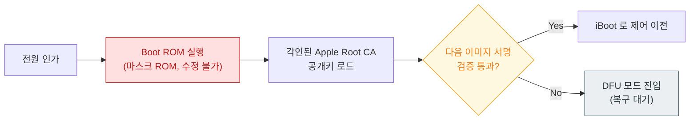

## Boot ROM 은 교체 불가능한 하드웨어 신뢰 근원이며 여기서만 신뢰가 시작된다

### 개념 (What)

**Boot ROM**(SecureROM)은 Apple SoC 를 제조할 때 실리콘에 직접 구워 넣는 **읽기 전용 코드**다. 전원이 인가되면 CPU 가 가장 먼저 실행하는 명령이며, 여기에는 **Apple Root CA 의 공개키가 함께 각인**되어 있다. Boot ROM 이 하는 일은 단 하나 — 다음 단계(iBoot)의 서명을 그 공개키로 검증하고, 통과할 때만 제어를 넘기는 것이다.

### 왜 필요한가 (Why)

신뢰 사슬은 어딘가에서 **검증되지 않은 채 신뢰받는 출발점**이 필요하다. 소프트웨어로 그 출발점을 만들면 그 소프트웨어 자체를 누가 검증하느냐는 문제가 무한히 반복된다. Boot ROM 은 이 문제를 물리적으로 끊는다.

1. **변경 불가능성**: 소프트웨어 업데이트로 고칠 수 없다는 것이 약점이자 강점이다. 공격자도 바꿀 수 없다.
2. **탈옥 가능성의 상한**: 상위 단계(iBoot, 커널)의 취약점은 패치로 막을 수 있지만 **Boot ROM 의 버그는 영구적**이다. checkm8 계열 취약점이 특정 세대 기기에서 패치 불가능한 탈옥을 허용한 이유가 이것이다.
3. **DFU 의 근거**: 기기가 완전히 벽돌이 되어도 DFU(Device Firmware Update) 모드로 복구가 되는 이유는, DFU 가 Boot ROM 레벨에서 동작하는 마지막 보루이기 때문이다.

### 내부 메커니즘 (How)

1. **고정 진입점**: 전원 인가 후 CPU 는 미리 정해진 주소의 Boot ROM 코드를 실행한다. 이 시점에는 파일 시스템도, 메모리 컨트롤러 초기화도 아직 없다.
2. **이미지 로드와 검증**: NAND 에서 다음 단계 이미지를 읽어 서명을 검증한다. Apple 의 부팅 이미지는 **IMG4** 컨테이너 형식으로, 페이로드·매니페스트·복원 정보가 함께 들어 있다.
3. **실패 처리**: 검증에 실패하면 진행하지 않고 DFU 모드로 떨어진다. "부팅되다 만 상태"가 아니라 **아예 진행하지 않는 것**이 설계 의도다.

### 복구 모드와의 구분

두 모드는 서로 다른 단계에서 멈춘 상태이며, 이 구분이 곧 장애 범위의 구분이다.

| 모드 | 멈춘 단계 | 복구 가능 범위 |
| :--- | :--- | :--- |
| **Recovery Mode** | iBoot 가 이미 실행됨 | OS 재설치·업데이트 |
| **DFU Mode** | Boot ROM 만 실행됨 | 펌웨어를 포함한 전체 복원 |

즉 **Recovery 로 안 되는데 DFU 로 되는 상황**은 iBoot 이하가 손상되었다는 신호다.

### 연관 문서

- [iBoot 는 하드웨어를 초기화하고 커널 이미지의 서명을 검증한 뒤에만 제어를 넘긴다](iboot-loads-and-verifies-the-kernel.md)
- [SSV 는 시스템 볼륨 전체를 해시 트리로 봉인해 읽는 순간마다 검증한다](signed-system-volume-seal.md)
- [AMFI 는 exec 시점에 코드 서명과 entitlement 를 커널에서 강제한다](../kernel-and-driver/amfi-code-signature-enforcement.md)
- [apple-boot-flow-and-images](../../00_foundations/apple-boot-flow-and-images.md) - 부팅 흐름 개괄

공식 문서: [Boot process for iOS and iPadOS devices](https://support.apple.com/guide/security/boot-process-for-ios-and-ipados-devices-secb3000f149/web)
