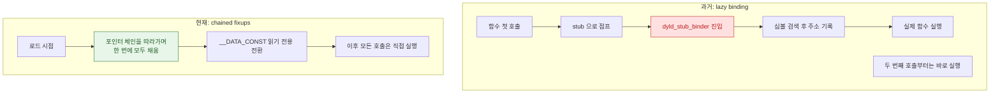

## chained fixups 는 lazy binding 을 대체해 심볼 해석 비용을 실행 전으로 옮긴다

### 개념 (What)

앱 바이너리 안의 "다른 라이브러리의 함수를 부르는 자리"는 컴파일 시점에는 **실제 주소를 알 수 없다**. dyld 가 실행 시점에 그 자리를 실제 주소로 채워 넣는 작업을 **fixup**(재배치 rebase + 바인딩 bind)이라고 한다.

이 작업을 **언제** 하느냐가 세대에 따라 달라졌다. 과거에는 함수를 처음 호출하는 순간까지 미뤘고(lazy binding), 현재의 **chained fixups** 는 실행 시작 전에 한 번에 처리한다.

### 왜 필요한가 (Why)

1. **바이너리 크기**: 예전 방식은 재배치할 위치 목록을 별도 테이블로 들고 있어야 했다. chained fixups 는 **고쳐야 할 위치를 포인터 안에 연결 리스트로 심어 두어** 그 테이블을 없앤다.
2. **보안**: 호출 시점마다 스텁을 거쳐 주소를 채우는 구조는 후킹 지점이 된다. 실행 전 확정 + `__DATA_CONST` 읽기 전용 전환은 그 지점을 줄인다.
3. **예측 가능한 성능**: 비용이 첫 호출 순간에 흩어져 나타나는 대신 시작 시점에 모인다. 측정과 최적화가 쉬워진다.

### 내부 메커니즘 (How)



**체인 방식의 핵심**: 고쳐야 할 포인터 슬롯 안에, 실제 값 대신 "다음에 고칠 슬롯까지의 거리"를 함께 인코딩해 둔다. dyld 는 시작 슬롯 하나만 알면 체인을 따라가며 전부 처리할 수 있다. 별도의 위치 목록이 필요 없다.

| 항목 | Lazy Binding | Chained Fixups |
| :--- | :--- | :--- |
| 해석 시점 | 함수 첫 호출 | 실행 시작 전 |
| 위치 정보 | 별도 재배치 테이블 | 포인터 안에 체인으로 내장 |
| 바이너리 크기 | 테이블만큼 큼 | 더 작음 |
| 후킹 표면 | 스텁 경유 지점 존재 | 줄어듦 |
| 비용 분포 | 실행 중 산발적 | 시작 시점에 집중 |

> [!NOTE] 적용 조건
> chained fixups 는 배포 타깃(deployment target)이 충분히 높을 때 링커가 선택한다. 오래된 타깃을 지원하는 프로젝트는 여전히 예전 방식으로 빌드될 수 있다.

### Pointer Authentication 과의 관계

arm64e 를 쓰는 환경에서는 채워 넣는 포인터에 **서명(PAC)** 이 함께 적용된다. 포인터를 임의로 덮어써도 역참조 시점에 서명 검증에서 걸리므로, fixup 이 끝난 포인터를 조작하는 공격이 어려워진다.

### 관찰 가능한 증거

```bash
# chained fixups 사용 여부는 load command 로 확인
otool -l MyApp.app/MyApp | grep -A2 LC_DYLD_CHAINED_FIXUPS

# 바인딩/재배치에 걸린 시간 (Xcode scheme 환경 변수)
DYLD_PRINT_STATISTICS=1
```

### 연관 문서

- [dyld shared cache 는 시스템 프레임워크를 한 번 매핑해 모든 프로세스가 공유하게 만든다](dyld-shared-cache.md)
- [pre-main 시간은 대부분 dylib 로딩과 static initializer 가 쓴다](pre-main-launch-time-budget.md)
- [Mach-O 의 __TEXT 는 읽기 전용이며 페이지 인 될 때마다 서명 해시와 대조된다](mach-o-segments-and-code-signature.md)

공식 문서: [WWDC 2022: Link fast — Improve build and launch times](https://developer.apple.com/videos/play/wwdc2022/110362/)
