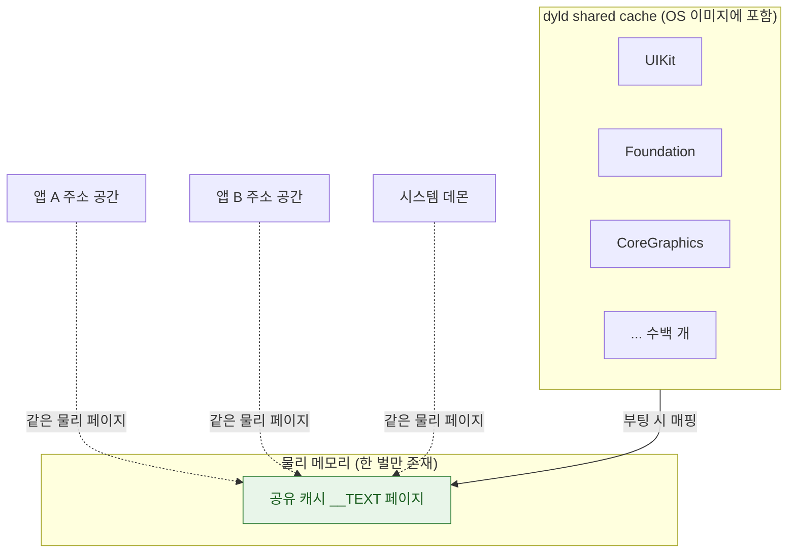

## dyld shared cache 는 시스템 프레임워크를 한 번 매핑해 모든 프로세스가 공유하게 만든다

### 개념 (What)

**dyld shared cache** 는 UIKit, Foundation, CoreGraphics 같은 시스템 프레임워크 수백 개를 **하나의 거대한 파일로 미리 합쳐 둔 것**이다. OS 이미지에 포함되어 배포되며, 개별 `.dylib` 파일은 디스크에 존재하지 않는다.

모든 프로세스는 이 캐시의 **같은 물리 페이지를 공유해서 매핑**한다. 앱이 100 개 떠 있어도 UIKit 코드는 메모리에 한 벌만 존재한다.

### 왜 필요한가 (Why)

1. **시작 시간**: 프레임워크마다 파일을 열고, 헤더를 읽고, 심볼을 해석하는 비용이 사라진다. 캐시는 이미 **재배치(rebase)와 상호 바인딩이 끝난 상태**로 만들어져 있다.
2. **메모리**: 시스템 프레임워크의 `__TEXT` 는 프로세스 수와 무관하게 한 벌이다. 이것이 없으면 앱 하나당 수십 MB 씩 중복된다.
3. **최적화 여지**: 하나의 이미지로 합쳐지므로, 프레임워크 경계를 넘는 호출도 미리 최적화할 수 있다.

### 내부 메커니즘 (How)



1. **사전 빌드**: 캐시는 OS 빌드 시점에 생성되며, 이때 내부 프레임워크 간의 심볼 바인딩과 재배치가 이미 해결되어 있다.
2. **공유 영역 매핑**: 프로세스가 시작하면 dyld 는 캐시를 프로세스의 공유 영역에 매핑한다. 개별 라이브러리를 하나씩 여는 과정이 없다.
3. **ASLR**: 캐시 전체가 부팅 시 한 번 무작위 위치에 배치된다. 프로세스마다 다시 섞지는 않는다.

### 실무적 귀결

| 상황 | 귀결 |
| :--- | :--- |
| 시스템 프레임워크 링크 | 사실상 공짜에 가깝다. 캐시에 이미 있다 |
| **서드파티 동적 프레임워크** | **캐시에 없다.** 앱 번들에서 개별적으로 열고 바인딩해야 한다 |
| 정적 라이브러리 | 앱 바이너리에 병합되어 dylib 로딩 비용이 없다 |

즉 앱 시작 시간에서 문제가 되는 것은 시스템 프레임워크가 아니라 **직접 넣은 동적 프레임워크의 개수**다. 개수를 줄이거나 정적 링크로 합치는 것이 가장 효과가 크다.

### 관찰 가능한 증거

```bash
# 실행 중 실제로 로드된 이미지 목록 (Xcode scheme 의 환경 변수로 설정)
DYLD_PRINT_LIBRARIES=1

# 앱 시작 단계별 소요 시간
DYLD_PRINT_STATISTICS=1
```

`vmmap` 출력에서 공유 캐시 영역은 별도로 집계되므로, 앱 고유 메모리와 구분해서 읽어야 한다.

### 연관 문서

- [chained fixups 는 lazy binding 을 대체해 심볼 해석 비용을 실행 전으로 옮긴다](dyld-fixups-and-launch-closures.md)
- [pre-main 시간은 대부분 dylib 로딩과 static initializer 가 쓴다](pre-main-launch-time-budget.md)
- [Mach-O 의 __TEXT 는 읽기 전용이며 페이지 인 될 때마다 서명 해시와 대조된다](mach-o-segments-and-code-signature.md)
- [apple-swift-package-manager](../../08_packaging_deployment/apple-swift-package-manager.md) - 동적/정적 링크 선택

공식 문서: [WWDC 2017: App Startup Time — Past, Present, and Future](https://developer.apple.com/videos/play/wwdc2017/413/)
