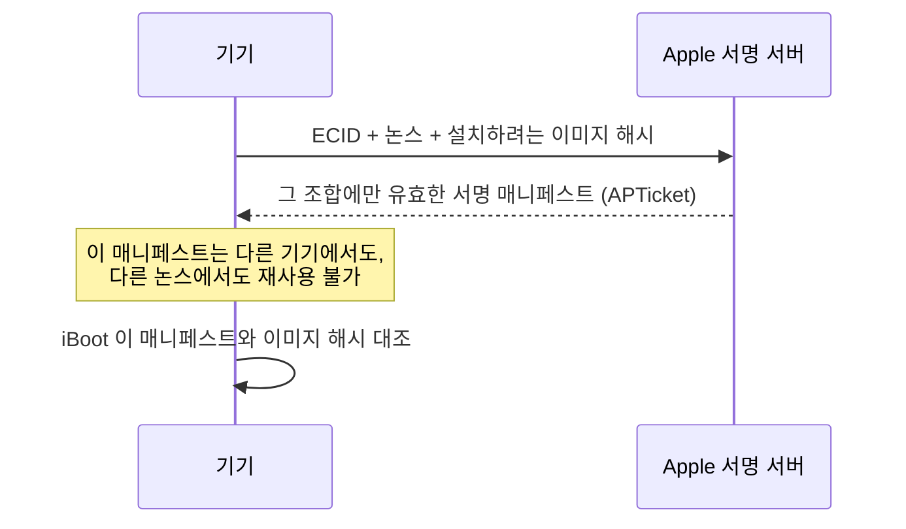

## iBoot 는 하드웨어를 초기화하고 커널 이미지의 서명을 검증한 뒤에만 제어를 넘긴다

### 개념 (What)

**iBoot** 는 Boot ROM 이 검증한 뒤 실행하는 부트로더다. Boot ROM 이 "검증만" 하는 최소 코드였다면, iBoot 는 실제로 **메모리 컨트롤러·디스플레이·스토리지를 초기화**하고, 커널 캐시(kernelcache)를 읽어 서명을 검증한 뒤 XNU 로 점프한다. 사용자가 보는 Apple 로고를 그리는 것도 iBoot 다.

### 왜 필요한가 (Why)

1. **하드웨어 준비**: 커널은 이미 초기화된 메모리와 스토리지를 전제로 시작한다. 그 준비를 담당할 단계가 필요하다.
2. **다운그레이드 차단**: iBoot 는 단순히 "Apple 서명인가"만 보지 않고 **이 기기를 위해, 이 시점에 서명된 이미지인가**까지 본다. 이것이 임의 버전으로 되돌리는 것을 막는다.
3. **복구 진입점**: Recovery Mode 는 iBoot 가 커널로 넘어가지 않고 멈춰 대기하는 상태다. 즉 iBoot 까지는 정상이라는 뜻이다.

### 내부 메커니즘 (How)

#### IMG4 와 개인화(Personalization)

Apple 의 부팅 이미지는 **IMG4** 컨테이너로 포장되며 세 부분으로 구성된다.

| 구성 요소 | 역할 |
| :--- | :--- |
| **IM4P** (Payload) | 실제 이미지 본체 (kernelcache, iBoot 등) |
| **IM4M** (Manifest) | Apple 이 서명한 매니페스트. 허용되는 이미지 해시 목록 |
| **IM4R** (Restore Info) | 복원 시 사용되는 논스 등 부가 정보 |

핵심은 매니페스트가 **기기 고유 식별자(ECID)와 서버가 발급한 논스에 묶여 서명된다**는 점이다.

- 매니페스트가 특정 기기·특정 논스에 묶이므로, 예전 버전의 서명을 그대로 재사용해 다운그레이드하는 것이 차단된다.
- Apple 이 특정 버전의 서명 발급을 중단하면("서명 창 닫힘") 그 버전으로의 설치가 더 이상 불가능해지는 이유도 이 구조 때문이다.

#### 커널로의 이전

1. 하드웨어 초기화 후 스토리지에서 kernelcache 를 읽는다.
2. IM4M 매니페스트와 이미지 해시를 대조한다.
3. 검증 통과 시 커널을 메모리에 배치하고 부트 인자(boot-args)를 전달하며 점프한다.
4. 실패 시 진행하지 않고 Recovery/DFU 로 떨어진다.

> [!NOTE] boot-args
> `boot-args` 는 커널에 전달되는 부팅 인자다. 개발 기기가 아닌 일반 기기에서는 서명 정책상 임의 설정이 차단되어 있어, 커널 디버깅 옵션을 켤 수 없다.

### 연관 문서

- [Boot ROM 은 교체 불가능한 하드웨어 신뢰 근원이며 여기서만 신뢰가 시작된다](boot-rom-hardware-root-of-trust.md)
- [SSV 는 시스템 볼륨 전체를 해시 트리로 봉인해 읽는 순간마다 검증한다](signed-system-volume-seal.md)
- [XNU 는 Mach 가 자원을, BSD 가 인터페이스를 맡는 분업 구조다](../kernel-and-driver/xnu-mach-bsd-split.md)

공식 문서: [Boot process for iOS and iPadOS devices](https://support.apple.com/guide/security/boot-process-for-ios-and-ipados-devices-secb3000f149/web)
