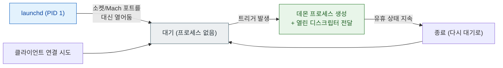

## launchd 는 PID 1 로서 모든 프로세스의 조상이며 선언에 따라 필요할 때만 데몬을 띄운다

### 개념 (What)

**launchd** 는 커널이 부팅 마지막에 실행하는 첫 사용자 공간 프로세스(PID 1)이며, 이후 시스템의 **모든 프로세스를 직접 또는 간접적으로 낳는 조상**이다. 전통적인 유닉스의 `init`, `inetd`, `cron`, `rc` 스크립트가 하던 일을 하나로 통합했다.

가장 중요한 성질은 **선언적 온디맨드 실행**이다. 데몬은 "언제 나를 깨워라"를 property list 로 선언하고, launchd 는 그 조건이 충족될 때까지 프로세스를 아예 만들지 않는다.

### 왜 필요한가 (Why)

1. **부팅 시간과 메모리**: 모든 데몬을 부팅 때 띄우면 느리고 메모리를 낭비한다. 요청이 올 때 띄우면 대부분의 데몬은 평소에 존재하지 않는다.
2. **XPC 의 기반**: 앱이 XPC 서비스에 연결하면 launchd 가 그 시점에 서비스 프로세스를 띄운다. XPC 의 "필요할 때 생기고 안 쓰면 사라진다"는 성질은 launchd 가 제공한다.
3. **일관된 수명 관리**: 크래시 후 재시작, 의존성 순서, 실행 조건이 스크립트가 아니라 선언으로 통일된다.

### 내부 메커니즘 (How)

#### 선언과 온디맨드 트리거

데몬은 자신을 어떻게 깨울지 plist 로 선언한다. launchd 는 그 **소켓이나 Mach 포트를 대신 열어 두고 기다린다**.



주요 트리거 조건:

| 키 | 의미 |
| :--- | :--- |
| `RunAtLoad` | 로드 즉시 실행 |
| `KeepAlive` | 종료되면 다시 띄움 (조건부 설정 가능) |
| `Sockets` | 해당 소켓에 연결이 오면 실행 |
| `MachServices` | 해당 Mach 서비스 이름으로 룩업이 오면 실행 |
| `StartInterval` / `StartCalendarInterval` | 주기/일정 기반 실행 |
| `WatchPaths` / `QueueDirectories` | 경로 변경 감지 시 실행 |

#### Daemon 과 Agent 의 구분

| 구분 | 실행 컨텍스트 | 사용자 세션 |
| :--- | :--- | :--- |
| **LaunchDaemon** | 시스템 전역, 로그인 전부터 동작 | 없음 (UI 접근 불가) |
| **LaunchAgent** | 로그인한 사용자 세션 안 | 있음 (UI 접근 가능) |

이 구분은 곧 **권한과 접근 가능 범위의 구분**이다. 사용자 데이터나 UI 가 필요하면 Agent 여야 한다.

### 관찰 가능한 증거 (macOS)

```bash
# 등록된 서비스 목록과 마지막 종료 코드
launchctl list

# 특정 서비스의 선언 내용, 상태, 실행 조건 전체
launchctl print system/com.apple.example
launchctl print gui/$(id -u)/com.apple.example

# 서비스가 왜 떴는지 로그로 추적
log stream --predicate 'process == "launchd"' --info
```

> [!NOTE] iOS 에서는
> iOS 에는 사용자가 접근할 수 있는 `launchctl` 이 없다. 동작 원리는 동일하지만 관찰은 `sysdiagnose` 나 Console.app 로그를 통해서만 가능하다.

### 연관 문서

- [XPC 연결은 launchd 가 중개하며 상대가 죽으면 함께 무효화된다](../ipc-and-process/xpc-connection-lifetime.md)
- [Mach port 는 이름이 아니라 커널이 소유한 능력(capability)이다](../ipc-and-process/mach-port-is-a-capability.md)
- [RunningBoard assertion 이 프로세스의 실행 지속 여부를 결정한다](../ipc-and-process/runningboard-assertions.md)
- [apple-interprocess-and-xpc](../../04_system_services/apple-interprocess-and-xpc.md) - 앱 관점의 XPC 사용법

공식 문서: [Creating launch daemons and agents](https://developer.apple.com/documentation/xpc/creating-launch-daemons-and-agents)
