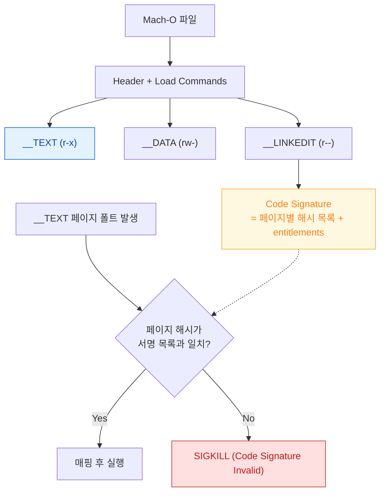

## Mach-O 의 __TEXT 는 읽기 전용이며 페이지 인 될 때마다 서명 해시와 대조된다

### 개념 (What)

**Mach-O** 는 Apple 플랫폼의 실행 파일 형식이다. 헤더 뒤에 **load command** 목록이 오고, 그 지시에 따라 **segment** 들이 메모리에 매핑된다. 코드 서명은 파일 전체에 대한 하나의 서명이 아니라, **페이지 단위 해시 목록**으로 `__LINKEDIT` 안에 들어간다.

이 구조 때문에 검증이 "실행 전 한 번"이 아니라 **"그 페이지를 실제로 읽어 들이는 순간마다"** 일어난다.

### 왜 필요한가 (Why)

1. **지연 로딩과 검증의 양립**: 실행 파일 전체를 미리 읽어 검증하면 앱 시작이 느려진다. 페이지 단위 해시는 실제로 쓰는 페이지만 검증하게 해 준다.
2. **실행 중 변조 차단**: 메모리에 올라온 뒤 디스크의 코드를 바꿔치기해도, 아직 읽지 않은 페이지는 다음 페이지 인 시점에 걸린다.
3. **entitlement 의 봉인 위치**: entitlement 는 코드 서명 블롭 안에 들어간다. 즉 서명을 다시 하지 않고 entitlement 만 바꾸는 것이 불가능하다.

### 내부 메커니즘 (How)

#### 주요 segment

| Segment | 보호 속성 | 내용 |
| :--- | :--- | :--- |
| `__TEXT` | 읽기 + 실행 (쓰기 불가) | 기계어 코드, 문자열 상수, 읽기 전용 데이터 |
| `__DATA` | 읽기 + 쓰기 | 전역 변수, 포인터 테이블 |
| `__DATA_CONST` | 로드 후 읽기 전용으로 전환 | 바인딩 완료 후 고정되는 포인터들 |
| `__LINKEDIT` | 읽기 전용 | 심볼 테이블, 재배치 정보, **코드 서명 블롭** |



1. **매핑**: 커널이 load command 를 읽어 각 segment 를 지정된 보호 속성으로 가상 메모리에 매핑한다. 이 시점에는 아직 물리 페이지가 없다.
2. **페이지 폴트**: 코드가 실제로 실행되면 해당 페이지에서 폴트가 발생하고, 커널이 디스크에서 읽어 온다.
3. **해시 대조**: 읽어 온 페이지의 해시를 `__LINKEDIT` 의 서명 목록과 대조한다. 불일치 시 프로세스는 즉시 종료된다.

> [!IMPORTANT] `__TEXT` 가 읽기 전용인 실질적 의미
> 런타임에 코드를 생성해 실행하려면 별도의 메모리를 할당하고 실행 권한을 얻어야 하는데, iOS 에서는 이것이 entitlement 없이는 금지된다. JIT 를 쓰는 브라우저 엔진이 특별 취급을 받는 이유다.

### 관찰 가능한 증거

```bash
# load command 와 segment 배치 확인
otool -l MyApp.app/MyApp | head -60

# 링크된 동적 라이브러리 목록 (앱 시작 비용의 주요 원인)
otool -L MyApp.app/MyApp

# 코드 서명 상세: 팀 식별자, 해시 알고리즘, 페이지 크기
codesign -dvvv MyApp.app

# 서명에 봉인된 entitlement 를 그대로 출력
codesign -d --entitlements :- MyApp.app
```

### 연관 문서

- [dyld shared cache 는 시스템 프레임워크를 한 번 매핑해 모든 프로세스가 공유하게 만든다](dyld-shared-cache.md)
- [chained fixups 는 lazy binding 을 대체해 심볼 해석 비용을 실행 전으로 옮긴다](dyld-fixups-and-launch-closures.md)
- [AMFI 는 exec 시점에 코드 서명과 entitlement 를 커널에서 강제한다](../kernel-and-driver/amfi-code-signature-enforcement.md)
- [apple-security-entitlements](../../05_security_privacy/apple-security-entitlements.md) - entitlement 의 의미와 신청

공식 문서: [Code Signing Guide](https://developer.apple.com/library/archive/documentation/Security/Conceptual/CodeSigningGuide/Introduction/Introduction.html)
