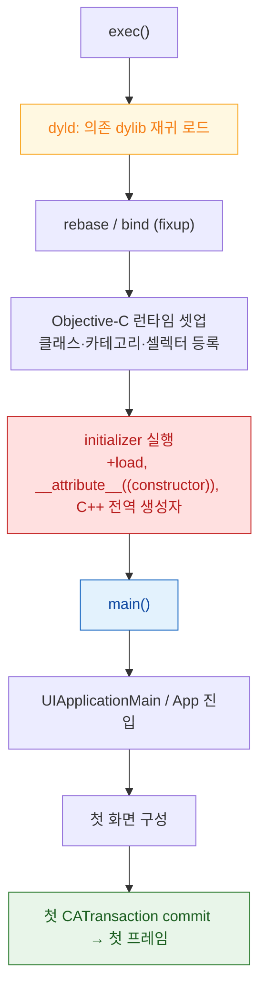

## pre-main 시간은 대부분 dylib 로딩과 static initializer 가 쓴다

### 개념 (What)

앱 시작 시간은 `main()` 을 기준으로 두 구간으로 나뉜다.

- **pre-main**: 프로세스 생성부터 `main()` 진입까지. **개발자가 코드를 한 줄도 실행하지 않았는데 흘러가는 시간**이다.
- **post-main**: `main()` 이후 첫 프레임이 그려질 때까지.

느린 시작을 고치려면 어느 쪽이 문제인지부터 나눠야 한다. pre-main 이 문제라면 코드 로직을 아무리 고쳐도 나아지지 않는다.

### 왜 필요한가 (Why)

1. **원인 구간이 다르면 처방이 다르다**: pre-main 은 링크 구조와 초기화 코드의 문제이고, post-main 은 뷰 계층과 데이터 로딩의 문제다.
2. **워치독 종료 위험**: 시작이 지나치게 오래 걸리면 시스템이 앱을 강제 종료한다. 이때는 크래시 리포트에 [워치독 예외 코드](../ipc-and-process/watchdog-termination-codes.md)가 남는다.
3. **사용자 체감**: 아이콘을 탭한 뒤 반응이 없는 시간은 그대로 품질 인상이 된다.

### 내부 메커니즘 (How)



각 단계에서 실제로 비용을 만드는 것:

| 단계 | 비용의 원인 | 줄이는 방법 |
| :--- | :--- | :--- |
| **dylib 로딩** | 앱 번들에 넣은 **서드파티 동적 프레임워크 개수** | 개수를 줄이거나 정적 라이브러리로 병합 |
| **fixup** | 외부 심볼 참조 수 | 불필요한 의존성 제거 |
| **ObjC 런타임 셋업** | 클래스·카테고리·셀렉터 총량 | 쓰지 않는 코드 제거 |
| **initializer** | `+load`, C++ 전역 생성자, `dispatch_once` 이전 초기화 | `+load` 대신 `+initialize`, 지연 초기화로 전환 |

> [!IMPORTANT] `+load` 대 `+initialize`
> `+load` 는 **클래스가 로드되는 순간 무조건** 실행된다. `+initialize` 는 **그 클래스를 처음 쓸 때** 실행된다. 시작 시간을 위해서는 `+initialize` 나 지연 초기화가 낫다. 분석 SDK 들이 `+load` 를 쓰면 그 비용이 전부 pre-main 에 쌓인다.

### 관찰 가능한 증거

```
# Xcode: Product > Scheme > Edit Scheme > Run > Arguments > Environment Variables
DYLD_PRINT_STATISTICS = 1
```

단계별 소요 시간이 콘솔에 출력된다. 어느 단계가 지배적인지 먼저 확인한 뒤 위 표의 처방을 적용한다.

추가 도구:

- **Instruments의 App Launch 템플릿**: pre-main 과 post-main 을 시간축에서 함께 본다.
- **MetricKit (`MXAppLaunchMetric`)**: 실사용자 기기에서의 시작 시간 분포를 수집한다. 개발 기기 측정과 달리 저사양 기기·콜드 스타트가 섞인 현실 분포를 보여준다.

### 연관 문서

- [dyld shared cache 는 시스템 프레임워크를 한 번 매핑해 모든 프로세스가 공유하게 만든다](dyld-shared-cache.md)
- [chained fixups 는 lazy binding 을 대체해 심볼 해석 비용을 실행 전으로 옮긴다](dyld-fixups-and-launch-closures.md)
- [워치독 종료는 예외 코드로 원인 구간을 구분할 수 있다](../ipc-and-process/watchdog-termination-codes.md)
- [apple-instruments-profiling](../../06_testing_performance/apple-instruments-profiling.md) - Instruments 사용법

공식 문서: [Reducing your app's launch time](https://developer.apple.com/documentation/xcode/reducing-your-app-s-launch-time)
