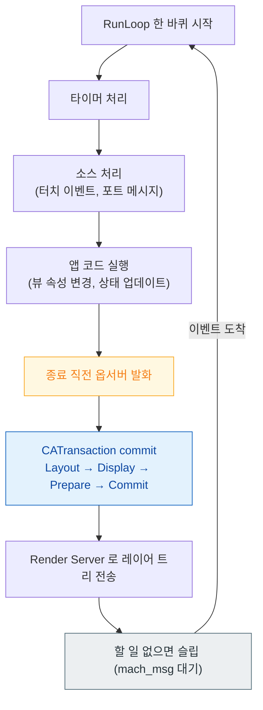

## 메인 스레드의 이벤트 처리와 화면 갱신은 RunLoop 한 바퀴 안에서 정해진 순서로 일어난다

### 개념 (What)

**RunLoop** 는 스레드가 할 일이 없을 때 잠들고, 이벤트가 오면 깨어나 처리하는 루프다. 메인 스레드는 앱이 시작될 때 RunLoop 에 진입해 앱이 끝날 때까지 그 안에서 돈다.

중요한 것은 이것이 단순한 `while(true)` 가 아니라 **단계가 정해진 루프**라는 점이다. 터치 처리, 타이머, 그리고 **화면 갱신 커밋**이 한 바퀴 안의 서로 다른 지점에서 일어난다.

### 왜 필요한가 (Why)

1. **"왜 내 UI 변경이 지금 반영되지 않는가"**: 레이어 속성을 바꿔도 즉시 그려지지 않는다. RunLoop 가 한 바퀴를 마치며 커밋할 때 반영된다. 같은 프레임 안에서 값을 여러 번 바꿔도 커밋은 한 번이다.
2. **"왜 스크롤 중에 타이머가 멈추는가"**: RunLoop 에는 **모드**가 있고, 스크롤 중에는 추적 모드로 전환된다. 기본 모드에만 등록한 타이머는 그동안 돌지 않는다.
3. **블로킹의 의미**: 메인 스레드에서 동기 작업을 하면 루프가 다음 바퀴로 못 넘어간다. 그 사이 터치도, 화면 갱신도 멈춘다.

### 내부 메커니즘 (How)

1. **입력 소스와 타이머**: 커널로부터 온 이벤트(터치, 포트 메시지)와 만료된 타이머가 처리된다.
2. **앱 코드 실행**: 이 안에서 개발자가 뷰 속성을 바꾸면, 변경은 즉시 그려지지 않고 **커밋 대상으로 표시**만 된다.
3. **커밋 옵서버**: Core Animation 은 RunLoop 종료 직전에 발화하는 옵서버를 등록해 두고, 여기서 `CATransaction` 을 커밋한다. 이때 레이아웃과 그리기가 실행되고 레이어 트리가 Render Server 로 넘어간다.
4. **슬립**: 할 일이 없으면 `mach_msg` 로 커널 대기 상태에 들어간다. CPU 를 쓰지 않는다.

#### RunLoop 모드

| 모드 | 언제 |
| :--- | :--- |
| `default` | 평상시 |
| `tracking` | 스크롤 등 사용자 추적 중 |
| `common` | 위 둘을 포함하는 의사 모드 |

`Timer` 를 기본 모드로만 등록하면 스크롤 중 멈춘다. `RunLoop.main.add(timer, forMode: .common)` 으로 등록해야 스크롤 중에도 동작한다.

### 관찰 가능한 증거

- **Instruments의 Time Profiler**: 메인 스레드 스택에서 `__CFRunLoopRun` 아래 어느 단계가 시간을 쓰는지 본다. 커밋 단계(`CA::Transaction::commit`)가 두꺼우면 렌더링 쪽 문제다.
- **행(hang) 진단**: 메인 스레드가 RunLoop 로 돌아오지 못하는 상태가 지속되면 Xcode 의 Hang Detection 이나 `spindump` 로 잡을 수 있다.

### 연관 문서

- [레이어 트리는 IPC 로 Render Server 에 커밋된다](../graphics-and-media/layer-tree-commit-to-render-server.md)
- [pre-main 시간은 대부분 dylib 로딩과 static initializer 가 쓴다](pre-main-launch-time-budget.md)
- [워치독 종료는 예외 코드로 원인 구간을 구분할 수 있다](../ipc-and-process/watchdog-termination-codes.md)
- [apple-rendering-and-media](../../02_ui_frameworks/apple-rendering-and-media.md) - 커밋 이후의 렌더링 파이프라인

공식 문서: [RunLoop](https://developer.apple.com/documentation/foundation/runloop)
