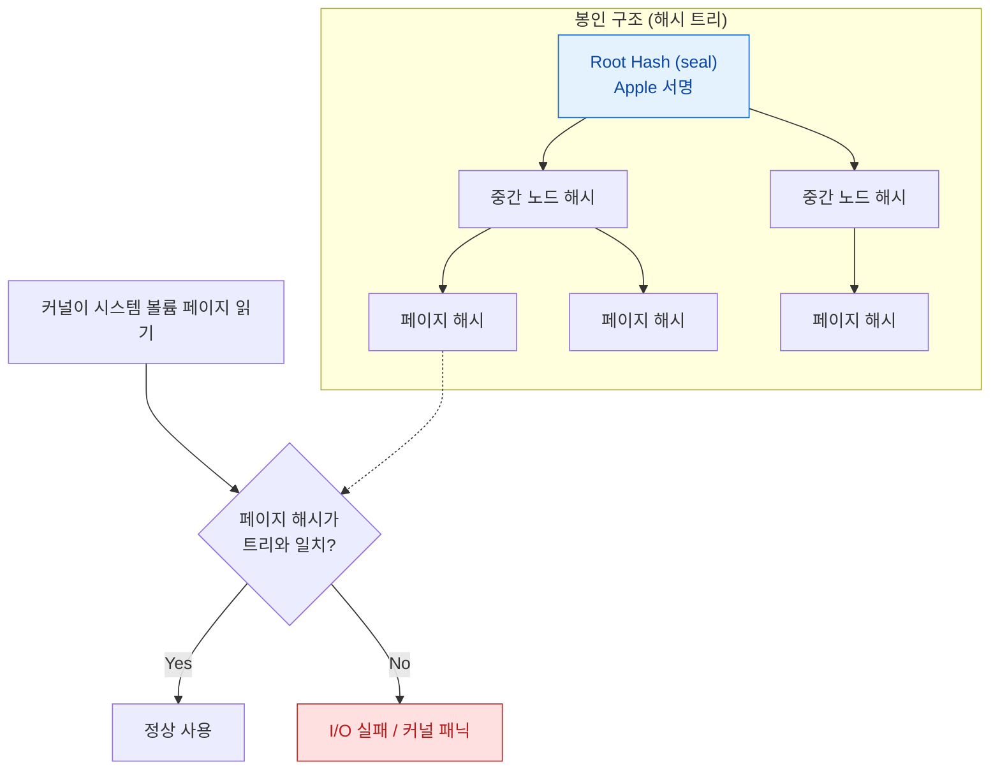

## SSV 는 시스템 볼륨 전체를 해시 트리로 봉인해 읽는 순간마다 검증한다

### 개념 (What)

**Signed System Volume(SSV)** 은 OS 가 들어 있는 시스템 볼륨을 **읽기 전용으로 만들고, 그 전체 내용을 하나의 해시 트리로 봉인**하는 메커니즘이다. 파일 하나하나가 아니라 볼륨 전체가 단 하나의 **seal(루트 해시)** 로 요약되며, 그 seal 은 Apple 이 서명한다.

핵심은 검증 시점이다. 부팅할 때 한 번만 확인하고 끝나는 것이 아니라, **커널이 시스템 볼륨의 페이지를 읽어 들일 때마다 해당 페이지의 해시를 트리와 대조**한다.

### 왜 필요한가 (Why)

1. **부팅 후 변조 차단**: 부팅 시점 검증만으로는 실행 중에 디스크 내용을 바꾸는 공격을 막지 못한다. 페이지 단위 검증은 이 창을 닫는다.
2. **시스템/데이터 분리의 근거**: 시스템 볼륨이 불변이므로, 사용자 데이터는 반드시 **별도의 데이터 볼륨**에 있어야 한다. macOS 에서 `/` 아래 경로들이 실제로는 데이터 볼륨을 가리키는 firmlink 인 이유가 이것이다.
3. **업데이트의 원자성**: 시스템 볼륨을 통째로 교체하고 seal 만 바꾸면 되므로, 업데이트가 반쯤 적용된 상태가 원리적으로 존재하지 않는다.

### 내부 메커니즘 (How)

1. **트리 구축**: 시스템 볼륨의 모든 데이터 블록에 대해 해시를 계산하고, 그 해시들을 다시 해시하여 최종적으로 하나의 루트 해시(seal)로 수렴시킨다.
2. **seal 서명**: Apple 이 이 루트 해시를 서명한다. 부팅 시 이 서명이 먼저 검증된다.
3. **읽기 시점 검증**: 이후 시스템 볼륨에서 페이지를 읽을 때마다 해당 페이지의 해시가 트리 경로를 따라 루트와 일치하는지 확인한다. 불일치하면 그 읽기는 실패한다.

### 실무적 귀결

| 관찰되는 현상 | 원인 |
| :--- | :--- |
| 시스템 경로에 쓰기가 거부된다 | 시스템 볼륨이 읽기 전용으로 마운트됨 |
| 시스템 파일을 고치면 부팅이 안 된다 | seal 이 깨져 검증 실패 |
| OS 업데이트가 "준비 중" 후 재부팅으로 끝난다 | 새 볼륨을 준비해 두고 seal 교체 후 부팅 대상만 전환 |

> [!TIP] 앱 개발자 관점
> 앱은 시스템 볼륨에 아무것도 쓸 수 없다는 전제로 설계해야 한다. 쓰기가 필요한 모든 데이터는 [앱 컨테이너](../storage/app-container-directory-policies.md) 안에 있어야 한다.

### 연관 문서

- [iBoot 는 하드웨어를 초기화하고 커널 이미지의 서명을 검증한 뒤에만 제어를 넘긴다](iboot-loads-and-verifies-the-kernel.md)
- [APFS 스냅샷은 시스템 업데이트를 되돌릴 수 있게 만든다](../storage/apfs-snapshots-and-updates.md)
- [앱 컨테이너의 디렉터리는 백업과 정리 정책이 서로 다르다](../storage/app-container-directory-policies.md)

공식 문서: [Signed system volume security](https://support.apple.com/guide/security/signed-system-volume-security-secd698747c9/web)
