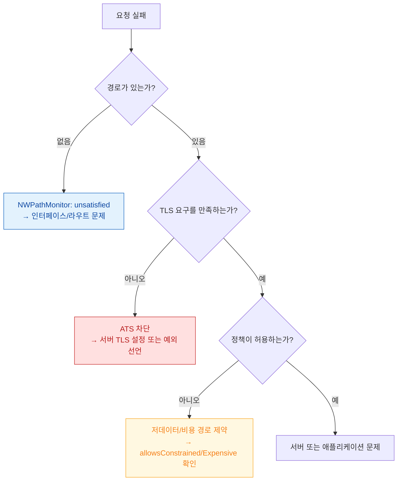

## 네트워크 실패는 경로 가용성·전송 보안·시스템 정책 세 층에서 서로 다르게 발생한다

"네트워크가 안 된다"는 하나의 증상이지만 층이 셋이다. **경로 자체가 없는 것**, **경로는 있으나 TLS 요구를 못 맞춘 것**, **시스템 정책(저데이터 모드, 저전력 모드, 백그라운드 제약)이 막은 것**은 로그도 처방도 다르다.

### 경로와 연결

- [Network.framework 는 소켓 대신 상태 머신으로 연결을 표현한다](network-framework-connection-state.md)
- [NWPathMonitor 는 경로 가용성을 보고하지 도달 가능성을 보고하지 않는다](nwpathmonitor-reports-path-not-reachability.md)

### 전송 보안

- [ATS 는 기본적으로 TLS 와 순방향 비밀성을 요구한다](ats-transport-security-defaults.md)

### 시스템 정책

- [백그라운드 전송은 앱이 아니라 시스템 데몬이 이어서 수행한다](background-transfer-daemon.md)
- [제약 경로와 비용 경로는 앱이 읽을 수 있는 신호다](constrained-and-expensive-paths.md)

### 경계

`URLSession` 사용 레시피와 오프라인 복원 패턴은 [apple-networking-and-cloud](../../03_data_networking/apple-networking-and-cloud.md) 와 [apple-offline-and-resilience](../../03_data_networking/apple-offline-and-resilience.md) 에 둔다.

### 연관 문서

- [apple-security-pq3](../../05_security_privacy/apple-security-pq3.md) - 전송 암호의 미래 대비
- [RunningBoard assertion 이 프로세스의 실행 지속 여부를 결정한다](../ipc-and-process/runningboard-assertions.md) - 백그라운드 실행 허가와의 관계
