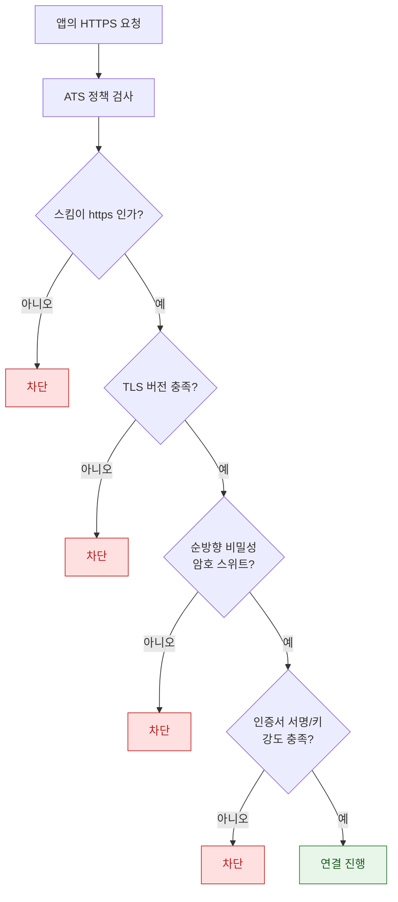

## ATS 는 기본적으로 TLS 와 순방향 비밀성을 요구한다

### 개념 (What)

**ATS(App Transport Security)** 는 앱의 네트워크 연결이 최소한의 전송 보안 기준을 만족하도록 **시스템이 강제**하는 정책이다. 앱 코드가 아니라 네트워킹 스택 아래에서 검사되므로, `URLSession` 이든 `NWConnection` 이든 우회할 수 없다.

기본 요구 사항은 대략 이렇다.

- 평문 HTTP 차단 (HTTPS 필수)
- TLS 최소 버전 요구
- **순방향 비밀성(forward secrecy)** 을 제공하는 암호 스위트
- 충분한 강도의 인증서 서명 알고리즘과 키 길이

### 왜 필요한가 (Why)

1. **"서버는 되는데 앱에서만 안 된다"의 원인**: 브라우저는 접속되는 서버가 앱에서는 ATS 에 걸려 실패한다. 브라우저보다 ATS 기준이 엄격하기 때문이다.
2. **예외는 심사 대상이다**: `NSAllowsArbitraryLoads` 로 전부 열어 버리는 것은 가능하지만, App Store 심사에서 정당화를 요구받는다.
3. **순방향 비밀성이 걸리는 지점**: TLS 버전은 맞는데도 실패한다면 암호 스위트가 원인인 경우가 많다. 오래된 RSA 키 교환만 지원하는 서버가 대표적이다.

### 내부 메커니즘 (How)



#### 예외 선언

전부 여는 대신 **도메인 단위로 최소 예외**를 선언하는 것이 옳다.

```xml
<key>NSAppTransportSecurity</key>
<dict>
  <key>NSExceptionDomains</key>
  <dict>
    <key>legacy.example.com</key>
    <dict>
      <!-- 이 도메인에 대해서만 순방향 비밀성 요구를 완화 -->
      <key>NSExceptionRequiresForwardSecrecy</key>
      <false/>
    </dict>
  </dict>
</dict>
```

| 예외 키 | 완화하는 것 | 심사 위험 |
| :--- | :--- | :--- |
| `NSExceptionRequiresForwardSecrecy` | 암호 스위트 제한 | 낮음 (도메인 한정) |
| `NSExceptionMinimumTLSVersion` | TLS 최소 버전 | 중간 |
| `NSExceptionAllowsInsecureHTTPLoads` | 평문 HTTP 허용 | 높음 |
| `NSAllowsArbitraryLoads` | **전부** | **가장 높음** |
| `NSAllowsLocalNetworking` | 로컬 네트워크만 | 낮음 (로컬 기기 통신에 적절) |

> [!TIP] 로컬 개발 서버
> 개발 중 로컬 HTTP 서버 때문에 `NSAllowsArbitraryLoads` 를 켜는 경우가 많은데, `NSAllowsLocalNetworking` 이 그 목적에 맞는 최소 예외다. 배포 빌드에 전역 예외가 남지 않게 한다.

### 관찰 가능한 증거 (macOS)

```bash
# 서버가 ATS 요구를 만족하는지 진단 (실패 시 필요한 예외를 알려준다)
nscurl --ats-diagnostics https://example.com

# 서버의 실제 TLS 버전과 암호 스위트 확인
openssl s_client -connect example.com:443 -tls1_2 </dev/null 2>/dev/null | grep -E "Protocol|Cipher"
```

`nscurl --ats-diagnostics` 가 가장 유용하다. 어떤 예외를 넣어야 통과하는지 조합별로 시험해 결과를 보여준다.

### 연관 문서

- [Network.framework 는 소켓 대신 상태 머신으로 연결을 표현한다](network-framework-connection-state.md)
- [apple-security-pq3](../../05_security_privacy/apple-security-pq3.md) - 양자 내성 전송 암호
- [apple-networking-and-cloud](../../03_data_networking/apple-networking-and-cloud.md) - 앱 관점 네트워크 보안
- [apple-secure-coding-checklist](../../05_security_privacy/apple-secure-coding-checklist.md) - 보안 점검 항목

공식 문서: [Preventing Insecure Network Connections](https://developer.apple.com/documentation/security/preventing-insecure-network-connections)
