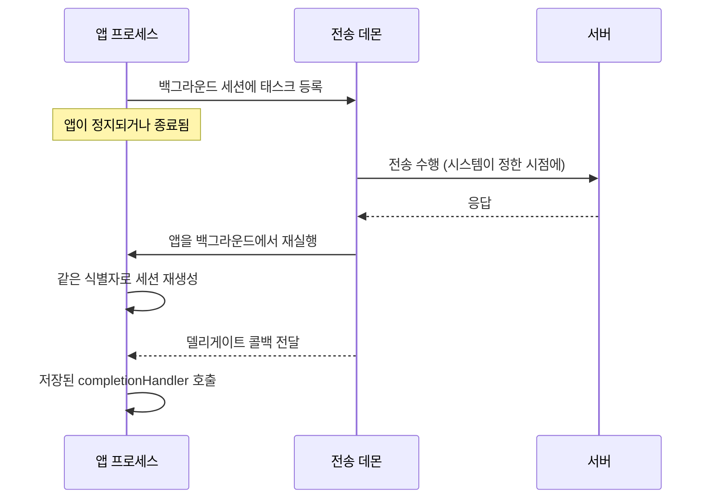

## 백그라운드 전송은 앱이 아니라 시스템 데몬이 이어서 수행한다

### 개념 (What)

백그라운드 구성으로 만든 `URLSession` 의 전송은 **앱 프로세스가 하는 것이 아니다.** 요청을 시스템 데몬에게 넘기고, 데몬이 앱이 정지되거나 **완전히 종료된 뒤에도** 전송을 계속한다. 완료되면 시스템이 앱을 백그라운드에서 다시 띄워 결과를 전달한다.

이 구조를 모르면 "왜 콜백이 안 오지", "왜 앱이 저절로 실행되지"를 이해할 수 없다.

### 왜 필요한가 (Why)

1. **앱 수명보다 긴 작업**: 대용량 다운로드는 앱이 전경에 있는 시간보다 오래 걸린다. 앱 프로세스에 묶으면 [정지되는 순간](../ipc-and-process/runningboard-assertions.md) 끊긴다.
2. **재실행 처리가 필수다**: 앱이 종료된 뒤 완료되면 시스템이 앱을 다시 띄운다. 이때 **세션을 같은 식별자로 재생성하지 않으면 결과를 영영 못 받는다.**
3. **즉시성이 없다**: 시스템이 배터리·네트워크 상황을 보고 시점을 정한다. "지금 당장" 전송되지 않는다.

### 내부 메커니즘 (How)



#### 반드시 지켜야 할 세 가지

**1. 같은 식별자로 세션을 재생성한다**

```swift
// 앱 어디서든 같은 식별자를 쓴다. 매번 새 식별자를 만들면 안 된다.
let config = URLSessionConfiguration.background(withIdentifier: "com.example.transfers")
let session = URLSession(configuration: config, delegate: self, delegateQueue: nil)
```

**2. 재실행 시 전달된 completion handler 를 저장했다가 호출한다**

```swift
// AppDelegate
func application(_ application: UIApplication,
                 handleEventsForBackgroundURLSession identifier: String,
                 completionHandler: @escaping () -> Void) {
    // 저장만 하고 즉시 호출하지 않는다
    backgroundCompletionHandler = completionHandler
    // 같은 식별자로 세션을 재생성해 델리게이트가 붙게 한다
    _ = makeBackgroundSession(identifier: identifier)
}

func urlSessionDidFinishEvents(forBackgroundURLSession session: URLSession) {
    DispatchQueue.main.async {
        self.backgroundCompletionHandler?()   // 여기서 호출
        self.backgroundCompletionHandler = nil
    }
}
```

호출하지 않으면 시스템은 앱이 아직 일하고 있다고 보고 **다음 재실행 기회를 줄인다.**

**3. 파일 보호 클래스를 확인한다**

앱이 정지된 동안(=기기가 잠긴 동안) 데몬이 결과를 디스크에 쓴다. 목적지 파일의 [보호 클래스](../storage/data-protection-classes.md)가 `complete` 면 쓰기가 실패할 수 있다.

### 제약 정리

| 제약 | 내용 |
| :--- | :--- |
| **구성 제한** | 백그라운드 세션은 ephemeral 구성과 함께 쓸 수 없다 |
| **태스크 종류** | 업로드/다운로드 태스크만. `dataTask` 불가 |
| **`isDiscretionary`** | true 면 시스템이 더 여유롭게 미룬다 (Wi-Fi·충전 중 선호) |
| **시점 통제 불가** | "지금 보내라"를 강제할 수 없다 |
| **업로드 소스** | 메모리가 아니라 **파일**에서 업로드해야 한다 |

> [!IMPORTANT] 테스트 방법
> Xcode 디버거가 붙어 있으면 앱이 정지되지 않아 실제 동작과 다르다. **Xcode 를 분리하고 앱을 강제 종료한 뒤** 전송이 완료되어 앱이 재실행되는지 확인해야 한다.

### 연관 문서

- [Data Protection 클래스는 파일 키를 기기 잠금 상태에 묶는다](../storage/data-protection-classes.md)
- [RunningBoard assertion 이 프로세스의 실행 지속 여부를 결정한다](../ipc-and-process/runningboard-assertions.md)
- [제약 경로와 비용 경로는 앱이 읽을 수 있는 신호다](constrained-and-expensive-paths.md)
- [apple-background-tasks](../../04_system_services/apple-background-tasks.md) - BGTaskScheduler 와의 구분

공식 문서: [Downloading files in the background](https://developer.apple.com/documentation/foundation/downloading-files-in-the-background)
