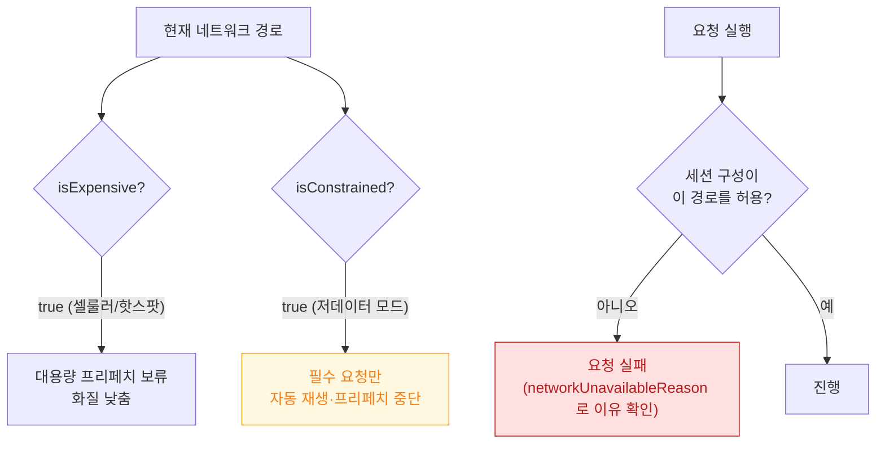

## 제약 경로와 비용 경로는 앱이 읽을 수 있는 신호다

### 개념 (What)

시스템은 현재 네트워크 경로에 두 가지 힌트를 붙인다.

- **`isExpensive`**: 셀룰러나 개인용 핫스팟처럼 **데이터 요금이 붙는** 경로
- **`isConstrained`**: 사용자가 **저데이터 모드(Low Data Mode)** 를 명시적으로 켠 상태

둘은 다르다. `isExpensive` 는 경로의 성질이고, **`isConstrained` 는 사용자의 의사 표현**이다. 후자를 무시하는 것은 사용자가 명시적으로 요청한 것을 어기는 일이며, 심사에서도 지적 대상이 된다.

### 왜 필요한가 (Why)

1. **사용자 의사를 존중해야 한다**: 저데이터 모드를 켠 사용자는 "꼭 필요한 것만 받아라"라고 말한 것이다. 고화질 프리페치를 그대로 하면 안 된다.
2. **요청이 조용히 막힐 수 있다**: `URLSessionConfiguration` 의 허용 플래그를 끄면 시스템이 그 경로에서 요청을 거부한다. 이 실패를 다루지 않으면 원인 불명의 오류가 된다.
3. **화질·프리페치 정책의 판단 근거**: "지금 얼마나 받아도 되는가"를 추측하지 않고 시스템 신호로 결정할 수 있다.

### 내부 메커니즘 (How)



#### 세션 구성으로 선언하기

```swift
let config = URLSessionConfiguration.default

// 이 세션의 요청은 저데이터 모드에서 실행하지 않는다
config.allowsConstrainedNetworkAccess = false
// 셀룰러에서도 실행하지 않는다
config.allowsExpensiveNetworkAccess = false

// 요청 단위로도 지정 가능
var request = URLRequest(url: url)
request.allowsConstrainedNetworkAccess = false
```

**용도별로 세션을 나누는 것**이 실용적이다.

| 세션 | 제약 경로 허용 | 예 |
| :--- | :---: | :--- |
| 필수 API (로그인, 결제) | O | 항상 실행되어야 함 |
| 이미지 고화질 | X | 저데이터 모드면 저화질로 대체 |
| 프리페치·선다운로드 | X | 저데이터 모드면 아예 안 함 |
| 분석·로그 업로드 | X | 나중으로 미룸 |

#### 실패 이유 구분

요청이 경로 제약으로 실패하면 오류에서 그 사실을 확인할 수 있다.

```swift
if let error = error as? URLError,
   error.networkUnavailableReason == .constrained {
    // 저데이터 모드 때문에 막혔다. 저화질 경로로 재시도하거나
    // 사용자에게 "저데이터 모드에서는 제한됩니다"를 알린다.
}
```

`.constrained`, `.expensive`, `.cellular` 를 구분할 수 있으므로, 무조건 "네트워크 오류"로 뭉뚱그리지 않고 정확한 안내를 줄 수 있다.

> [!TIP] 테스트
> 저데이터 모드는 `설정 > Wi-Fi > (네트워크) > 저데이터 모드` 또는 `설정 > 셀룰러 > 셀룰러 데이터 옵션` 에서 켠다. 시뮬레이터에서는 재현되지 않으므로 **실기기에서 확인**해야 한다.

### 연관 문서

- [NWPathMonitor 는 경로 가용성을 보고하지 도달 가능성을 보고하지 않는다](nwpathmonitor-reports-path-not-reachability.md)
- [백그라운드 전송은 앱이 아니라 시스템 데몬이 이어서 수행한다](background-transfer-daemon.md)
- [apple-offline-and-resilience](../../03_data_networking/apple-offline-and-resilience.md) - 오프라인 큐와 재시도

공식 문서: [Adapting to Low Data Mode](https://developer.apple.com/documentation/foundation/url_loading_system/adapting_to_low_data_mode)
