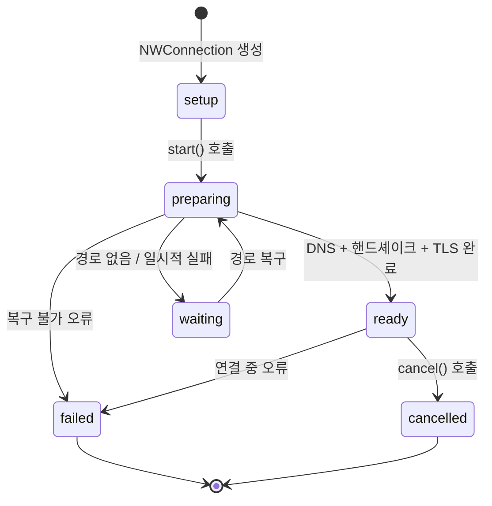

## Network.framework 는 소켓 대신 상태 머신으로 연결을 표현한다

### 개념 (What)

BSD 소켓은 "파일 디스크립터에 읽고 쓴다"는 모델이다. 연결이 살아 있는지, 경로가 바뀌었는지, TLS 협상이 어디까지 갔는지는 전부 앱이 따로 추적해야 한다.

**Network.framework** 의 `NWConnection` 은 대신 **명시적 상태 머신**을 노출한다. 연결은 `setup → preparing → ready → failed/cancelled` 중 한 상태에 있고, 앱은 상태 변화를 콜백으로 받는다. TLS, DNS 해석, IPv4/IPv6 선택, 인터페이스 선택이 전부 이 안에 포함된다.

### 왜 필요한가 (Why)

1. **모바일 네트워크는 계속 바뀐다**: Wi-Fi 에서 셀룰러로, 셀룰러에서 다시 Wi-Fi 로. 소켓 모델에서는 이 전환이 그냥 "연결 끊김"으로 나타난다. 상태 머신은 그 이유를 구분해 준다.
2. **Happy Eyeballs 를 대신해 준다**: IPv4/IPv6 와 여러 인터페이스 후보 중 가장 빨리 붙는 것을 고르는 로직을 직접 짜지 않아도 된다.
3. **TLS 가 1급 개념**: 소켓 위에 TLS 라이브러리를 얹는 구조가 아니라 연결 파라미터의 일부다.

### 내부 메커니즘 (How)



**`waiting` 상태가 특히 중요하다.** 이것은 실패가 아니라 "지금은 경로가 없지만 생기면 계속하겠다"는 상태다. 비행기 모드에서 요청하면 즉시 실패하는 대신 여기 머물다가 복구되면 진행한다.

```swift
let connection = NWConnection(host: "example.com", port: 443, using: .tls)

connection.stateUpdateHandler = { state in
    switch state {
    case .waiting(let error):
        // 실패가 아니다. 경로를 기다리는 중.
        // 사용자에게 "오프라인" 표시는 여기서.
        log("waiting: \(error)")
    case .ready:
        send()
    case .failed(let error):
        // 여기서만 진짜 실패로 처리한다.
        retryOrGiveUp(error)
    default:
        break
    }
}
connection.start(queue: .main)
```

#### `URLSession` 과의 관계

`URLSession` 은 내부적으로 이 계층 위에 있다. HTTP 를 쓴다면 `URLSession` 이 여전히 맞는 선택이고, **HTTP 가 아닌 프로토콜**(커스텀 TCP/UDP, 로컬 네트워크 발견, QUIC 직접 제어)에서 Network.framework 를 직접 쓴다.

| 상황 | 선택 |
| :--- | :--- |
| REST/GraphQL 등 HTTP | `URLSession` |
| 백그라운드 대용량 전송 | `URLSession` 백그라운드 구성 |
| 커스텀 TCP/UDP 프로토콜 | `NWConnection` |
| Bonjour 로컬 서비스 발견 | `NWBrowser` |
| 경로 변화 감시 | `NWPathMonitor` |

### 관찰 가능한 증거

```bash
# 네트워크 스택 로그
log stream --device --predicate 'subsystem == "com.apple.network"' --info
```

- **Instruments의 Network 템플릿**: 연결 수립, 재시도, 전송량을 시간축에서 본다.
- **Network Link Conditioner**: 저대역폭·고지연·패킷 손실 환경을 재현한다. `waiting` 상태 처리를 테스트하려면 필수다.

### 연관 문서

- [NWPathMonitor 는 경로 가용성을 보고하지 도달 가능성을 보고하지 않는다](nwpathmonitor-reports-path-not-reachability.md)
- [제약 경로와 비용 경로는 앱이 읽을 수 있는 신호다](constrained-and-expensive-paths.md)
- [ATS 는 기본적으로 TLS 와 순방향 비밀성을 요구한다](ats-transport-security-defaults.md)
- [apple-networking-and-cloud](../../03_data_networking/apple-networking-and-cloud.md) - 앱 관점 네트워킹

공식 문서: [Network](https://developer.apple.com/documentation/network)
