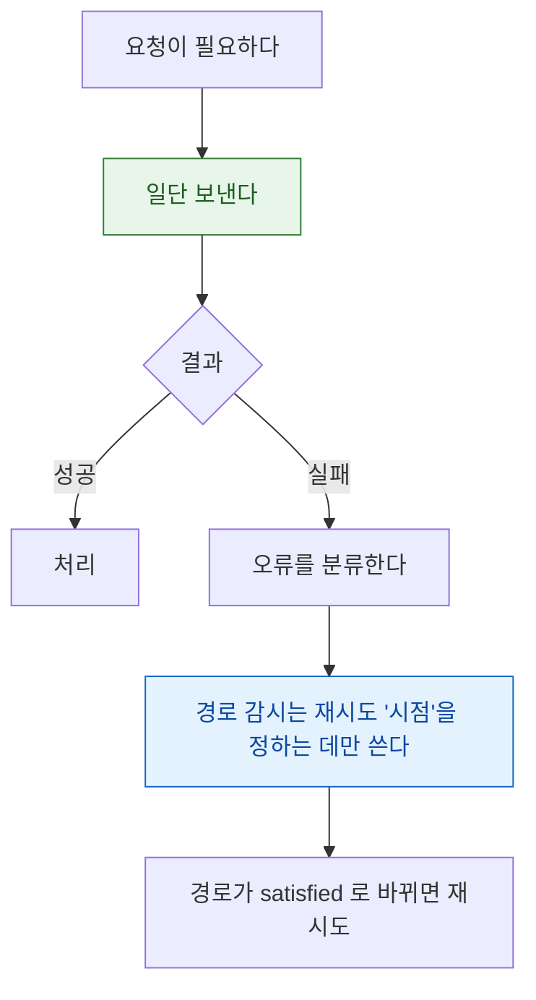

## NWPathMonitor 는 경로 가용성을 보고하지 도달 가능성을 보고하지 않는다

### 개념 (What)

`NWPathMonitor` 가 `satisfied` 를 보고한다는 것은 **"네트워크 인터페이스가 올라와 있고 라우트가 존재한다"** 는 뜻이다. 그것은 **내 서버에 실제로 도달할 수 있다는 보장이 전혀 아니다.**

- 카페 Wi-Fi 에 붙었지만 캡티브 포털 로그인 전 → `satisfied`, 그러나 아무 데도 못 간다
- 회사 네트워크에 붙었지만 방화벽이 내 API 도메인을 막음 → `satisfied`, 그러나 그 서버만 못 간다
- 셀룰러는 연결됐지만 신호가 극도로 약함 → `satisfied`, 그러나 타임아웃

### 왜 필요한가 (Why)

이 오해가 만드는 안티패턴이 널리 퍼져 있다 — **요청을 보내기 전에 도달 가능성을 먼저 확인하는 것**이다.

```swift
// ❌ 안티패턴: 확인한 뒤 요청
if monitor.currentPath.status == .satisfied {
    sendRequest()   // 그래도 실패할 수 있다
} else {
    showOfflineUI() // 실제로는 될 수도 있는데 막았다
}
```

이 패턴은 두 방향으로 틀린다. `satisfied` 여도 실패하고, `unsatisfied` 여도 (경로가 곧 생겨서) 성공할 수 있다.

### 올바른 사용법



**원칙: 요청을 막는 데 쓰지 말고, 재시도 시점을 잡는 데 쓴다.**

```swift
let monitor = NWPathMonitor()
monitor.pathUpdateHandler = { path in
    switch path.status {
    case .satisfied:
        // 도달 가능하다는 뜻이 아니다.
        // "지금 재시도해 볼 만하다"는 뜻이다.
        retryQueuedRequests()
    case .unsatisfied:
        // UI 힌트로만 쓴다. 요청 자체를 막지 않는다.
        showOfflineHint()
    case .requiresConnection:
        break
    @unknown default:
        break
    }
}
monitor.start(queue: .global(qos: .utility))
```

### 경로에서 읽을 수 있는 정보

| 속성 | 의미 |
| :--- | :--- |
| `status` | `satisfied` / `unsatisfied` / `requiresConnection` |
| `isExpensive` | 셀룰러 또는 개인용 핫스팟 |
| `isConstrained` | 사용자가 **저데이터 모드**를 켬 |
| `availableInterfaces` | Wi-Fi, 셀룰러, 유선, 루프백 등 |
| `supportsIPv4` / `supportsIPv6` | 프로토콜 지원 여부 |

특정 인터페이스만 감시하려면 `NWPathMonitor(requiredInterfaceType: .wifi)` 처럼 생성한다. 로컬 네트워크 기능이 Wi-Fi 에서만 의미 있을 때 유용하다.

> [!TIP] 캡티브 포털 구분
> 경로는 `satisfied` 인데 모든 요청이 예상치 못한 HTML 응답을 받는다면 캡티브 포털일 가능성이 높다. 시스템이 자체 감지해 로그인 화면을 띄우지만, 앱은 그 사이 요청이 이상한 응답을 받는 구간을 견뎌야 한다. **응답의 Content-Type 이 기대와 다르면 네트워크 오류로 처리**하는 방어가 필요하다.

### 연관 문서

- [Network.framework 는 소켓 대신 상태 머신으로 연결을 표현한다](network-framework-connection-state.md)
- [제약 경로와 비용 경로는 앱이 읽을 수 있는 신호다](constrained-and-expensive-paths.md)
- [apple-offline-and-resilience](../../03_data_networking/apple-offline-and-resilience.md) - 재시도와 오프라인 큐

공식 문서: [NWPathMonitor](https://developer.apple.com/documentation/network/nwpathmonitor)
