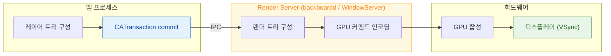

## 화면과 소리는 앱이 직접 그리는 것이 아니라 전담 데몬에게 넘긴 뒤 마감 시각에 맞춰 나온다

앱은 화면에 픽셀을 직접 쓰지 않는다. **레이어 트리를 만들어 Render Server 에 넘기고**, 실제 합성과 표시는 그 프로세스가 한다. 오디오도 마찬가지로 `mediaserverd` 가 라우팅과 하드웨어를 소유한다.

이 구조가 진단에서 갖는 의미는 명확하다 — **끊김의 원인이 내 프로세스 안에 없을 수도 있다.**

### 프레임이 나오는 경로

- [레이어 트리는 IPC 로 Render Server 에 커밋된다](layer-tree-commit-to-render-server.md)
- [Render Server 는 앱 프로세스와 독립적으로 합성한다](render-server-composition.md)
- [가변 주사율에서는 프레임 마감 시각 자체가 달라진다](promotion-variable-refresh-deadline.md)

### 비용과 측정

- [Offscreen 렌더링은 추가 패스와 컨텍스트 전환을 강제한다](offscreen-rendering-cost.md)
- [히치는 평균 FPS 가 아니라 사용자가 실제로 본 지연을 잰다](hitches-measure-user-visible-jank.md)

### 버퍼와 GPU

- [IOSurface 는 프로세스와 GPU 가 함께 보는 메모리다](iosurface-shared-gpu-memory.md)
- [Metal 커맨드 버퍼는 커밋될 뿐 즉시 실행되지 않는다](metal-command-submission.md)

### 오디오

- [mediaserverd 가 오디오 라우팅과 하드웨어 코덱을 소유한다](mediaserverd-audio-arbitration.md)

### 진단 순서

1. **어느 프로세스가 늦었는가**: 앱의 commit 이 늦은 것인지, Render Server 의 합성이 늦은 것인지를 먼저 나눈다. Instruments 의 **Animation Hitches** 템플릿이 이 구분을 보여준다.
2. **commit 이 늦다면** → 레이아웃/그리기 비용. [offscreen 렌더링](offscreen-rendering-cost.md) 과 메인 스레드 블로킹을 본다.
3. **합성이 늦다면** → GPU 부하. 레이어 수, 블렌딩, 큰 텍스처를 본다.
4. **마감 자체가 짧아진 것은 아닌가** → [가변 주사율](promotion-variable-refresh-deadline.md) 에서 120Hz 로 올라가면 마감이 절반이 된다.

### 경계

- 앱 관점의 Core Animation/Metal 사용법은 [apple-rendering-and-media](../../02_ui_frameworks/apple-rendering-and-media.md) 에, 애니메이션 설계는 [apple-animation-and-motion](../../02_ui_frameworks/apple-animation-and-motion.md) 에 둔다.
- AVFoundation 캡처/재생 파이프라인 사용법은 [apple-media-pipeline-deep](../../02_ui_frameworks/apple-media-pipeline-deep.md) 에 둔다.

### 연관 문서

- [메인 스레드의 이벤트 처리와 화면 갱신은 RunLoop 한 바퀴 안에서 정해진 순서로 일어난다](../boot-and-runtime/runloop-drives-main-thread.md)
- [SpringBoard 와 FrontBoard 가 앱의 전경·배경 전이를 소유한다](../ipc-and-process/springboard-frontboard-lifecycle.md)
