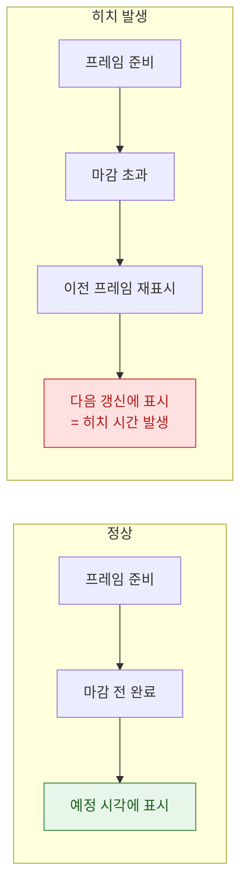

## 히치는 평균 FPS 가 아니라 사용자가 실제로 본 지연을 잰다

### 개념 (What)

**히치(hitch)** 는 프레임이 **예정된 시각보다 늦게 표시된 것**이고, 그 지연 시간의 총량이 지표가 된다. 평균 FPS 와 결정적으로 다르다.

평균 FPS 가 왜 부족한지는 예로 보면 명확하다. 1 초 동안 60 프레임이 나왔지만 그중 한 번이 200ms 늦었다면, 평균 FPS 는 여전히 60 에 가깝다. 그러나 사용자는 그 200ms 를 명확히 "걸렸다"고 느낀다. **평균은 이 사건을 지워 버린다.**

### 왜 필요한가 (Why)

1. **최적화 대상을 바꾼다**: 평균 FPS 를 보면 "전반적으로 조금씩 빠르게"가 목표가 되지만, 히치를 보면 **"가장 나쁜 한 프레임"을 없애는 것**이 목표가 된다. 후자가 체감에 직결된다.
2. **비교 가능한 단위**: 히치 시간을 스크롤 지속 시간으로 나눈 **히치 시간 비율**(초당 밀리초)은 세션 길이와 무관하게 비교할 수 있다.
3. **실사용자 데이터와 연결된다**: 개발 기기에서는 재현이 안 되는 히치가 실기기에서는 흔하다. MetricKit 과 Xcode Organizer 가 이 지표를 실사용자 분포로 제공한다.

### 내부 메커니즘 (How)



#### 히치의 두 원인 구간

| 구간 | 늦은 주체 | 대표 원인 |
| :--- | :--- | :--- |
| **Commit hitch** | 앱 프로세스 | 메인 스레드 블로킹, [이미지 디코딩](layer-tree-commit-to-render-server.md), 무거운 레이아웃 |
| **Render hitch** | Render Server / GPU | 레이어 과다, [offscreen 패스](offscreen-rendering-cost.md), 오버드로 |

Instruments 의 Animation Hitches 템플릿이 이 둘을 시간축에서 분리해 보여준다. **먼저 어느 구간인지 확정한 뒤** 해당 노트의 처방으로 간다.

### 측정 방법

**개발 중 (Instruments)**

```
Instruments > Animation Hitches
  - 각 프레임의 마감 준수 여부
  - commit 구간과 render 구간의 분리
  - 히치 시간 비율 집계
```

**자동화 테스트 (XCTest)**

`XCTOSSignpostMetric.scrollDecelerationMetric` 등을 쓰면 스크롤 성능을 회귀 테스트로 고정할 수 있다. 리팩터링이 히치를 늘렸는지 CI 에서 잡을 수 있다.

**실사용자 (MetricKit / Xcode Organizer)**

`MXAnimationMetric.scrollHitchTimeRatio` 가 실사용자 기기의 스크롤 히치 비율을 준다. Xcode Organizer 의 Scrolling 지표도 같은 데이터를 기기 모델·OS 버전별로 나눠 보여준다.

> [!TIP] 어떤 값이 나쁜가
> Apple 은 히치 시간 비율의 목표 구간을 제시하고 있으며, 낮을수록 좋다. 다만 절대 기준을 외우기보다 **자기 앱의 릴리스 간 추이**와 **기기 모델별 편차**를 보는 것이 실용적이다. 특정 모델에서만 비율이 튀면 그 모델의 주사율이나 GPU 성능이 원인일 가능성이 높다.

### 연관 문서

- [레이어 트리는 IPC 로 Render Server 에 커밋된다](layer-tree-commit-to-render-server.md)
- [Offscreen 렌더링은 추가 패스와 컨텍스트 전환을 강제한다](offscreen-rendering-cost.md)
- [가변 주사율에서는 프레임 마감 시각 자체가 달라진다](promotion-variable-refresh-deadline.md)
- [apple-instruments-profiling](../../06_testing_performance/apple-instruments-profiling.md) - Instruments 사용법

공식 문서: [WWDC 2020: Eliminate animation hitches with XCTest](https://developer.apple.com/videos/play/wwdc2020/10077/)
