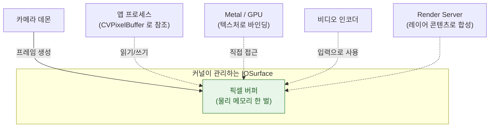

## IOSurface 는 프로세스와 GPU 가 함께 보는 메모리다

### 개념 (What)

**IOSurface** 는 커널이 관리하는 이미지 버퍼로, **여러 프로세스와 CPU/GPU 가 동시에 참조할 수 있다.** 카메라가 만든 프레임을 앱이 처리하고 인코더가 압축하는 과정에서, 데이터는 복사되지 않고 **같은 버퍼의 참조만 이동**한다.

`CVPixelBuffer` 는 대부분 IOSurface 를 뒷단으로 갖는다. 그래서 카메라 → Metal → 인코더 경로가 복사 없이 이어진다.

### 왜 필요한가 (Why)

1. **복사 비용이 치명적이다**: 4K 프레임 하나가 수십 MB 다. 초당 30 프레임을 CPU 로 복사하면 대역폭과 발열이 감당되지 않는다.
2. **프로세스 경계를 넘는다**: 카메라 데몬, 앱, Render Server 가 서로 다른 프로세스인데도 같은 픽셀 데이터를 볼 수 있어야 한다.
3. **메모리 회계가 헷갈리는 이유**: IOSurface 메모리는 힙에 안 잡힌다. Allocations 계측기에서는 안 보이는데 [footprint](../kernel-and-driver/mach-vm-and-memory-regions.md) 는 올라가는 현상의 흔한 원인이다.

### 내부 메커니즘 (How)

1. **참조 계수**: 커널이 이 버퍼를 참조하는 주체 수를 센다. 마지막 참조가 사라져야 해제된다. 어딘가에서 붙잡고 있으면 메모리가 계속 남는다.
2. **잠금(lock) 규약**: CPU 로 픽셀에 접근하려면 명시적으로 잠그고(`CVPixelBufferLockBaseAddress`) 끝나면 풀어야 한다. GPU 가 동시에 쓰는 것을 막기 위한 규약이며, 풀지 않으면 그대로 누수다.
3. **풀(pool) 사용**: 매 프레임 새 버퍼를 만들면 할당 비용이 크다. `CVPixelBufferPool` 로 재사용하는 것이 표준 패턴이다.

### 복사가 끼어드는 지점

zero-copy 경로는 쉽게 깨진다. 다음 변환이 들어가는 순간 CPU 복사가 발생한다.

| 하는 일 | 결과 |
| :--- | :--- |
| `CVPixelBuffer` → `CGImage` → `UIImage` | **복사 발생.** 실시간 경로에서 피한다 |
| `CMSampleBuffer` → `Data` 직렬화 | **복사 발생** |
| `CIImage` 로 필터 적용 후 Metal 텍스처로 렌더 | 복사 없이 유지 가능 |
| `CVMetalTextureCache` 로 텍스처 생성 | **복사 없음.** 권장 경로 |

실시간 카메라 필터를 만들 때 `CVMetalTextureCache` 를 쓰는 이유가 이것이다.

### 관찰 가능한 증거

- **Instruments의 VM Tracker**: IOSurface 영역이 별도로 집계된다. 힙은 그대로인데 이 영역이 계속 자라면 버퍼를 놓아주지 않고 있는 것이다.
- **Instruments의 Allocations 로는 안 보인다**: 힙 할당이 아니므로 여기서 찾으려 하면 시간을 낭비한다.
- **`vmmap <pid>`** (macOS): `IOSurface` 로 표시된 영역의 크기를 확인한다.

> [!WARNING] 프레임을 붙잡지 마라
> `AVCaptureVideoDataOutput` 의 델리게이트에서 받은 `CMSampleBuffer` 를 배열에 쌓아 두면, 그 버퍼들이 풀로 반환되지 않아 캡처 세션이 프레임을 떨어뜨리기 시작한다. 필요한 데이터만 복사하고 버퍼는 즉시 놓아준다.

### 연관 문서

- [Mach VM 은 영역 단위로 매핑하고 물리 페이지 할당을 미룬다](../kernel-and-driver/mach-vm-and-memory-regions.md)
- [Metal 커맨드 버퍼는 커밋될 뿐 즉시 실행되지 않는다](metal-command-submission.md)
- [mediaserverd 가 오디오 라우팅과 하드웨어 코덱을 소유한다](mediaserverd-audio-arbitration.md)
- [apple-media-pipeline-deep](../../02_ui_frameworks/apple-media-pipeline-deep.md) - AVFoundation 파이프라인

공식 문서: [Core Video](https://developer.apple.com/documentation/corevideo)
